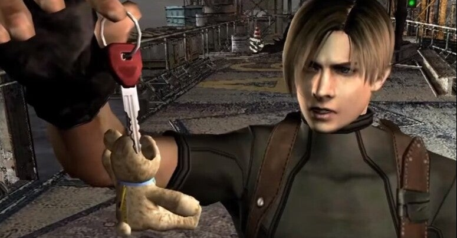

<figure>

</figure>

　『デッドバイデイライト』の次の新チャプターは、『バイオハザード』とのコラボだ。6月に登場するこの新チャプター、5/26の5周年生放送で情報が明らかにされるということで、『バイオハザード』とコラボするということ以外、詳細は一切明らかにされていない。

　しかし、『バイオハザード』もシリーズとしてはかなり長くて、ファンにとってみると、魅力的な登場人物も数多い。その中から、サバイバーが誰になるかというだけで戦争が起きそうな勢いである。

　個人的には、『ストレンジャーシングス』チャプターのように、二人のサバイバーが来てもいいんじゃないかいと思っている。

　かつて共演したクリスとジルの2人サバイバーなら、きっと誰も文句を言わないだろう。しかし、シリーズ的には最新主人公のイーサンも捨てがたいかもしれない。ただし、イーサンはFPSという特性上、顔がいまいちハッキリしなくて、アピアランス的には今ひとつだ。シリーズ最高傑作の『バイオハザード４』の主人公レオンも捨てがたく、また、悪役ではあるが、初代から強烈な個性をアピールし続けるウェスカーなんて存在もいる。

　もう、サバイバーが誰かを考えるだけで心配になってくるゲームだ。どうしよう、バリーとかハンク辺りのマイナーなキャラクターだったら。暴動が起きそうだ。

　しかし、もっと心配なのはキラーである。正直、『バイオハザード』シリーズのキャラクターからキラーを持ってくると、どれも強力すぎて、フックに吊るすとかそういうレベルじゃ済まない感じだ。サバイバーを徹底的に引き裂くか、感染してサバイバーを別の生物に変化させる勢いで凶悪なやつばかりじゃないか。

　もっともそれを言ったら、デモゴルゴンだって異次元からやってきた相当凶悪な化け物で、もはや殺人鬼とは言えないが。でも、『バイオハザード』シリーズからタイラントなんて出てきたら、圧倒的すぎて鬼ごっこゲームの『デッドバイデイライト』にはそぐわないんじゃないかと思ってしまう

　今回出た『バイオハザード８』には、敵ながら愛嬌のあるやつも多くて、やはりこちらも新作からコラボする可能性もあるんじゃないかと思ってしまう。

　あと１週間で発表ではあるが、ファンとしてあれこれ妄想するのは楽しいものである。願わくば、ファンのみんなが納得できる人選（？）であってほしい。

　そう考えると、『サイレントヒルチャプター』は文句なしだった気がするな……
