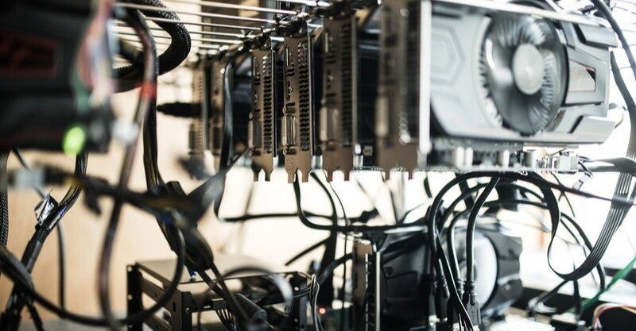

<figure>

</figure>

　ご存知の通り、半導体不足でスマホやゲーム機など、我々の生活に極めて近いものが手に入りにくくなっている。特にゲーマーにとっては厳しい状況が続いていると言える。

　この半導体不足がいつまで続くのか、ITアナリスト等の予測を見ていても、徐々に見通しは厳しくなり、その予想は先へ先へと伸びる形になっている。

[https://japan.cnet.com/article/35170521/](https://japan.cnet.com/article/35170521/)

　最近では、中国が仮想通貨のマイニングを禁止するニュースなども流れ、実際ビットコインは暴落している。しかし、一方でこれも限定的な動きとするニュースもあり、決して楽観的な見方はできないようだ。

[https://jp.reuters.com/article/crypto-currency-idJPKCN2D2251](https://jp.reuters.com/article/crypto-currency-idJPKCN2D2251)

　今年に入ってから僕は、安穏とグラフィックボードの価格が下がってくるのを待っていた。ネットの価格遷移情報などを見つつ、もう一声！　などとやっていたら、すっかり買い時を逃してしまったようだ。今では半年前の倍以上の価格で取引されているグラボを指をくわえて眺めるのみである。

　幸い、偶然PS5の抽選販売に当選したため、当面ゲームをプレイするのに困ることはなさそうだが、残念ながらPCのゲームはスペック的に厳しくなり始めている。

　市場を見ていると、相変わらずPS5は抽選販売が続いているし、Xboxに至っては販売しているのかすら疑わしいような状態だ。そこへ持ってきて、PCのグラボも供給不足である。これはもうゲーマーにとっては危機的状況と言うしかない。

　ここまでゲームで遊ぶ環境が整わないとなると、ゲームを開発するメーカーとしてもターゲットとなるマシンの設定に困るのではないだろうか。実際、普段プレイしているゲームも、アップデートでターゲットスペックが上がる度に遊びにくくなっている。

　昨今の半導体不足に対して、個人ゲーマーとしてできることは少ない。本当に価格が落ち着いてくれるのを祈るしかないような状況である。しかし、ゲーム機の製造メーカーや、PCを供給するBTOのショップなどには、少しずつでも部材を備蓄してもらい、計画的に市場に製品を流してもらうしかないだろう。我々は、ただそれを待つのみだ。

　あとは、レトロゲームに走るって手もあるけど、実にゲーム業界にとって後ろ向きな話になってしまいそうだ。
