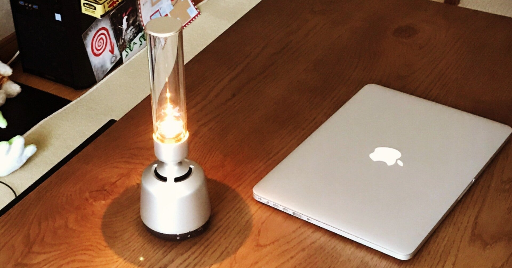

<figure>

</figure>

　ソニーのBluetoothスピーカー『LSPX-S2』を買ってみた。2年ほど前に発売された製品で、円筒状のガラスが特徴的な、おしゃれなスピーカーだ。

　『LSPX-S2』の外見は、まるでランプのようにも見えるが、その外見通り、円筒状のガラス内部にはLEDが設置されていて、これが光る。普通に証明のように光るモードと、ろうそくが瞬くように光るモードがあり、遊び心のある作りになっている。

　リビングに無垢材のいい感じのテーブルを導入したので、そこに置いて、ちょっと音楽を聞くために買った。要するに音は二の次、デザイン優先で選んだようなものだ。

　しかし、実際に再生してみると、これが意外にいい音で鳴ってくれる。スピーカーの土台が、小型のウーハーになっているので、それほどうるさくなく、かと言ってまったくスカスカでもない出音が上品だ。

　上部のガラス管がツィーターになっているということだが、ガラスがびびることもなく、本当に静かに高音を出力してくれる。

　普段聞いている音楽が割りとディストーションギター多めの、にぎやかな音楽なので、果たしてこういうスピーカーはどうなのかと思ったものの、そういうラウドな音楽にもしっかり対応してくれて、細かな部分までクリアなサウンドが再生されるのは嬉しいところだ。それでいて、アコースティックギターや、ピアノが登場すると、これがより一層繊細に鳴り響いてくれるので嬉しい。結構満足度の高い製品であった。

　結構気に入って使い始めた『LSPX-S2』だが、唯一難点があるとすれば、ちょっと価格が高いということ。もう少し安ければみんな手を出しやすいのにね、という気はする。とは言え、すでに買ってしまったのだから値段のことは問題ない。できる限り活用していこう。

　BluetoothのコーデックとしてaptXに対応していないということ、その代わり、ソニー製品らしくLDACは対応しているということ。音にこだわる人はその辺りも抑えておくと、間違いないのかもしれない。

　ちなみに、このスピーカー、2台用意するとステレオで再生してくれるらしい。うん、2台買うのはちょっとお高いが、考慮してもいいくらいの音かな。
