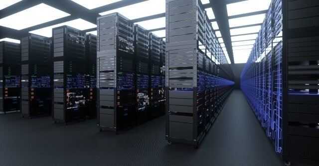

<figure>

</figure>

　我が家はMac Miniを家庭内サーバとして使っている。もう10年近くかどうしているが、HDDも交換していないので（もちろんバックアップは取っているが）その辺の心配も含めてそろそろなんとかしたい。

　もともと自宅でサーバを立ててみようと思ったのは、もうかれこれ20年ほど前になる。ごく普通の自作PCを引退させて、Linuxを入れてサーバにしてみた。

　特に自宅にサーバが必要というわけではなかったが、純粋に興味があったので、趣味的にサーバ構築をしてみたのだ。その頃ちょうど、ADSLが普及し始めていたので、自分用にメールサーバなどを立てるのもやってみた。

　結果として、その手の書籍を読めば素人にも一応動くサーバが作れることがわかり、それ以降は普段使っているPCを更新する度に新しいサーバを構築しては入れ替えてきた。

　しかし、自作PCの巨大なPCケースと、あまり静音を考慮していないファンで構成されたサーバは、24時間かどうさせるにはうるさい。それに、部屋に置いておくと夏は気温が上がる。住んでいる場所によっては、家の外にある物置までLANケーブルを引っ張ったこともあったけど、転勤族なのですべての住居で同じことができるわけではなかった。

　やがて、巨大なPCをサーバとして使うのはやめようという発想が生まれた。それが、10年ほど前に買ったMac Miniにつながる。ファンレスで静かな素晴らしいマシンだ。しかも置き場所にも困らない。そんなところが気に入って、長く使ってきた。

　そのMac Miniも、そろそろ限界のようだ。最近はローカルでログオンすると、Macの動作が明らかに重い。OSが重くなってきたのと、やっぱり10年間同じ機器構成で使っていることが原因だろう。

　そこで最近は大仰なサーバをやめて、NASに移行しようと考えている。その昔、LAN HDDというのを使ったこともあるが、これはデータの転送速度が遅くてお話にならなかった。さすがに最近のNASならそういうこともないだろう。

　あの頃と違い、家の中もすべて1Gbpsで接続しているので、データのやり取り自体もそれほど遅くないし、NASのCPU自体もスピードが上がっている。

　できれば今すぐにでも乗り換えたいところだが、Macに独自形式で保存してある写真データをエクスポートしなければならい。そこがネックでまだNAS導入に至ってないのだ。

　とは言え、NASをLANに繋がなければ、写真をエクスポートする先もない。よし、近々NASを買うことにしよう。今月はいろいろ買い込んでしまったので、また来月かな。
