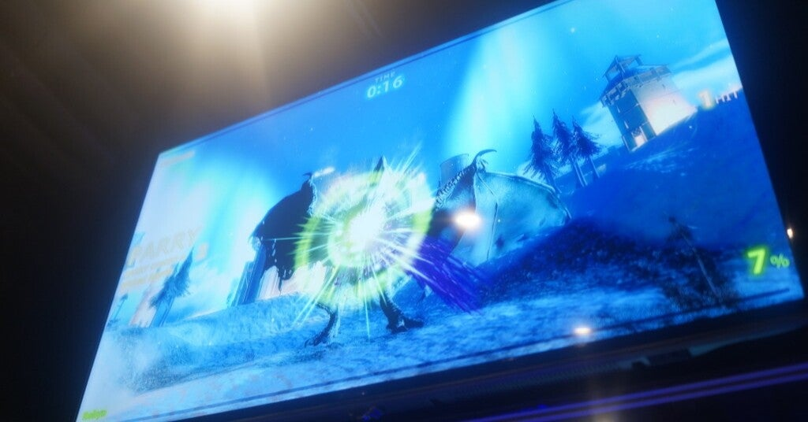

<figure>

</figure>

　我が家のPCのグラボには、HDMI端子とともにディスプレイポートの端子がついている。

　あまり普及している感じの端子ではないが、うちだと、Mac miniがディスプレイポートを装備していて、それでモニターに接続していたので、僕としてもたまたま使って知っていたという感じだ。

　ちょっと調べてみると、どうやらHDMIと比較して、信号の帯域が広く作られていて、より高解像度、高フレームレートにも対応できるスペックの高い接続方法のようだ。

　とは言っても、我が家に高性能ゲーミングモニターなどはないので、あまり関係ない。本当にたまたまMacがディスプレイポートを備えていて、なおかつ、液晶モニターにもディスプレイポートがついていたため、ふさがっているHDMI端子の代わりに使っていたというだけの話だ。

　最近、4KモニターにつないでいるPCに、どうしてもまた以前使っていたフルHDのモニターをつなぎたくなる案件があった。いつも遊んでいる『デッドバイデイライト』が、4K環境で録画するとフルHDに解像度を落としても、録画された映像に不具合が生じるため、それを回避する策として以前のモニターをつなぎたくなったのだ。

　それなら、ちょうどグラボのディスプレイポートが余っているじゃないか。Mac miniもサーバとして使っているだけだからケーブルも借りてきて問題ないだろう。という感じで、Macからケーブルを拝借して液晶モニターをつなぐことにした。

　ところが、これがつながらないのだ。なぜかと言えば、Macに使われているのは同じディスプレイポートでも、ディスプレイポートminiという規格だったのである。PCのグラボは大きなディスプレイポートの端子がついているのに、Macのそれは小さな端子。ただでさえマイナーなディスプレイポートに、さらにこんなややこしい分類があるとは。

　まあ、とは言えHDMIも小さい端子とかあるから仕方ないのか。とりあえず、ディスプレイポートのケーブルを注文することにした。バージョンの新しい、より高解像度に対応するケーブルは3000円以上するが、ちょっと古いバージョンのディスプレイポートケーブルでもフルHDにはそれで十分のようだ。値段は1000円。

　そんなわけで、また今度ディスプレイポートで液晶モニターを接続してみる。どうやら、HDMIより優れた規格でもあるようなので、今後注視してみてもいい接続方法かもしれない。勉強してみよう。
