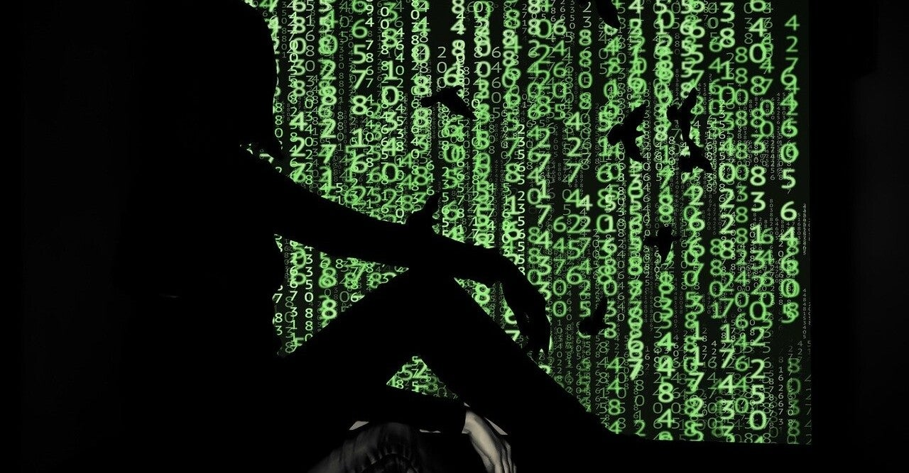

<figure>

</figure>

　早速ディスプレイポートのケーブルを買ってモニターを接続してみた。昨日の話のつづきだ。

[https://note.com/keigox68000/n/n87a4b7c41597](https://note.com/keigox68000/n/n87a4b7c41597)

　PCに接続したモニターは、2012年に買ったDELLの27インチ。長年に渡って、主にゲーム方面で活躍してくれたモニターで、今も現役で使っている。

　ところが、このモニターをディスプレイポートケーブルで接続してびっくり。なんと今までフルHDだと思っていたモニターは、2K対応であった。今までたまたまフルHDを超える機器を接続したことがなく、まったく気づかずに使っていたようだ。なんか笑える。

　かくして、結局新しく買った4Kモニターと、2Kモニターで、広大なデスクトップ環境が誕生した。今やDTMをやることもなくなったので、この広い世界を有効活用するシーンはほとんどないような気がする。

　しかし、不思議なことに意外なところに、このデュアルモニター環境が影響を及ぼす。

　実は、4Kモニター導入以降、PCゲームの録画がうまくいかない現象に悩まされていたのだが、なぜか2Kモニターを接続しただけで、録画の解像度がうまく見た目通りに収まってしまったのだ。PCにとってみれば今までより表示する面積が増えているので、これはまったく不可解なことであり、その原因は杳として知れない。

　まあ、いずれにしても結果オーケイみたいな感じで、『デッドバイデイライト』が4Kできれいに録画できそうなのでこれから試してみようと思っている。数日してYoutubeにPCでプレイした『デッドバイデイライト』動画がアップできていれば、無事に録画できたということだ。

　それにしてもPCモニターの世界は不可解なことばかりである。
