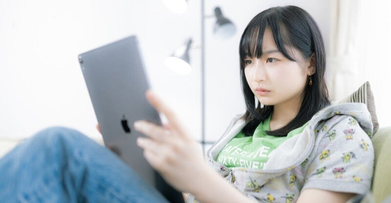

<figure>

</figure>

　主に使っているSNSはツイッター。使い始めてから、かれこれ15年になろうとしているのには我ながら驚きだ。

　ツイッターでは、多くの人と知り合うことができ、それはやがてリアルでも友人となり、本当にかけがえのない出会いがあったと言える。それは自分でも強く感じるし、ここしばらくは実際に会えない状況にあっても、ツイッターさえあれば、同じ趣味の話題で盛り上がったり、一緒にオンラインゲームをしたり、まるで近くにいるかのように付き合えるのは素晴らしいことだ。

　しかし一方で、それがあまりに日常になりすぎて、もうあって当たり前。そんなに毎日、常にSNSに張り付いていなくてもいいような感じになっている。

　昔は、商店街にある家電店に展示してある白黒テレビを、近所の人がみんなで集まってみていたというような話を聞くが（さすがに自分はそんな世代ではない）、今そんなことをする人はいない。

　SNSもそれと同じで、以前はフォローしている人すべてと挨拶を交わし、同好の士でグループを作って盛り上がり、オフ会に足繁く通うという姿があった。もちろん、家にいる間はずっとツイッターに張り付きっぱなしだ。

　でも、最近はツイッターもごく限られた時間で見ているだけだ。朝起きて眺めるときもあれば、夕方仕事が終わるまでまったく見ないこともある。自分でbotを作って、Youtubeにアップした動画や、このnoteに書いた記事の宣伝をすることはあるが、個人的なことはそんなにつぶやかなくなっている。

　要するに、SNSが我々の生活の一部に溶け込み、空気と同じようになってしまっているのだ。取り立てて大騒ぎもせず、だからといって、一切やめたわけでもなく。これまでと同じようにフォロワーたちと会話しながら、適度に嗜む。そんな存在になりつつある。

　これは、同じくツイッターをやっている人、皆に共通することではないだろう。たまたま自分の、SNSとの付き合い方が、そのように変化してきただけなのだと思う。

　かつて友人と連絡を取り合うのに大活躍していたメールだって、今では仕事の連絡するだけにしか使っていない。SNSも、15年前の使い方から変容して当たり前だ。これは、自分が人間として歳を重ねたこと、SNSの存在が我々の生活の中で成熟してきたこと、そういうことの証かもしれない。

　これからも、ネット上には様々なサービスが現れるだろう。自分の生活を乱すことなく、無理のない範囲でそれを使っていけばよい。そして、その中で自分自身は人間的な成長をしていけばよいのだ。
