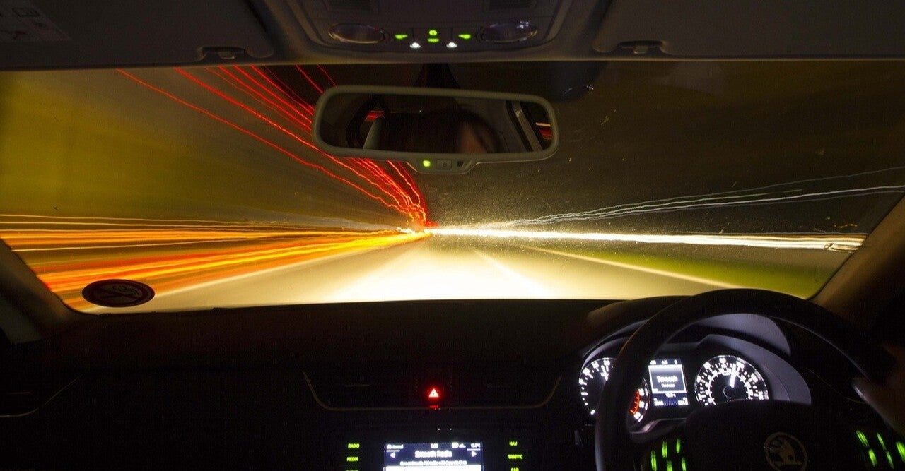

<figure>

</figure>

　最近スマホ運転のドライバーを頻繁に見かける。ナビ代わりにしているスマホを凝視するとかそんなレベルではなく、手に持ったスマホを見ながら運転している恐ろしいドライバーだ。

　中にはスマホを片手に持ち、もう片方の手でハンドルを握り、スマホをタップしながら運転している人もいる。それもう、前見てないじゃん！　本当に怖い。

　そこまでいかなくても、停車中にスマホを見ている人もいる。こちらは完全に下を向いてスマホを見ているため、信号が青になったのに気づかない。後ろの車にクラクションを鳴らされて、ようやく発進する。ひどいときは、後ろの車も発進しないの待っていて気が長いなと思っていると、後ろのドライバーもスマホ見ていて、もう誰も信号見てなかったりすることすらある。

　この前見かけたのは、スマホ見ていて信号に気づかない車に発信を促そうとクラクションを鳴らした車にキレたらしく、発進したあとに追い抜いた後続の車を煽っているスマホ運転の車だ。スマホ見ていてキレるとなると、これはもう話題のスマホ脳じゃないかと疑いたくなる。

　もちろん、こちらも運転しているから、すべての車がスマホ運転なのかどうか確信を持っているわけではない。しかし、前を走っている車が異様に遅く、しかもフラフラとセンターラインを超える運転をしているとなると、これはスマホ見ているな、と疑いたくなるのも仕方ない。

　スマホに気を取られているから、信号で停まるときも前の車との車間に無頓着で、3台分も4台分も車間空けて止まっていたりする。もはや社会の迷惑以外の何物でもない。

　もちろん危険運転はスマホに限ったことではなくて、テレビを見ているとか、雑誌を読んでいるとか、ときにはナビだって凝視していると危ない。しかし、スマホは小型で片手で持ちやすいだけに、余計に危険な運転が増えているような気がする。

　そして、そういう車に限って衝突防止装置のついていない車だったりする。絶対危ない。万が一事故になった場合、今の車はドライブレコーダーがついているから、スマホ運転の姿なんて克明に記録されているかも知れない。事故を起こすリスク、事故を起こした際の罪の大きさのリスク、そういうものをまったく考えない人が車を走らせているというのが怖い。

　みんな、もっと自分が危険な乗り物を動かしている自覚を持ったほうがいい。事故を起こせば悲惨だよ。
