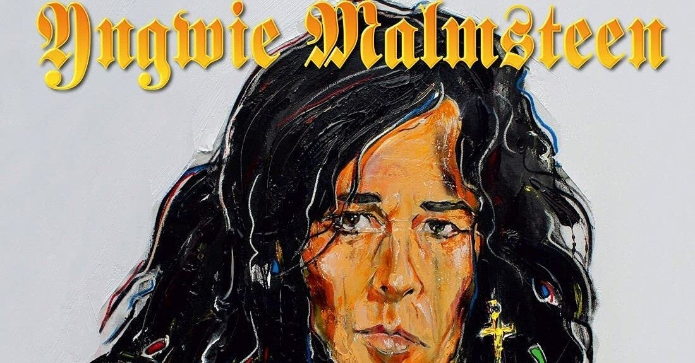

<figure>

</figure>

　イングヴェイのニューアルバムが7月にリリースされるということで、カバーマークが明らかになった。もうなにか吹っ切れてるというか、適当というか、そんな雰囲気がプンプンするのである。

[https://www.amazon.co.jp/dp/B094DCVRL2](https://www.amazon.co.jp/dp/B094DCVRL2)

　それでもこのご時世、日本盤が出るのはすごいことかもしれないし、潜在的に昔からのファンが買うのだろう。僕はもうイングヴェイのアルバムは買っていない。アルバムの出来に関係なく、ストリーミングで聞くからだ。

　少し前にニューアルバムの曲がYouTubeで先行公開されている。

[https://www.youtube.com/watch?v=F74Tw99qfRg](https://www.youtube.com/watch?v=F74Tw99qfRg)

　この曲の出来がまた不安しか感じさせない。ここ10年以上サウンドプロダクションが最悪で、サウンドの全体像がはっきりしないこもったような音には閉口する。とにかくギターの音が前に出ればいいというミックスも聞き苦しい。イングヴェイ自身のヴォーカルも、加工しすぎていて、繊細なメロディを表現するには程遠いとしか言いようがない。個人的には、もしかすると、イングヴェイは耳が悪くなっているんじゃないかと思っている。

　それでも一聴してイングヴェイとわかるメロディとギターソロはさすがの個性なのかもしれない。一方で、曲の展開はドラマ性に乏しく、もはやサビらしいサビもない平坦な印象だ。歌詞もイングヴェイの貧弱な英語力が顕になっていて残念な感じである。

　ギターソロには、パガニーニのカプリース24番を引用しているのだが、これは2000年に発表された『War To End All Wars』に収録されていた"Prophet of Doom"でもやったネタだ。引き出しが多いんだから、もっと別の曲から引っ張ってくればよかったのにと思ってしまう。

[https://open.spotify.com/album/5uipht6FwaIHY0R9Q25ETF?si=eTVwOuxOQ4WkuNqCAsbm\_A](https://open.spotify.com/album/5uipht6FwaIHY0R9Q25ETF?si=eTVwOuxOQ4WkuNqCAsbm_A)

　そんなわけで、先行公開の曲だけで不満たらたらなのだが、せめてサウンドプロダクションだけでもなんとかしてもらえば、もう少し印象がよくなるのにと思っている。まあ、ここ十数年思い続けていることなんだけど。

　話は変わるが、1997年に発表された『Facing The Animal』では、何を思ったかプロデューサーにクリス・タンガリーディスを起用している。このアルバムは、コージー・パウエルのドラムもタイトだし、マッツ・レヴィンのハスキーなヴォーカルもB急臭さを払拭するのに一役買っている。イングヴェイの作品の中でもなかなか聴き応えのある作品だった。

　などと、思い出話を混じえながら愚痴りたくなるニューアルバムだが、もちろんすべての曲を聞いたわけではないのでなんとも言えない。アルバムが出れば印象が変わるのかもしれない。

　そんなわけねーだろうなー！期待してないからいいよ。
