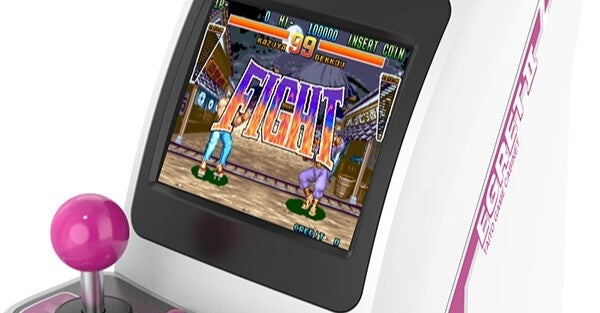
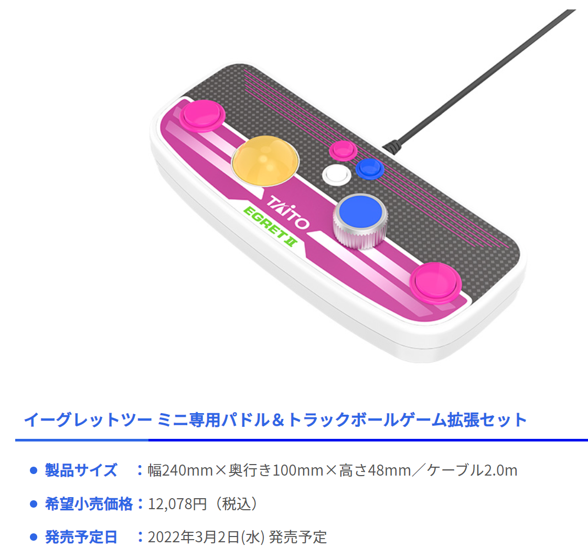

<figure>

</figure>

[https://game.watch.impress.co.jp/docs/news/1329265.html](https://game.watch.impress.co.jp/docs/news/1329265.html)

　タイトーが満を持して（？）世に送り出すミニ筐体レトロゲーム集。僕のTLでは同じぐらいの年代の人が多く盛り上がっていた。

　僕もレトロゲームは好きだが、正直筐体はいらない。もちろん、商売的に言えば、本体を筐体のミニチュアにして、特殊コントローラーを別売りで出せば、より儲かるということだろう。

　しかも、今回は外付けスティック、トラックボール＆パドル、ゲームパッドと、オプション品のラインナップも豊富。かつ、追加ゲームをSDカードで供給できるということで、売る気満々のミニ筐体商法だ。

　ここ数年のタイトーのレトロゲーム商売は、押しなべてこんな感じで、今回も、ああまたか……という感は否めない。

　いや、そんなことを批判しようと思ったわけではないのだが、少なくとも、今のプレイヤーがゲームとして楽しみたいのであれば、一番遊びやすいのは、主要な家庭用ゲーム機現行機種用にソフトウェアとしてリリースすることだ。（まあ、タイトーは家庭用移植もガラクタ特典商法でえげつない価格設定をしてきて閉口しているわけだが）

　で、何がいいたいかと言うと、果たしてこれだけオプションコントローラーを用意して、アーケードゲーマー向けにどの程度の満足感を実現できるのだろうか、ということである。

　例えば、前述したパドル＆トラックボール。全幅240mmの筐体にトラックボールが収まっているわけだが、サイバリオンをプレイするのに耐えられる品質なのだろうか。コントローラー本体が動いてしまった遊びにくいのではないか。

　パドルの方も、プラっぽい質感で、たぶんプラなんだけど、恐らくアルカノイドのパドルのような重厚感は実現できないんじゃないだろうか。アイテム「B（ブレイク）」が出現したときに、緊急脱出とばかりにパドルを勢いに任せて回すのだが、ゲーセンの専用パドルは、あの重さがはずみ車の役目を果たして自機バウスを高速で動かせたのだが、そういうプレイスタイルにまで対応できるのだろうか。

　難癖をつけるつもりではないのだが、とにかく、この手の製品は不安ばかりである。以前セガから出たアストロシティミニが、いろいろなところで不十分な製品だった（そのせいで購入を見送った）ため、どうしても後続の商品にも不安を感じてしまう。

　それはともかく、リリースされるゲームのラインナップが明かされないのも不満な点ではある。おそらく、過去のミニゲーム機と同じような手法のプロモーションを取っているのだろうが、到底安心して予約できない。比較的好評だったメガドラミニでさえ、もったいぶって動画配信でプロモーションしていたが、個人的にはああいうのは好きではない。

　そんなわけで、全然予約しようという気持ちが起きずに、また見送っている。自分の話をすると、ゲームは好きだが、あのゲーセンに置いてあった筐体そのものには、それほどロマンを感じていないというのが正直なところだ。アーケード筐体は、ゲームを遊びやすくする箱に過ぎない。プレイしやすければ、別の形の装置があってもいい。そんな思いだ。

　こんなこと書いていると、「レトロゲーム好きじゃないんでしょ」と言われてしまいそうだが、そうかもしれないし、そうでもないとも言える。

　もうしばらく様子を見ようか。
