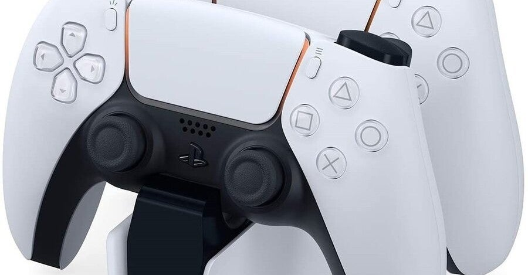

<figure>

</figure>

　すごく久々にゲームとか売ってる店へ行った。タイトルの通り、デュアルセンスの充電スタンドを買うためだ。

　この手の充電スタンドってやつを買うのは初めてだ。これまでもワイヤレスコントローラーを使うゲーム機は何台も買ってきたが、コントローラーの充電スタンドというのは買ったことがない。

　PS5でも、別に本体にUSBケーブル差して、そこにコントローラーつなげておけばいいじゃん、という感じだった。しかし、先日部屋をきれいにしたおかげで、PS5がだらしなく伸びるUSBケーブルが気になるようになってしまったのだ。

　仕方ないので、ソファの下に隠してある、AnkerのUSBアダプタにケーブルを差して、デュアルセンスを充電することにした。ところが、デュアルセンスはAnkerのUSBアダプタでは充電できないのだ。どういうことなのか。

　難しいことはよくわからないが、少し前に買った、ソニーのグラスサウンドスピーカーに付属のUSBアダプタをつないでみると充電できる。同じソニーだから？

　そんな感じで、デュアルセンスを充電するためには、ソニーのアダプタを用意しなければならなくなってしまった。それならということで、充電スタンドを買って、ソファの横の目立たないところにコントローラーを据え置きできるようにしたのだ。

　結論から言うと、デュアルセンスを充電スタンドに置くことで、USBケーブルをただ伸ばして放置してあるより、ずっと見栄えがよくなった。ゲームで遊んだあとは充電スタンドに戻すので、ケーブルの接続忘れで充電されていないということもなくなった。ついでに言えば、この前デュアルセンスを修理に出している間に2台目を買ってしまったので、ふたつのデュアルセンスを置いておくのに丁度いい。

　なんとなく、目的と手段と入れ替わっている感がなくもないが、まあ、部屋がきれいに保てるならいいことだろう。

　しかし、コントローラーの故障の件と言い、充電可能なアダプタと言い、結局スタンドを買ってしまったことと言い、ここのところずっとソニーにやられっぱなしのような気がしている。別にいいんだけど、ここまでソニーべったりになっているんだから、ユーザー満足度高いサービスを頼むよ。
