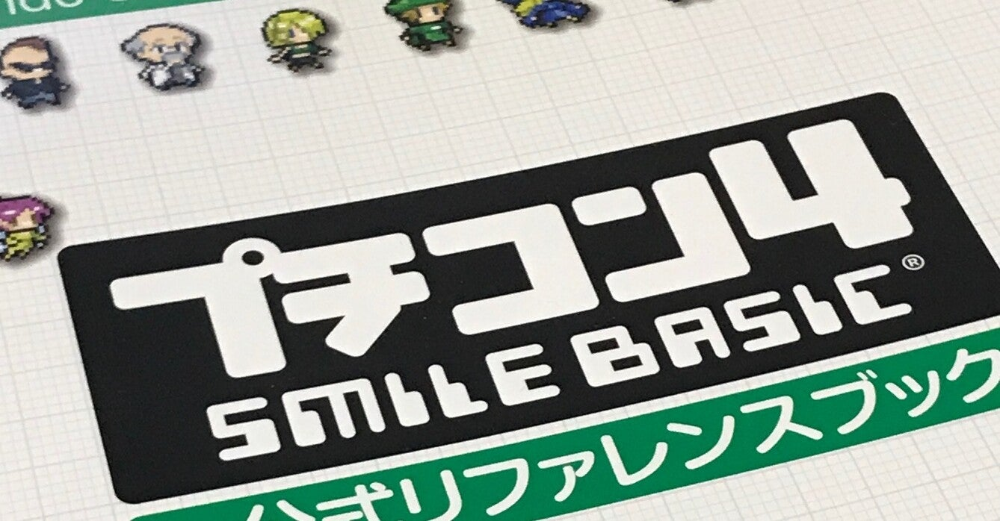

<figure>

</figure>

　『プチコン4 SmileBASIC 公式リファレンスブック』という書籍があったので購入、去年の12月ぐらいに出た本らしいが、存在を知らなかった。

　『プチコン』は、10年前にニンテンドーDSiのソフトとして発売された、ゲーム機上でBASICを使ったプログラムが作れるというソフトだ。その後、3DS、WiiUとプラットフォームを変えながら新バージョンがリリースされ、いまは任天堂Switch用に『プチコン4』が販売されている。

　僕も毎回リリースの度に、この『プチコン』を購入しているのだが、ちょっとスプライトを動かしてみては満足して放置してあった。しかし、こんなリファレンスブックを見て、少しなにか作ってみようかなと思ったりしている。

　その昔、小学生の頃にPC-8001のBASICに触れたところから、コンピュータとの付き合いが続いているような感じなのだが、当時はBASICでゲームを作っても動作おせーなーというのが正直なところだった。

　ところが、最近のゲーム機上で動くBASICは非常に高速で、世に出ているプチコン製のゲームを見ても、市販のゲームと比較して遜色ない動作を見せてくれるようなものも多い。

　働くようになってからは、さすがにBASICには触れないでしょう、と思いきや、Excel VBAなどを未だに便利に使っていて、どうやら一生BASICとの付き合いは切れないのかも知れない。

　さて、それはともかく、今回手に入れたのはただのリファレンスなので、『プチコン4』に搭載されているSMILE BASICの命令や仕様が書かれているだけだ。でも、さんざん付き合ってきたBASICだ。こういうリファレンスで十分。プログラムを作る助けにはなるだろう。

　そんなわけで、お盆休みにでもちょっと何かやってみようと思う。それまでリファレンス見ながらお勉強かな。こういうのも楽しいよね。
