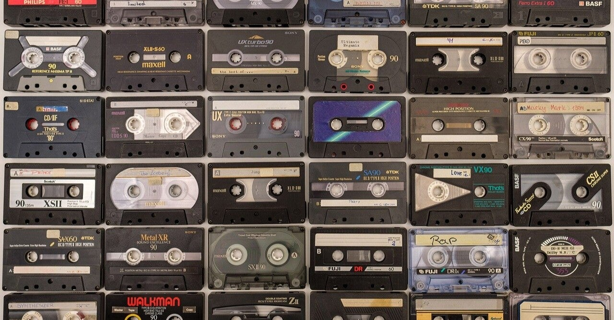

<figure>

</figure>

　学生の頃から音楽を聞くのが好きで、その音楽を聞く環境も金が無いなりに工夫して構築していた。

　学生の頃使っていたCDプレーヤーは、バイトした金で買ったLDプレーヤー。アンプは友人からもらったAM/FMチューナー付きの当時ですらビンテージなステレオアンプ。スピーカーは、これまた友人からもらった全高120cmほどの巨大なスピーカー。見た目には、立派なオーディオシステムだ。

　考えてみると、自分の実家もリビングにはレコードプレーヤーとか、時代が新しくなるとミニコンポが置いてあった。主に父親が日々レコードを聞くのに使っていた。

　社会人になってから数年は、少しずつオーディオ機器をアップグレードして、レコードプレーヤーも新規に買ってみたり、当時出たばかりのMDプレーヤーも導入してみたり、いろいろと揃えたものだ。

　ところが、今はどうだ。リビングどころか、家の中にいわゆる昔ながらのオーディオ機器は1台もない、その昔は左右にドーンと鎮座していたスピーカーもない。それどころか、CDを再生する機器もない。一応リビングに大型モニターを置いてあるので、それ用にサウンドバーを設置しているが、音楽を聞くのは主にBluetoothスピーカーだ。

　少し前まではゲームをやるためにモニターの左右にPCスピーカーを置いていたのだが、それもすっきりしないので撤去してしまった。音楽を聞くのが好きと言いながら、こともあろうにステレオで音楽を聞く環境をすべて無くしてしまったのだ。

　しかし、なんかこれで用が足りているのかな、という気がしてきた。もちろん、部屋に巨大オーディオ機器でビル建築をするかのようなピュアオーディオの世界にはそれなりの満足感はあるのだろう。でも、自分にはそういう大仰なものはいらないなという結論に達してしまったのだ。

　いいオーディオで聞く、いい音にはそこでしか得られない感動があるだろう。でも自分にとっては、音楽はいわゆる音のよさに感動するという体験ではなく、音楽そのもの、メロディやフレーズ、そしてギターソロ（！）に感動するもののようだ。

　と、言いつつ、まだまだCDは結構残っているので、現状まったく聞けないのはときどき不便なこともある。どうしてもCDを聞きたいときは、Macbook Proにドライブを繋いで、リッピングしてから聞いているのだ。それもどうかとは思うものの……
