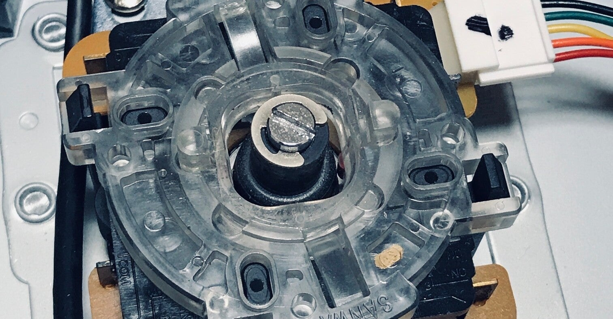

<figure>

</figure>

　今使っているアーケードスティックは、HORI製のRAP V4 隼というモデルだ。これは、PS4でアーケードアーカイブスがリリースされると聞いて、ゲーセンに近い操作性を実現するために購入した。

　最初のアーケードアーカイブス『クレイジークライマー』がリリースされたのは2014年5月なので、実に7年以上使っている。ボタンとレバーは三和製に交換して、歴代のアーケードスティックの中でもお気に入りの1台だ。

　そして、今もこのアーケードスティックの操作性に特に不満は感じていないのだが、PS5時代に突入して困ったことが出てきた。

　それは、PS4時代からコントローラーに搭載されたタッチパッド機能がないことだ。実は、PS4のゲームでは、隼のL3/R3ボタンを同時押しすることで、タッチパッドを押下した動作を擬似的に実現している。

　ところが、PS5になってから、このタッチパッド機能が使えなくなってしまったのだ。

　アーケードアーカイブスでは、オプション設定に入るにはタッチパッドが必要だ。また、先日発売された『カプコンアーケードスタジアム』では、R3押下でクレジット投入、タッチパッドでゲームスタートというボタンアサインがなされている。しかも、これらはオプションで別ボタンに変更することはできない。

　そんなわけで、現状ではタッチパッドが必要になると、いちいちコントローラーに操作を切り替えてタッチパッドを押している。実に面倒だ。

　そんな理由から新しいアーケードスティックが欲しくなったというわけだ。隼も、僕の持っているモデルの次のバージョンからはタッチパッドを備えている。というか、今のHORI製アーケードスティックはすべてタッチパッド機能が備わっている。

　そりゃあ、一番アーケードスティックを使いそうなアーケードアーカイブスがタッチパッド必須となれば、当然HORIとしてもアーケードスティックにタッチパッドをつけないわけにはいかなかったのだろう。もう少し待ってから買えばよかったぜ。てか、最初からタッチパッドつけろよな。

　一応、欲しいアーケードスティックには目星をつけてあって、最初はビューリクスタイプのアーケードスティックが欲しいと思ったのだが、残念ながらこちらは生産終了。そこで、今の最有力候補には『ファイティングエッジ刃』を考えている。

　ちょっと本体が大きい感じだが、無骨な筐体にシンプルに配置されたレバーとボタンが美しい。どうやら、三和やセイミツの部品に交換することも可能なようだ。

　ただ、気軽に買うにはちょっとお高いので、カードの締日を1回見送ってから買おうかと思っている。そしたら、久々にレバーとボタンの換装をしよう。

　まあ、それぐらいアーケードスティックは使っているので、ここらで新調するのもいいだろう。

[https://hori.jp/products/p4/fe4/](https://hori.jp/products/p4/fe4/)
