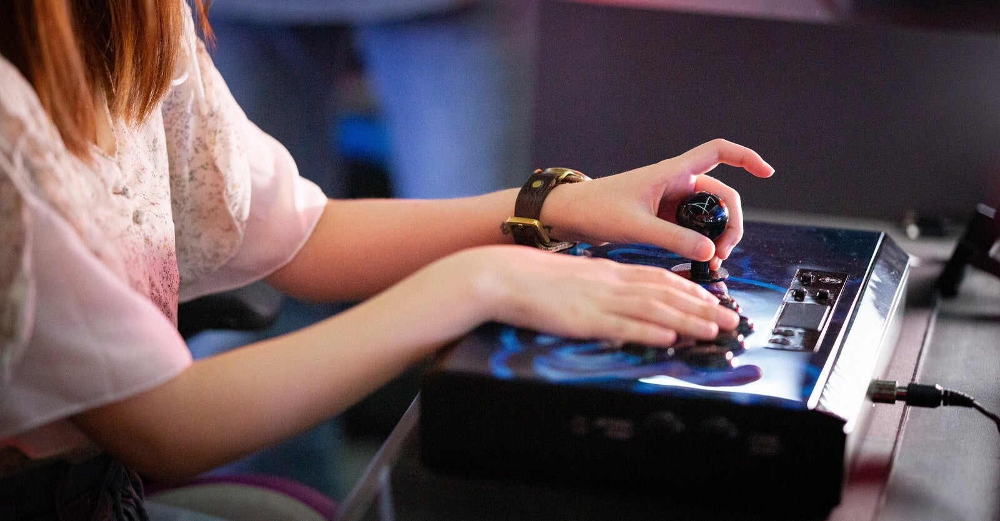

<figure>

</figure>

　普段、リビングでゲームをしている。自室もあって、基板で遊べる環境とかはそこにセッティングしてあるのだが、最近は99.9%家庭用ゲームで遊んでいる。

　そんなわけで、ほとんどリビングでゲームをしているのだが、ゲーム機のコントローラを握ってゲームで遊んでいると、そのコンパクトさがすごくありがたい。無線のコントローラが普通になって、コードの取り回しを気にしなくてよくなったのも、すごく快適なゲーム環境を作り出している。本当にいい時代になった。

　ところがである。昔のアーケードゲームをプレイするとなると、事情は変わってくる。たとえ今のゲーム機であっても、本格的にレトロゲームをプレイするときはアーケードスティックを取り出してくる。これが難物だ。

　まず、ほとんどのアーケードスティックは有線方式だ。これがリビングを無神経に横断し、見た目も悪い上に邪魔になる。そして、巨大で重量感のアーケードスティックをどこかに置かなければならない。

　しかし、リビングのテーブルを無垢材のいい感じのやつに新調した今、重量級のアーケードスティックをその上にどすんと置くのは憚られる。かと言って、折りたたみの（あの足がパタンとたためる）ミニテーブルでは安定感に欠ける。

　さて、一体アーケードスティックをどこに置いてプレイするのがいいのか。よく、プロゲーマーなどが膝（腿？）の上にアーケードスティックを置いてゲームをプレイしている写真を見かけるのだが、それは最も安定しないスタイルではないのか。

　そんなことを思いながら、とりあえず置く場所がないので、膝上プレイを試してみる。

　あ、あれ？　これ意外に安定するのかな？　うん、アーケードスティックの重みがあるので、一見して安定しない膝の上でも安定性は確保できる。しかも、テーブルなどに置いたときと違って、無駄に腕を伸ばさなくて済むので、長時間プレイしても二の腕が疲れたりはしない。

　なるほど。プロゲーマーがやっているスタイルだけあって、それほど悪くないプレイスタイルなのかも知れない。

　というわけで、当面は膝上アーケードスティックスタイルでゲームをプレイしてみることにする。

　なんか、リビング意外にゲーム部屋を作ればいいのかも知れないけどね。ソファのあるリビングが一番落ち着くんだよね。
