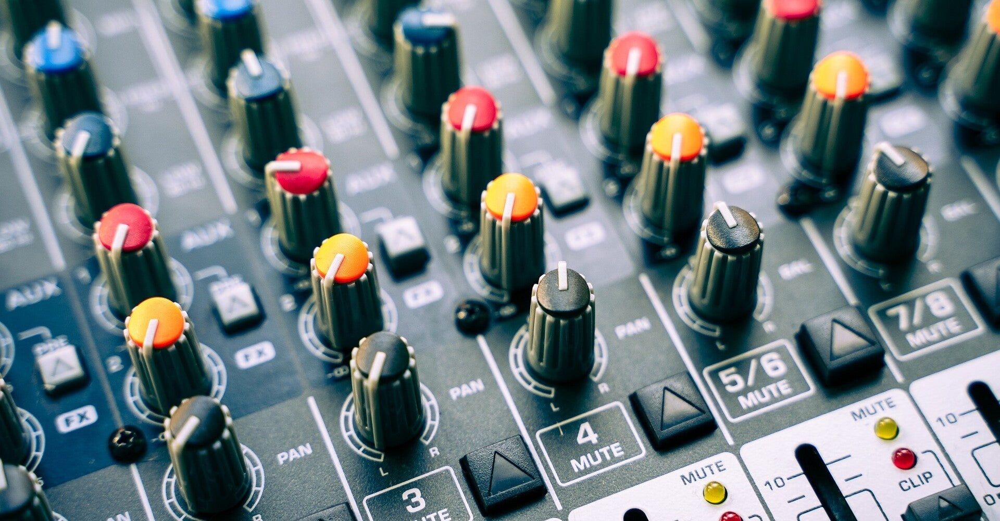
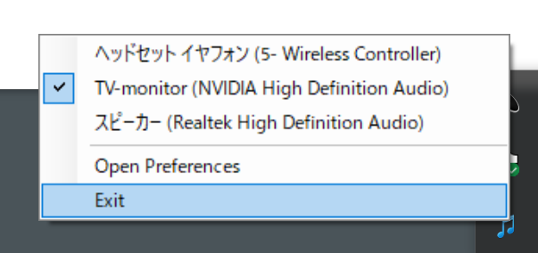
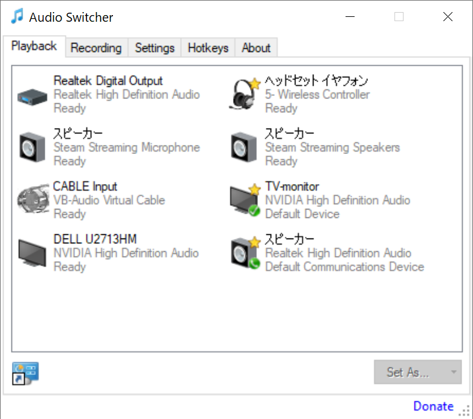
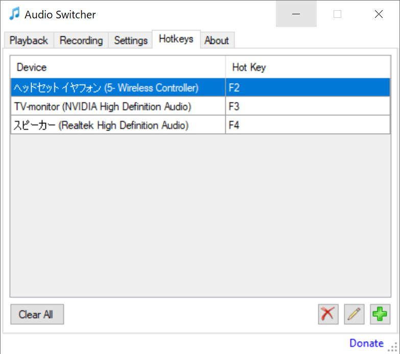

<figure>

</figure>

　PCでサウンドを出力するデバイスを切り替えるのに、『Audio Switcher』というフリーソフトを使っている。

　オンラインゲームでマッチング待ちのときにスピーカーから音を出して、マッチングの状況を聞いているわけだが、ゲーム中はヘッドホンで音を聞いている。

　そうすると、オーディオデバイスの切り替えが必要になるのだが、Windowsでデバイスの切り替えがひと手間なのは、経験のある人ならよく知っていることだろう。

　この切り替えを、なるべく簡単にしようというのが『Audio Switcher』だ。

[https://audioswit.ch/er](https://audioswit.ch/er)

　作者は、ニュージーランドのSean Chapmanって人で、このソフト専用のサイト作っていてわかりやすい。

　『Audio Switcher』を起動すると、タスクトレイに常駐し、右クリックで出力デバイスを切り替えられる。

　また、お気に入りのデバイスを登録することで、タスクトレイをクリックすることで、出力デバイスを順番に切り替えられる。

　お気に入りデバイスをホットキーに割り当てることで、ショートカットキーで切り替えることもできる。

　たったこれだけの機能のシンプルなソフトなのだが、これがあるだけで、オーディオデバイスの切り替えがものすごく楽になった。特に、最初に書いたゲーム中の素早い切り替えが楽で、それだけでゲームのプレイ環境が飛躍的に向上したように感じる。

　以前は、モニター接続の関係上、スピーカーとモニターに接続したヘッドホンから同時に音が出ていたので、こういう切り替えはいらなかったのだが、新しいモニターにヘッドホン端子がないので、こんな苦肉の策を取っている。

　本当は、モニターから出力されている光デジタル出力を分岐して、スピーカーとヘッドホン（アンプ）に同時出力すればいいんじゃないかと思っていたのだが、こちらの方がシンプルかつ余計な機器がいらないので、もうこれでいいかなと思っている。なんと言ってもフリーソフトだしね。

　とは言え、件の専用サイトには、寄付も歓迎と書いてあったので、しばらく使って安定動作が見込めればDonateしておこうかな。
