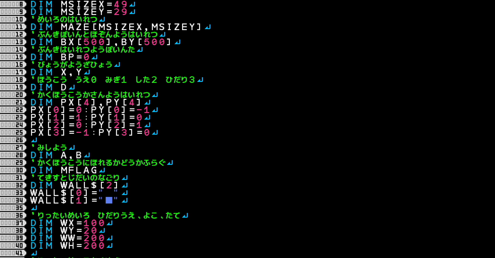
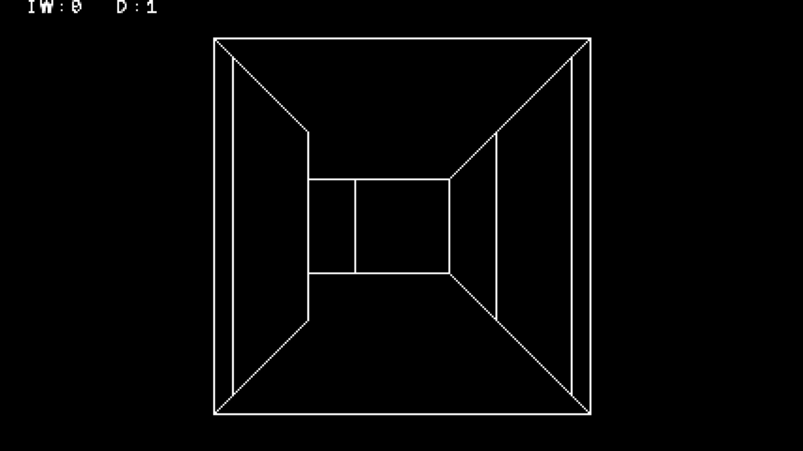

<figure>

</figure>

　ついこの前、『プチコン4』で何か作ろうかな、なんて話題を書いていた。

[https://note.com/keigox68000/n/n22e660ea12c1](https://note.com/keigox68000/n/n22e660ea12c1)

　で、早速色々いじっているんだけど、意外にも2年ぐらい前にも同じことを思って作りかけていたファイルが残っていた。自分でもこんなの忘れていたよ。

　いくつか作りかけみたいなプログラムがあったんだけど、その中で3D表示の迷路なんてのが出てきて、自分でも笑ってしまった。

　画面見て、どんだけウィザードリィ好きなんだと思わずにはいれない。なんか、このワイヤーフレーム風の迷路表示が好きで、自分でもやってみたくなったに違いない。

　一応、最初に迷路を生成するんだけど、その様子を画面に描画して見せて、それから3D表示に切り替わるというプログラムだった。本当に何もかも忘れていた。

　で、もしかして……と思ってツイッターを掘り返したら、動画でもアップしていた。

[https://twitter.com/keigox68000/status/1141675070185603074](https://twitter.com/keigox68000/status/1141675070185603074)

　うーん、どうやら定期的に何かプログラム作りたくなる病気みたいのを持っているようだ。そして完成しない。

　まあ、今回の何か作ろう！　も中途半端に終わる可能性は大きいのだが、どうやら作っているときに様々な知見があったようなので、それは忘れずに残しておこう。

　プチコンにpush,pop命令は用意されてるらしいぞ。  

[https://twitter.com/keigox68000/status/1141697760501960704](https://twitter.com/keigox68000/status/1141697760501960704)

　何かできあがるといいね。
