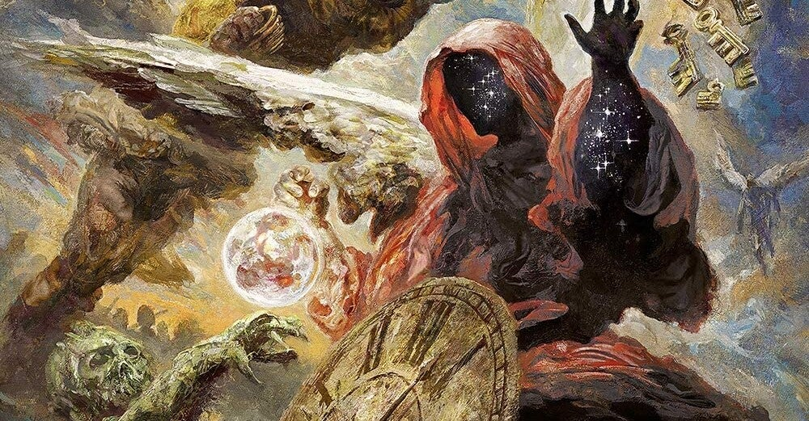

<figure>

</figure>

　僕らのハロウィンが帰ってきた！　前作『MY GOD-GIVEN RIGHT』から6年。なんとバンド名をタイトルに掲げての凱旋だ。

　アルバムジャケットのデザインは、TESTAMENTなどの重厚なジャケット絵で知られるエリラン・カントール。（若干無理矢理だけど）守護神伝を予感させる濃密なアートワークはこれぞヘヴィメタルと言わせるだけのエナジーに満ちている。

[https://www.elirankantor.com/](https://www.elirankantor.com/)

　なんと今回のアルバムは、数年前に企画されたパンプキンズ・ユナイテッドの布陣そのまま。マイケル・キスクとカイ・ハンセンを加えた7人編成でのアルバムだ。よくマイケル・ヴァイカートが許したな。いや、大人になればみんな丸くなる。カイ・ハンセンもマイケル・キスクもすっかり丸くなった。まるで別人だ。

　思えば、3年前のパンプキンズ・ユナイテッドのライブを見に行ったのが、僕にとっての最後のライブとなっている。あのときのメンバーでアルバムまで出してくれたことはファンとして嬉しい限りである。

　肝心のアルバムの中身だが、1曲目"Out For The Glory"からマイケル・キスクらしいメロディラインが炸裂する。かつて（ハロウィン風）ジャーマンメタルがメタル界を席巻した頃の、ちょっと危なっかしいハイトーンヴォーカルで突っ走る閃光のスピードメタルが蘇る。

　続く2曲目"Fear Of The Fallen"はいかにもアンディ・デリスらしい潤いのあるメロディが魅力的な佳曲。考えてみれば、マイケル・キスクがハロウィンの顔と思っていた時代より、PINK CREAM69から電撃移籍したアンディ・デリスがヴォーカルを担当していた時代の方が遥かに長いのだ。ファンにもしっくり来るいつもハロウィン節だろう。

　注目したいのはマーカス・グロスコフのペンによる7曲目"INDESTRUCTIBLE"。ハロウィンのオリジナルメンバーであるマーカスの曲を、なんとアンディ・デリス、マイケル・キスク、そしてカイ・ハンセンの3人で歌っているのだ。こういうナンバーをラインナップしてこそのパンプキンズ・ユナイテッドだ。カイ・ハンセンの歌唱力は相変わらずだけど。

　そしてアルバムはカイ・ハンセンの"Skyfall"で幕を閉じる。ラストまでハロウィンらしい疾走感と希望に満ちた、彼ららしいサウンドだ。カイ・ハンセンはどこにいてもカイ・ハンセンだ。そしてマイケル・キスクのヴォーカルも、この楽曲にはしっくり来る。

　そう考えてみると、カイ・ハンセンもマイケル・キスクもいなくなり、初期の頃とは変わったと思っていたハロウィンだが、旧メンバーと現体制のサウンドの親和性は実に高く、それがうまくミックスされたアルバムが、この『HELLOWEEN』なのかもしれない。

　欲を言えば、かつてのキラーチューンのような勢いも欲しいところだが、その分は楽曲の完成度で勝負のアルバムだろう。円熟の極みのメタルサウンド。我らのハロウィンが帰ってきた。

[https://open.spotify.com/album/6ZOpyAm1HCU9Z0aRSLMPnn?si=7uiKRr0XTWu2MHknc9ut7w&dl\_branch=1](https://open.spotify.com/album/6ZOpyAm1HCU9Z0aRSLMPnn?si=7uiKRr0XTWu2MHknc9ut7w&dl_branch=1)
