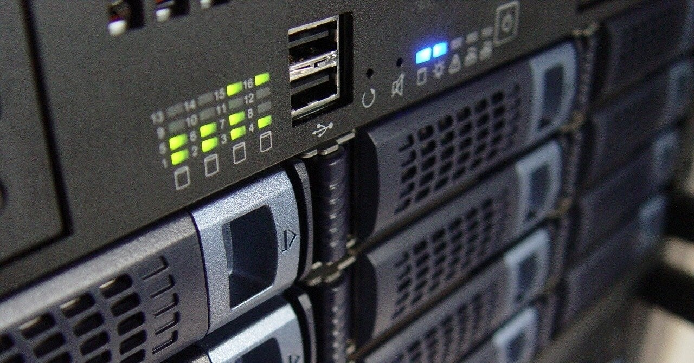

<figure>

</figure>

　先月、NASを買いたいという話を書いた。

[https://note.com/keigox68000/n/n9ebd2b7172c3](https://note.com/keigox68000/n/n9ebd2b7172c3)

　あれから1ヶ月ぐらい経つので、そろそろ機種選定に入っている。そうなると、容量はどれぐらい必要か考えなければならない。そこで、今使っているサーバの中身を見てみた。

　これがなんと、400GBしかファイルがない。拍子抜けだ。いや、正確には、別HDDに写真と音楽が結構保存してあるので、全部合わせれば1TBは超えると思う。うん、たぶん。

　いずれにしても、20年以上ためてきたと思ったデータなんて、わずか500GBにも満たなかったということにショックと動揺を隠せない。いや、そんな大袈裟なものじゃないか。

　しかし、これで話は早くなった。写真と音楽とわずかなデータ類を合わせても、３TBのHDDを2台で運用すればいいだろう。冗長化に重きを置いて、RAID1で運用するつもりだが……もしかしたら、2TBを2台でRAID0という選択肢もあるのかもしれない。

　と、同時にバックアップもどうするか考えないといけない。NASに外付けHDDを接続して、そこにバックアップする方法が一番シンプルで、復旧がしやすいのかもしれない。

　なんて、いろいろと考えている間が楽しいのである。いずれにしても、今使っているサーバが10年になろうかという状況で、緊急ではないとは言え、早々に新しいシステムに移行したい。

　さて、肝心のNASはどれにしようか。Synologyかな。思わずSynologyのサイトで初心者ガイドをダウンロードして読み込んでしまった。どうにも気が早いのである。

　そんなことを考えているこの2,3日であった。たかがデータ保存に何を浮かれているのやら。
