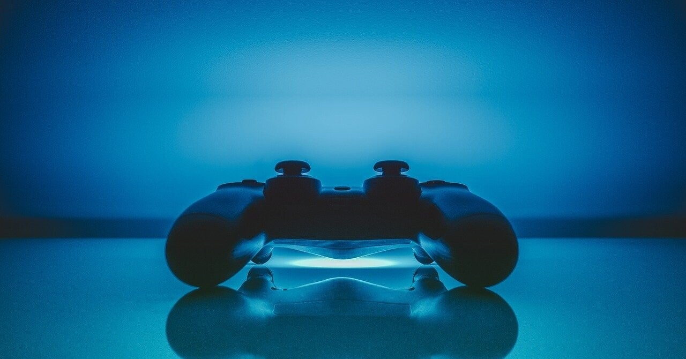

<figure>

</figure>

　ふと所有していた歴代ゲーム機のコントローラーに思いを馳せたりする。

## ファミコン

　友人の家に四角ボタンのファミコンがあって、「これって初期型なんだって」「へー、貴重だね」「でも押しにくいよね」「うん」なんて話していた。コードが短いので、対戦でエキサイトすると本体ごと引っ張ったり。

## PCエンジン

　本体が白くておしゃれなPCエンジン。コントローラーも白を基調としていておしゃれだった。スタートボタンがRUNボタンっていうのもコンピュータっぽくてかっこいいよね。でも連射したくて買ったターボパッドは、グレーのなんだか野暮ったい色になってしまっていた。

## メガドライブ

　メガドライブのコントローラーは、十字ボタンが誤入力するというもっぱらの噂だった。しかし、生産国によって違いがあり、中には誤入力しない強パッドあったらしいが。

## スーパーファミコン

　この頃になると、グレーの機器は最新のイメージだった。なんでそんなこと思っていたんだろう。でも、スーファミの４つのボタンとLRは使いやすかったよ。

## プレイステーション

　プレステの頃も、グレーが高級品のイメージを持っていた。コントローラーの形が未来っぽいのもゲーマーにとって驚きだった。こんな形状で持ちやすいのか！？　持ちやすいんだよ、これが。

## セガサターン

　セガサターンもグレー。ホントに各社灰色病に取り憑かれていたんだ。一方コントローラーは、メガドラよりつやつやしていて安っぽくなったんじゃない？　という印象のセガサターン。こんなコントローラーでバーチャファイターやダライアス外伝ができるかー！

## ニンテンドー64

　ロクヨンのコントローラーはそれ単体で発進して宇宙まで行けそうなデザインだ。あまりに先進的すぎる。しかも、大昔のテレビゲーム機みたいに、短小ジョイスティックがついているんだ。こんな形でゲームできるのかよ。これで操作性いいところがさすが任天堂。

## ドリームキャスト

　ロクヨンに続いて、でかけりゃいいって発想のコントローラーシリーズ。しかも、液晶表示のついたメモリーカードまで差し込めちゃう。なんか、任天堂の影響でアナログスティックは必須みたいになっていたよね。この頃からコントローラーの単価は高くなってきたような気がするよ。

## プレイステーション2

　黒いボディのプレイステーション2。ミッドナイトブルーのアクセントもクールでかっこよかった。コントローラーもプレイステーションの形状を継承しながら、黒一色でかっこよかったなあ。そのうち本体のドライブが故障してディスク読み込まなくなるんだけど。これはコントローラーと関係ない話。

## ゲームキューブ

　ロクヨンの後継機ということで、任天堂がどんなコントローラーを出してくるか話題になっていた。レバーやボタンはロクヨンに準じながら、コントローラーの形状はカニみたいだった。今も使われる個性的かつ優秀なデザインのコントローラーだったね。

## XBOX

　舶来品という感じの巨大戦艦。それがXBOX。てか、デカすぎるだろ。コントローラーもずっしりと重量感あるイメージで、ある意味XBOXのゲームにふさわしい見た目のコントローラーだった。

## XBOX360

　初代XBOXからリファインされた洗練のコントローラー。それがXBOX360コントローラーだ。流線型のデザインもスマートで、これぞ新時代のゲーム機というイメージで、もしかすると歴代ゲーム機のコントローラーの中でもっとも愛用したんじゃないかな。今でもときどきPCにつないで遊ぶときがある。

## プレイステーション3

　なんか、代わり映えしなくなってしまったソニーのコントローラー。いや、代り映えしないんじゃなくて、デザイン的にはプレイステーションのときにゲームコントローラーとしての形が完成されていたのだろう。でも、長い間使っていないとプラが劣化して確実にぶっ壊れるんだよね。プレステ3のだけ壊れるのはなんで？

## Wii

　モーションセンサーを内蔵した、またまた世代交代したと思わせるコントローラー。しかも、右手のWiiリモコンと、左手のヌンチャクでセパレートになっているのが、なんだか人間工学デザインでかっこいいぞ。Wiiリモコンはガンコンになるのもよかったよね。でも、センサーバーが必要なのが微妙に面倒だったり。

## Wii U

いよいよ、コントローラーも大画面時代。巨大な液晶モニターを内蔵したコントローラーは、ゲームの二次的な情報を表示する使い方もできてとっても便利。単体でゲーム機として機能するのも便利だった。でも、ボタンが壊れただけで、でかい画面のついたコントローラーごと修理に出さないとダメなんだよね。

## プレイステーション4

　安定のデュアルショック。すっかりゲーム界の古参コントローラーになった感じ。最近品薄でみんな困ってるよ？

## XBOX ONE

　期待のXBOX360後継コントローラー。と思いきや、購入後1ヶ月しないで故障。しかもwebからコントローラー単体で修理受け付けられず、手詰まり。もうマイクロソフトのコントローラーは信用できなくなりました。

## 任天堂スイッチ

　Wii Uの反省を生かしてか、ゲーム機本体から取り外して使えるコントローラーが付属した任天堂スイッチ。携帯ゲーム機にも、ドックに接続してテレビに映しても遊べるのがいい。とか言って、ほとんどプロコンで遊んでるんだけどね。

## プレイステーション5

　コントローラーは進化すると甲殻類の形になる！？　デュアルセンスの先進的なところは、その形状だけでなく、プログラマブルにLRボタンを押したときの負荷を変化させられるところ。『バイオハザード8』では、銃器によってトリガーの感触が違っていて実に凝っている。でも買ってから5ヶ月で故障。仕方なく2台めを買う羽目に。

　本当にいろんなコントローラーと付き合ってきた。これからも僕たちを楽しませるコントローラーの登場を期待したい。
