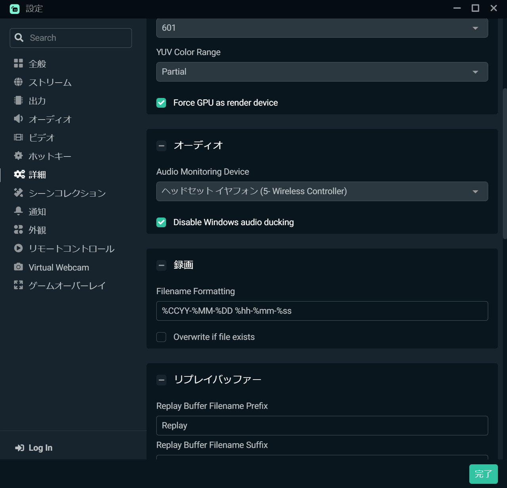

　PCでゲームを遊ぶ際に、どうしてもヘッドホンが必要になるゲームがある。しかし、先日もnoteに書いたように、モニターを新調したらヘッドホン端子がついていない。

　今は、PCにつないでいるプレイステーション4のコントローラー、デュアルショック4にヘッドホンを接続して音を聞いている。いずれにしても、ヘッドホンを繋ぐと、スピーカーからは音が出ない。

　ゲームを遊ぶには困らないのだが、我が家は夫婦で並んでゲームをしているので、できれば見ている人にも音が聞こえると嬉しい。

　最初は、HDMIからの音声をデジタルで分割してスピーカーとデジタル入力できるヘッドホンアンプにでも振り分けようかと思った。それなら、いっそのことデジタルで入力できるヘッドホンアンプを買えばいいじゃないかとも思ったが、実は現行品で適切な（価格も含めて）製品が見当たらない。そもそも、あまり機器を増やすと部屋がごちゃごちゃするので、それは避けたい。

　そんなわけで、仕方なくヘッドホンをつけているときは外に音声を出力するのをあきらめていた。

　しかし、ちょっとした発想の転換で、この問題は解決することとなった。キーアイテムは配信ソフトでおなじみのOBS。これをちょっと設定するだけで、ヘッドホンとスピーカーにおサウンドを同時出力することが可能になった。

　やり方は簡単だった。OBSでプレイしているゲームをキャプチャ。音声をモニターする設定をオンにする。そして、設定の詳細から、例えばヘッドホンをつないでいるオーディオデバイスを選択する。このとき、Windows audio duckingの項目をDisableにしておく。

　なんと、これだけで、Windowsで設定したデバイスで音を聞きながら、なおかつOBSの方で設定したデバイスで音声をモニターできる。

　実際に、少しゲームを遊んでみたが、どうやら遅延もなく良好に動作しているようだ。

　すぐにハードに頼るのではなく、ソフトウェアでなんとかしてみようというのも大事なことかもしれない。

　これで、PCの音声をスピーカー、ヘッドホン両方から出力できたが、PS5やスイッチではまだ同じことが実現できていない。ゲーム機でヘッドホンを使う機会はそれほど多くないが、今後の課題で考えていこう。今回は求めていた動作が簡単に（なおかつコストゼロで）実現できて大満足だ。
