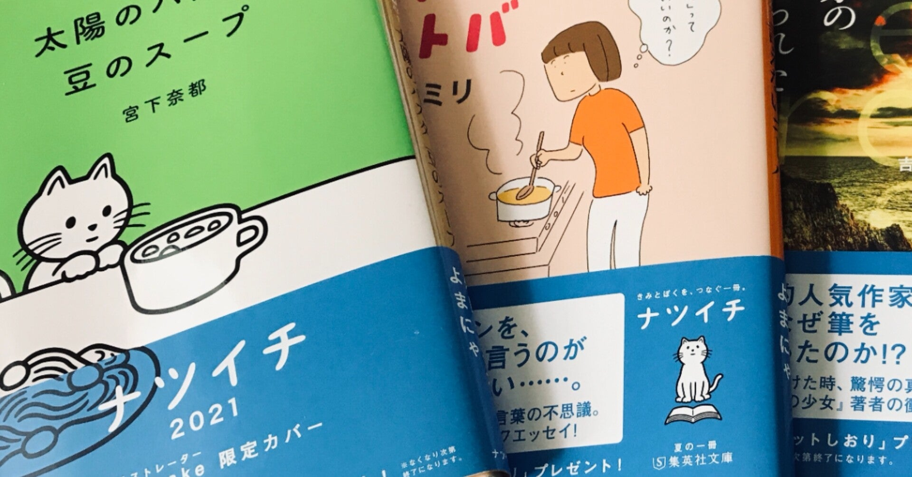
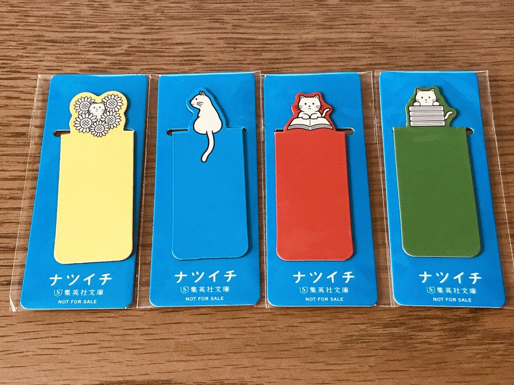
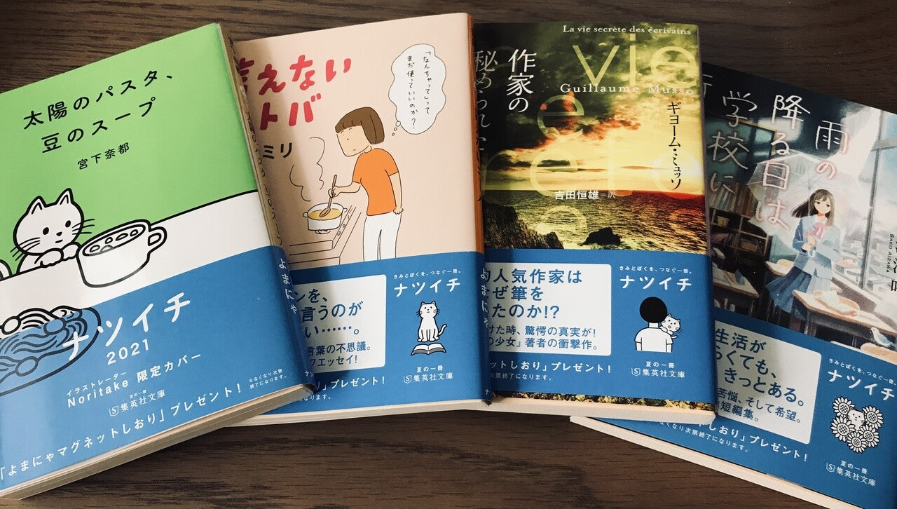

<figure>

</figure>

　毎年夏前のこの時期になると、集英社、角川書店、新潮社の3社が夏の文庫フェアを開催する。それぞれ、ナツイチ、カドフェス、新潮文庫の100冊というタイトルで文庫本をピックアップし、特典を付けて売り出すという内容だ。

　各出版社の今年の特典は、集英社がここ数年の流れを踏襲してマグネットしおり。なんとなく年々小さくなってきている気がするが、まあ、去年とはまた違った趣で楽しい。新潮文庫は、7月1日からスタートということで、今の所まだ特典は配布していないが、昨年に引き続きうちわしおり。キュンタのデザインが可愛くて涼しげだ。カドフェスは、去年から店頭での特典配布をやめて、webからプレゼント応募に変わった。今年も何ももらえない。

　一方で角川は、「紙を買うと電子がもらえる」というフェアを行っている。要するに紙の本を買うと電子書籍がもらえるというわけだ。普段紙の本を中心に買っている人間からすると、もうそんなの当たり前にしてほしいところであるが、そういう出版界全体に対する要望は置いておいて、興味があったので1冊買ってみた。

　買ったのは、原田マハの『アノニム』。

[https://www.amazon.co.jp/dp/4041092949](https://www.amazon.co.jp/dp/4041092949)

　電子書籍をもらうための手続き詳細は、帯についているQRコードから読みに行かなければならない。アプリをインストールすると、そこに表示されるお知らせに初めて詳細が書いてある。どうやら、カドカワアプリで会員登録することでebook japanの電子書籍がもらえるようだ。どうせそんなことだろうと思ったよ。あまり利用する予定のないebook japanに個人情報を提供する気もないので、電子書籍をもらうのはやめておいた。

　一方、ナツイチの方は『言えないコトバ/益田ミリ』『太陽のパスタ、豆のスープ/宮下奈都』『作家の秘められた人生/ギョーム・ミュッソ』『雨の降る日は学校に行かない/相沢沙呼』の4冊を選択。今年は厚めの本は避けた。最近読書の時間が少ないのと、去年のナツイチで買った『白夜行/東野圭吾』が読み終わってないからだ。まったくもって面目ない。

　別に夏の文庫フェアの特典をコンプしようというつもりはなかったつもりのつもりなのだが、ここ数年は結局特典を集めてしまったいたりする。まあ、それもいいだろう。とりあえず買った本は読まねば。ネバーギブアップ。

[https://www.amazon.co.jp/dp/4087450260](https://www.amazon.co.jp/dp/4087450260)

[https://www.amazon.co.jp/dp/408746847X](https://www.amazon.co.jp/dp/408746847X)

[https://www.amazon.co.jp/dp/4087607674](https://www.amazon.co.jp/dp/4087607674)

[https://www.amazon.co.jp/dp/408745553X](https://www.amazon.co.jp/dp/408745553X)
