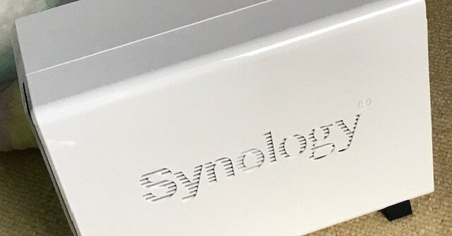
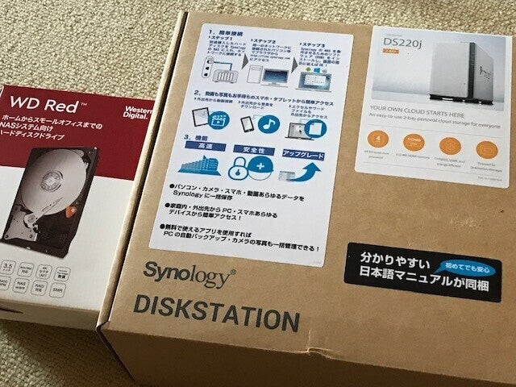
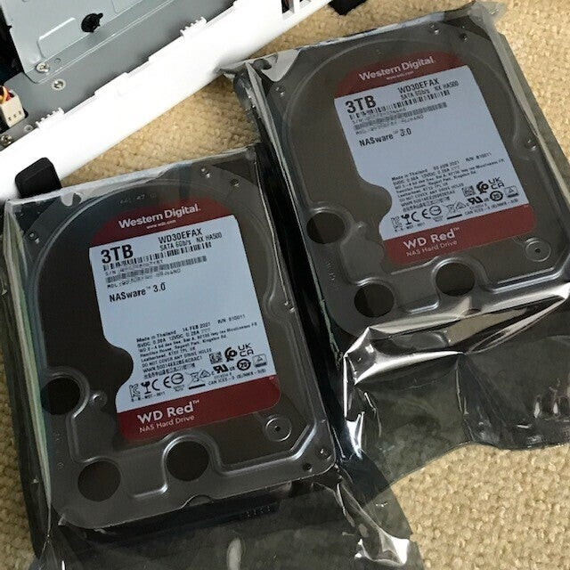
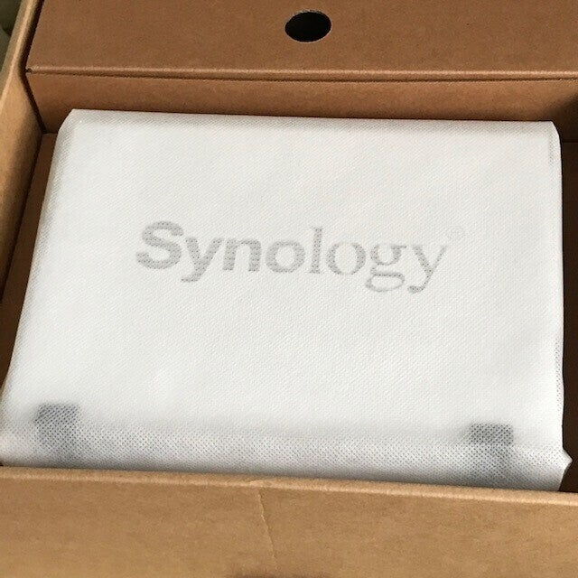
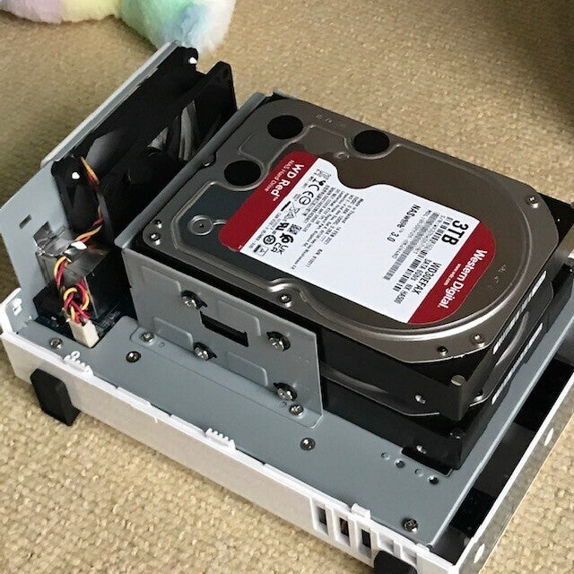
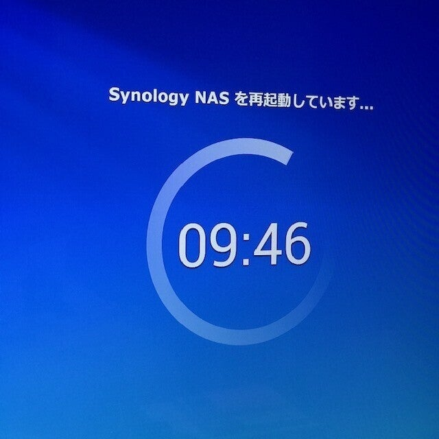

<figure>

</figure>

　というわけで、以前noteにも書いていたNASを導入した。

[https://note.com/keigox68000/n/n9ebd2b7172c3](https://note.com/keigox68000/n/n9ebd2b7172c3)

　ずっとPCやMacでサーバを建てていたので、NASを導入するのは初めてだ。まあ、ファイルサーバで使っているPCとNASにそう大差ないのかもしれない。（一度だけLAN HDDという名称の製品を使ったことがあったけど、それは読み書きが遅くて使いものにならなかった。）

　購入したNASはSynologyのDS220j。スペックとか勘案して選んだのだが、ぶっちゃけ売れていそうなモデルを買った。こういうときに尖った機種を選定しないで、みんなが使っているのを選ぶとトラブル時に情報が多くて助かる。僕のいつものやり方だ。

　HDDの容量は3TBを2台。これをRAID1でミラーリングして使う。ただし、Synologyでは、容量の合っていない複数のHDDを効率良く使うためのSHRという方式がデフォルトで用意されているので、実際はこれを使うことになる。

　簡素なダンボールの梱包を開けると、ちょっとおしゃれな白い筐体が収められている。最近は何でもアップル風（？）のパッケージングが流行っているみたいで笑ってしまうのだが。

　NASにHDDを取り付けるのは簡単だ。NASの筐体を開けてネジ止めするだけ。PCの組み立てとかやったことある人ならなんの問題もないだろう。もちろん、自作PCなんか作ったことなくても全然問題ない。

　HDDを取り付けたら、NASを家の中のLANに接続する。NASを導入しようというような家庭には大抵ルータもあるだろう。IPアドレスもDHCPで配布してくれるので問題ないはずだ。

　同じLANに接続されているPCからNASのURLに接続すると、セットアップが始まる。ここでブラウザ上からNASを管理するためのDiskStation Manager（DSM）をインストールしたりする。簡単だ。ただし、設定後の再起動には10分ほどかかった。

　これでNASは使えるようになったわけだが、ここから先は自分なりの使い方に合わせて設定をしていくことになる。僕の場合はファイルサーバとして使うのが主たる目的なので、Windowsマシンからネットワークドライブとしてマウントできるようにワークグループを変更した。

　あとは、このNASの売りの機能であるマルチメディアサーバとしての機能をインストールしてみた。SynologyのNASは、ブラウザ上からDSMというシステムを介して、機能ごとに分割されたアプリケーションをインストールすることで、便利機能を増やすことができる。

　試しに、その昔iTunesを使っていた頃、大量に取り込んだ音楽ファイルをNASに転送してみた。DSMにはメディアプレイヤーの機能もあるのだが、それを通して音楽を聞くことができる。まだ試していないが、スマホからも聞くことができるようだ。

　さて、これで無事にNASを導入することができた。古いサーバのデータをどうやって残していくかということは、ここ数年の懸案事項だったので、ようやくスッキリした思いだ。

　あとは、データの移行を行っていかなければならない。きっとこれに時間がかかることだろう。そして、最大の山場は、MacのApertureで管理していた写真をどうやって移行するかである。まだまだやることは多そうだ。（ちょっと楽しい）
