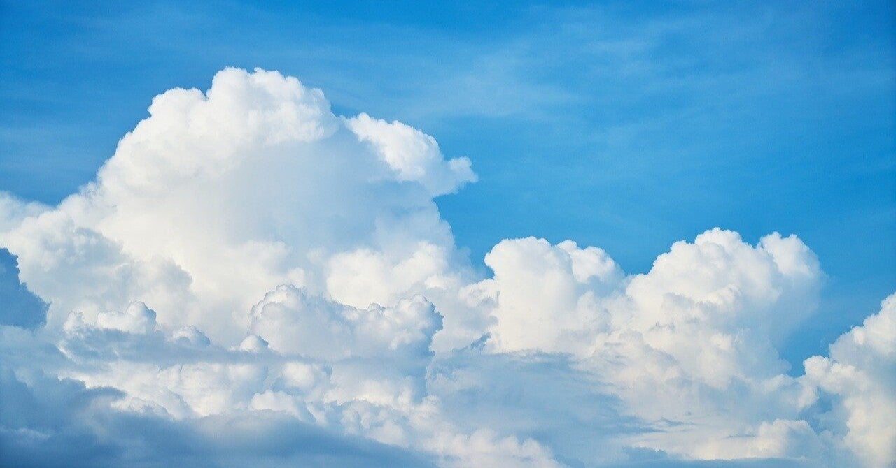

<figure>

</figure>

　梅雨入りしたとは言え、雨は疎らに降り、ときおり胸のすくような青空が広がる。

　夏を間近に控えたこの時期の晴れ間は、ときとして厚い雲を伴って我々の前に姿をあらわす。その真っ青な空に、くっきりと白い雲が積み重なるさまは見ていて実に心地よい。

　学生時分はよく、こういう晴れた日に河原へ行った。河原へ行って弁当を食べる。ただそれだけのことが、本当に気持ちよく、開放的な気分になれるのだった。ついでに言えば、午後の講義は自主休講。後は野となれ山となれ。

　思えばそういう自由な日々を謳歌することもなくなった。それどころか、天気が晴れていようが、雨だろうが、とりあえず目の前の仕事をこなすことが第一。当然河原に行くなんて思い立つこともない。無味乾燥な毎日だ。

　などと書くと、分別にある大人っぽいが、実は全然そんなことはない。大人は大人で別の楽しい毎日を過ごすやり方がある。学生の頃の遊び方とはもちろん異なるが、今は今でこの貴重な青空を楽しんでいる。

　そんなわけで最初の話に戻るわけだ。朝の通勤時間に、頭上に広がる青い空と白い雲。そのコントラストだけで今日も生きていける。次の休日には河原へ行ってみよう。
