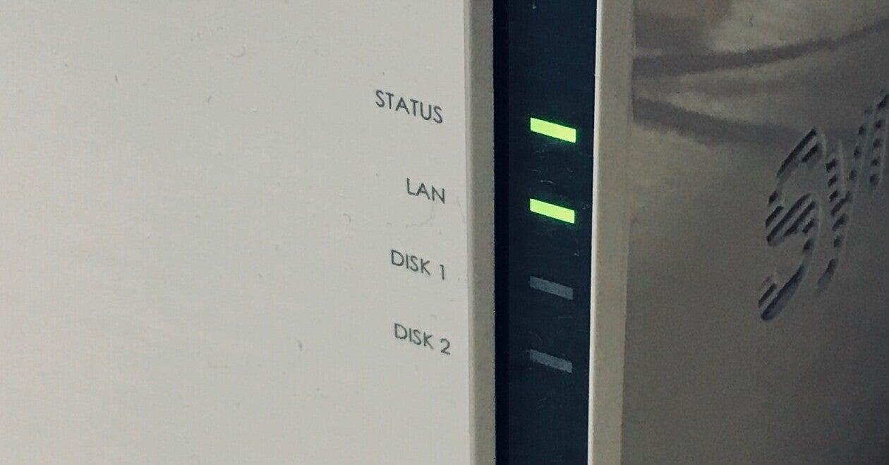

<figure>

</figure>

　前回書いたnoteで、設定まで完了したSynologyのNAS『DS220j』であるが、きびきびとした動作の速さも手伝って、あっという間に旧サーバからファイルの移行が終わった。

　以前使っていたMac miniサーバでは、音楽ファイルも動画ファイルもすべてSambaで共有できる場所に置いてあった。しかし今回は、それぞれ専用のフォルダ（ディレクトリ？）に振り分けることにした。さらにここに、MacでiTunesを使って取り込んであった音楽ファイルも統合して保存した。

　こうすることによって、NASに保存された音楽ファイルも、動画ファイルも、SynologyのNAS用OS『DSM』によってLAN内からはもちろん、インターネット越しに世界中どこからでも再生ができる。

　もちろん、こんなことは普通のサーバでもできることだが、SynologyのNASの場合、ダイナミックDNSを使うことなくインターネットを介してアクセスできるのが特徴だ。

　これはSynologyの提供する『Synology QuickConnect』というサービスが肝である。ユーザーはQuickConnectサービス上に作ったアカウントにログインすることで、自分のNASにQuickConnect（のサーバ）を通して接続できる。これでダイナミックDNSなどを使って自分の家のIPアドレスを指定しなくても、自宅NASの中身にアクセスできるという仕組みだ。

　Synologyという一企業のサーバを通って、自分のNASにアクセスするというところに不安を感じる向きもあるかもしれない。実際僕自身もそう考えたのだが、ダイナミックDNS等を使って自宅のIPアドレスをそのまま全世界に公開するよりは安全かなという理屈で、今回はQuickConnectを使ってみることにした。

　もちろんこれは、Synology社のQuickConnectサービスのセキュリティが堅牢であることや、そもそもSynology社が継続してこのサービスを提供し続けることが大前提となる。一応、Synology社のサイトでセキュリティに関するアナウンスもあるので、それを読んで納得して使ってみることにしたというわけだ。

[https://www.synology.com/ja-jp/security](https://www.synology.com/ja-jp/security)

　ちなみに、万が一Synology社がサービス提供をやめたり、会社がなくなったりした場合はダイナミックDNSでも使える。

　さて、このQuickConnectでアクセスできるようになったファイルだが、スマホやタブレット用に専用のクライアントアプリが用意されている。これは単にサーバ（NAS）上のファイルを再生するアプリだが、そこにQuickConnectへのログイン機能がつけられたものだ。NASと同じLANからアクセスするだけならログインすることなく使える。

　現在僕は、主にストリーミングサービスで音楽を聞いている。ほとんどそれで用が足りているが、どうしてもストリーミングサービスではラインナップされないアルバムがある。そういう曲は、手持ちの音源をスマホなどに転送する昔ながらのやり方で聞かなければならない。しかし、それらの音源を保存してあるNASに出先からアクセスできれば、事前に転送などする必要はない。しかもストリーミングで聞けるのだから実に便利だ。

　今回NASを導入したのは、古くなったサーバからの移行が目的だ。ストリーミングでメディアファイルを再生することには重きを置いていなかったのだが、QuickConnectのおかげで思いがけず便利な使い方ができた。

　早速通勤の際に、ストリーミングサービスに絶対ラインナップされないであろう、ラルフ・シーパースが歌うガンマ・レイのファーストアルバムを聞きながら車を走らせてみた。これはいい。知らない人にはなんだか意味のわからない話だな。

[https://www.youtube.com/watch?v=hcfJAPGe3Wg](https://www.youtube.com/watch?v=hcfJAPGe3Wg)
