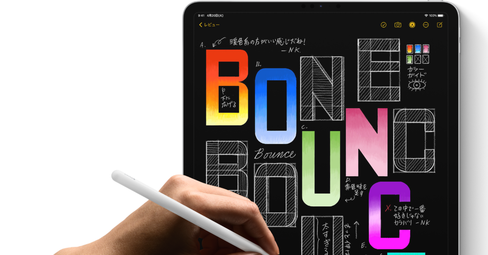

<figure>

</figure>

　僕の持っているiPad Proは第2世代。まだベゼル幅が広くて、Apple PencilをLightningコネクタに刺してうちわのような形状にして充電する、なんだか洗練されていない時代のモデルだ。

　一方、奥さんのiPad Proは第3世代。ここからはベゼルが薄くなり、Apple PencilもマグネットでiPad本体にくっつけておけば充電できるスマートな仕様になっている。

　そんなこともあり、そろそろ新しいiPad Proにするか、と思い立ってアップルのサイトを眺めてみると、なんとiPad Proも第5世代にまで進化しているではないか。驚いた。毎年新機種が出ているってことかな。

　それなら、最新機種に買い替え（買い増し）てやれ、とばかりにiPad Proの12インチをカートにぶっこんだ。よーし買うぞ！　と確定ボタンを押そうとしたそのとき、「納期３〜４週間」の文字が目に入ってきた。

　え、そんなに納期長いの？　一気に物欲がしぼむ。俺は今すぐ欲しいんだ。とりあえずサイトで買うのはやめて、アップル商品を取り扱っている店舗へ行ってみることにした。

　なんと、店頭にも売ってない。店の人の話だと、ときどき入ってくるけど台数が少ないそうだ。なんでも、昨今の半導体不足が影響しているとかしていないとか。IT関係のニュースサイトによれば、ディスプレイ部分のぞうさんに遅れが出てるという話もある。

　もう、あっちもこっちも半導体不足である。そんなに足りないのか、半導体。正直半導体の正体なんてよく知らないし、どうやって作るのかもよくわからない。お菓子のウェハースなら知っている。

　半導体不足にやられているのは、iPad Proだけじゃない。かねてより欲しがっているグラボだって半導体不足で全然価格が落ちない。一体どうなっているのか。

　最近この手の半導体不足の状況を見ていつも思っている。ゲームも、スマホやタブレットも、自動車もそうだろうが、欲しいときに手に入らなければ、購買意欲に水を指すことは間違いない。

　ゲームなんかで言えば、どんなにグレードアップしたグラフィックが用意されても、それを描画できる環境が手に入らないようでは、きっとゲーム人気も崩壊するだろう。

　最近はグラボの強化もままならないから、PS5などの家庭用ゲーム機でソフトを買う方向へ流れている人も多い。そのPS5すら入手困難な状況では、きっとトリプルAの豪華なゲームは消えていくだろう。

　あとに残るのはプアな表現の一世代前のゲームか。それともスマホゲーのようなアニメ絵を収集するゲームか。いずれにしても、半導体不足は一刻も早く解消されてもらいたいものである。
