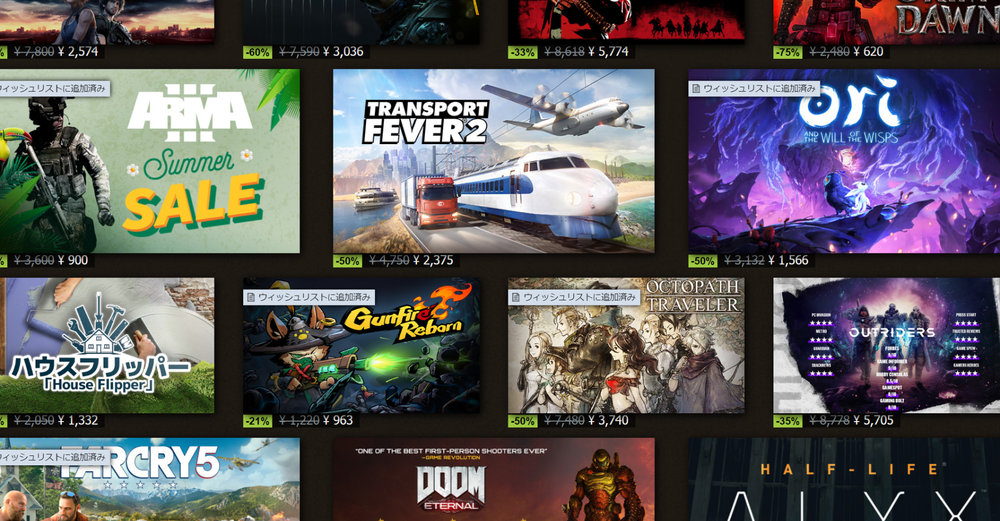

<figure>

</figure>

　今年もまたやってきました。Steamサマーセール。

　と言っても、セールだからと言って、突然欲しいゲームを選び始めるわけではない。普段からウィッシュリストにためまくっている、いつか買おうと思っているゲームから選んで買うのが、長年Steamを使っているユーザーの正しい姿だ。いや、もちろんいきなり新しいゲーム買ったりもするよ。

　実は、今回のサマーセールでは、こんなゲームが面白そう！　なんて記事を書こうと思っていたのだが、自分で買う予定のゲームを全然絞り込めず、しかたなくこんなよくわからない記事になってしまった。

　とにかく、数百本積み重なったSteamのウィッシュリストから、今回買うゲームを選び出そうっていうのだから一筋縄ではいかない。いっそのこと全部買うという手もあるが、さすがに予算がそれを許さない。自分としては10本程度が今後積みゲーとなる……ではなく、これから楽しく遊んでいくには適切な数かなと思っている。

　そんなことを考えつつ、ようやく30本まで絞り込んだ。よくがんばった。しかし、30本は買えない。今回はなぜか、セール価格適用後で1000円〜2000円ぐらいの価格帯が多く、これで30本買うとちょっと熱い。その値段は積んではいけない。

　そんなわけで、1日ゲームをしながら、その合間にどれにしようかなー。こっちを買おうかな、こっちを保留しようかな。という作業をやっていたわけだ。

　結果、16本まで絞り込んだ。がんばったが、もうちょっと減らしたいところだ。しかし、ここでストアページのトップを通過したのがまずかった。また気になるゲームが出てきてしまい、さらに1本追加。合計17本が今の候補リストに入っている。

　毎回セールのたびにこんなことをやりながらゲームを買っているわけだが、最後は割りといいかげんになってしまうのも事実だ。いや、これでいいのだ。Steamのセールは買うゲームを絞り込むところが楽しい。どれを買うかは問題ではない。

　さて、これから最終選考に入って、買ったゲームはまたnoteでレビューを書くぞ。よし、がんばろう。
