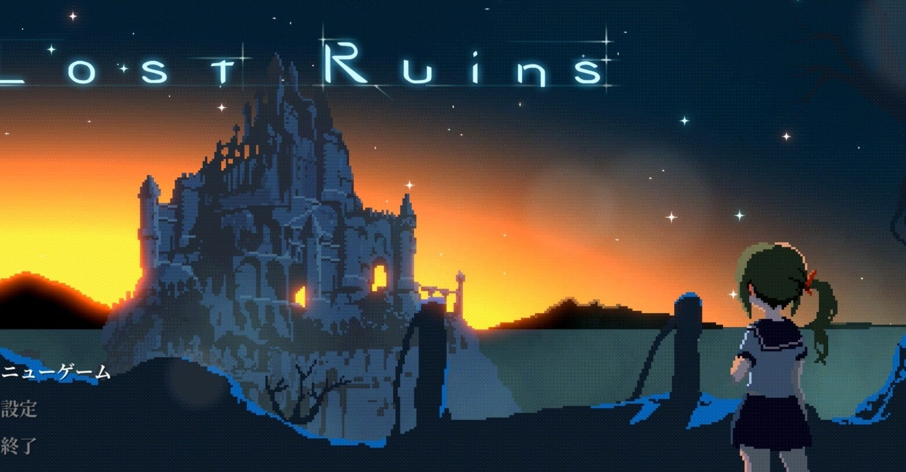

<figure>

</figure>

　リストアップしていたサマーセールの購入候補を少しずつ買い始めた。まだしばらくセールは続くが、とりあえず買ったゲームの紹介を。

## Ring of Pain

[https://store.steampowered.com/app/998740/Ring\_of\_Pain/?l=japanese](https://store.steampowered.com/app/998740/Ring_of_Pain/?l=japanese)

　『Slay the Spire』に連なる、ローグライトなダンジョン探索カードゲーム。デッキという概念はなく、一連のカードゲームよりもシンプルで理解しやすいのが特徴。プレイヤーは、リング状に展開するカードを回転させながら、より自分に有利なカードを選択してダンジョンを進んでいく。1プレイの時間が短いのが秀逸。

[https://www.youtube.com/watch?v=-bJ9uym4QYU](https://www.youtube.com/watch?v=-bJ9uym4QYU)

## Missile Dancer

[https://store.steampowered.com/app/860590/MissileDancer/?l=japanese](https://store.steampowered.com/app/860590/MissileDancer/?l=japanese)

　数々のシューティングゲームをリリースしているTERARIN GAMESによる2018年の作品。敵をロックオンしてホーミングミサイルで撃墜するのが特徴のシューティングで、敵の出現パターンを理解してチェインを稼ぐことで高得点を狙える。シンプルな操作系がわかりやすくて、特典稼ぎに集中できる。キャラバンモードも実装。

[https://www.youtube.com/watch?v=S-GgphXK61k](https://www.youtube.com/watch?v=S-GgphXK61k)

## Zombie Army 4

[https://store.steampowered.com/developer/Rebellion/sale/zombiearmyleft4dead](https://store.steampowered.com/developer/Rebellion/sale/zombiearmyleft4dead)

　『スナイパーエリート』シリーズが有名な、イギリスのREBELLION INTERACTIVEのゾンビTPS。敵をスナイプすると、急所破壊モーションがカット・インされる演出は『スナイパーエリート』譲り。迫りくるゾンビの大群を、いかに掃討するかが熱い作品だ。今回なぜかValveの『Left 4 Dead』とのコラボで、L4Dの登場人物が使えるDLCが登場。しかも『Left 4 Dead』とのバンドルで単体より安くなるという意味のわからない安売りで買ってしまった。またビルおじいちゃんの活躍が見られるのは僥倖。

[https://www.youtube.com/watch?v=gwzyQrrce9g](https://www.youtube.com/watch?v=gwzyQrrce9g)

## Lost Ruins

[https://store.steampowered.com/app/1306630/Lost\_Ruins/?l=japanese](https://store.steampowered.com/app/1306630/Lost_Ruins/?l=japanese)

　セーラー服の女の子が主人公のメトロイドヴァニアダンジョン探索ゲーム。主に刀剣類を武器とする戦闘スタイルが特徴で、武器によってモーションや攻撃の速度が変わるのをうまくコントロールして敵を倒していく。よく動くドット絵が心地よく、見ているだけで楽しい。ただし、ゲームはシビアなダメージ管理が必要で、手応えありのプレイ感。

[https://www.youtube.com/watch?v=CqxhiEYEn7o](https://www.youtube.com/watch?v=CqxhiEYEn7o)

　というわけで、とりあえず4本を買ってみた。どれもなかなか楽しそうで、本格的にプレイするのが楽しみだ。いや、プレイするよ。ホントに。

　ちなみに、おまけでついてきた『Left 4 Dead』も、久々にプレイしたら10年以上前のゲームにも関わらず、かなり楽しめた。

[https://www.youtube.com/watch?v=DCUv4uY8XC0](https://www.youtube.com/watch?v=DCUv4uY8XC0)
