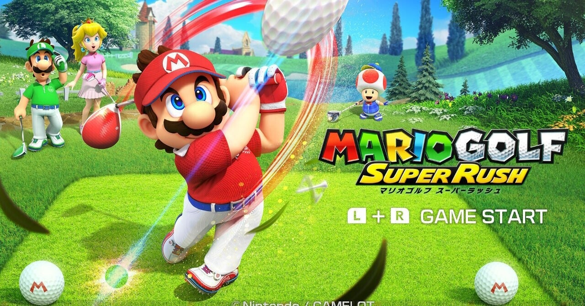

<figure>

</figure>

　つい先日、『マリオゴルフ スーパーラッシュ』が発売になった。任天堂のゴルフゲームということで早速購入してプレイしてみることにした。

[https://www.nintendo.co.jp/switch/at9ha/index.html](https://www.nintendo.co.jp/switch/at9ha/index.html)

　ところが、これが予想を裏切って面白くない。ゴルフ部分はよくできていて一見楽しそうなのだが、マリオの世界を冒険しながらゴルフに挑むモードがびっくりするほど冗長で辟易する。

　このモードでゴルフをするためには、広いマップ上を自分で歩き回り、目的のコースの場所にたどり着かなければならない。道中には、スーパーマリオの世界に登場するキャラクターが配置され、当たり障りのない会話をして情報を与えてくれる。これをひとつひとつ聞くだけでもストレスだ。

　ところどころに、お題を伴った練習課題を与えてくれるキャラクターもいて、これをクリアすることで経験値がたまる。レベルアップすれば能力値を上げることができるので、課題をクリアすることは必須である。しかし、このお題が、ひたすらパットを繰り返して一定点数を取得するなど、極めて地道なプレイに終止する。どうせならゴルフそのものをプレイしてレベルアップするスタイルがいいのに。

　さらには、肝心のゴルフをプレイするコースには、巨大な崖の高低差に阻まれるクロスカントリーコースなどというギミックがあり、これがすごく難しい。単にコースがアクロバティックなだけでなく、コース上に吹き出している竜巻にボールを乗せて、すごく高い場所へ移動したりしなければクリアできない。

　もうここで力尽きてしまった。最初から、そういうギミックの含まれるゴルフとは理解していたが、いくらなんでもプレイヤーに課せられるストレスに意味がなくてつまらない。どうして、ゴルフゲームを遊ぶのに自分の部屋に帰ってベッドで寝たり、1試合クリア失敗するたびに受付に行って意味のない会話をしなければならないのか。正直、任天堂のソフトと思えないほどユーザーに不便さを強いるつくりだ。

　もっとも、この冒険するモードを除けば、ゲームとしては楽しい仕掛けがいっぱいで、些末なことに文句など言わずにそれを愉しめばいいとは思うんだけど。

　いや、冒険するモードは些末なことではないな。ゲームの大きな部分を占める大事なところだけに、もっとサクサク遊べる軽快さが欲しかったところだ。

　ちょっとユーザーとして任天堂に過大な期待をいだきすぎなのかな……？

　まあ、でもこれはあくまで「今のところ」の感想である。もうちょっとがんばって遊べば何か光明が見えてくるかもしれない。
