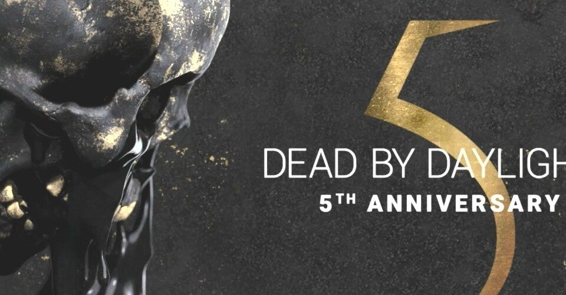

<figure>

</figure>

　毎日のように遊んでいる『デッドバイデイライト』がいよいよ5周年。なんだか大物ゲームに成長してきた感はある。

　僕が『デッドバイデイライト』を始めたとき、オフィシャルのグッズには2周年記念のタペストリーがラインナップされていた。そう考えると、僕自身もすでに3年以上、4年目に突入する勢いで遊び続けているということだ。早いものである。

　さてその5周年だが、早速イベントが開催されている。今回も金色に輝く王冠が取得でき、ブラッドウェブを回すと、ブラッドポイント（BP、経験値のようなもの）が多くもらえるケーキやイベント用ライト・医療キットなどの特別なアイテムが手に入る。

　昨年の4周年記念イベントは、サイレントヒルチャプターが登場して大いに盛り上がったのだが、このときもBPがたくさんもらえるケーキがあった。4周年にちなんで、ケーキを使うと104%のBPを追加で取得できた。それなら、今年はきっと105%増だね、とか言っていたら本当に今年のケーキは105%余分にBPがもらえる。太っ腹なイベントだ。

　早速遊んでみると、サバイバー4人とキラー1人で、5人分のケーキが画面に並ぶことがある。壮観だ。見た目に派手なだけでなく、105%✕5人で、525%のBPが追加でもらえる。これは大きい。

　ところが、かねてよりマッチングに問題のあることで有名な『デッドバイデイライト』。なぜかランク1の超強いキラーしかやってこない。5つのケーキが並んでも、1台も発電機を修理せずに終わったりしてしまうことが続いた。

　これではせっかくのケーキも無駄である。いや、あまりに一方的なゲーム展開は、キラーにとってもあまりスコアにならない。どっちの得にもならないしょうもないマッチが連発していた。

　しかし、こういうあまりにデタラメなマッチングが平気で出てくる辺りは『デッドバイデイライト』らしい。もうみんな慣れていて、文句こそ言うものの、そういうものとして受け入れているようにすら見える。

　ついでに言えば、イベント開始時に50万BPがプレゼントされた。早速新キャラのレオンを育てるのに使っていると、その操作中にエラーが起きた。いやな予感を抱きながら再度ゲームを始めると、案の定15万BPほど使って取得したはずのパークやアイテムがきれいさっぱり消えている。もちろんBPは返ってこない。さすがの『デッドバイデイライト』である。オフィシャルもこの事実を確認しながら、なんの対応もしないでスルーだ。本当に平常運転で安心する。

　こんな感じで、あいも変わらずバグ＆バグで始まった5周年イベント。週末を迎える前に修正がされるのだろうか。僕の失われた15万BPは返ってくるのだろうか。（たぶん返ってこない）

　まあ、こんなトラブルには負けないのが『デッドバイデイライト』プレイヤー。今日も1日霧の森を彷徨うこととしよう。
