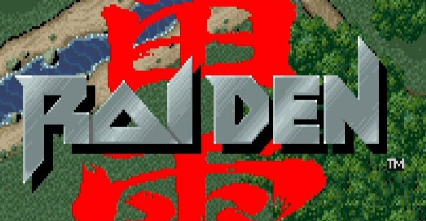

<figure>

</figure>

　セイブ開発の『雷電』がアーケードアーカイブスにラインナップされた。この日をどれだけ待ちわびたことか。そもそも、僕が基板に手を出したのは、家で本物の『雷電』を遊びたかったからだ。本当に長い間待っていた。

　『雷電』は、1990年にゲーセンに登場すると、シンプルなゲームシステムながらシューターの挑戦意欲を掻き立てる難易度とレベルデザインで、一気に人気作品となった。

　人気作品ゆえに移植作品も多く、PCエンジン、プレイステーション、メガドライブ、スーパーファミコン他、多くのゲーム機、PCに移植された。しかし、そのどれもがゲーセンの興奮を思い起こさせる域には達しておらず、夜のプレイヤーを落胆させた。（と思う）

　ゲーセンでプレイした本物の『雷電』には数多くの魅力があった。精緻なドット絵で描画されたメカニカルなキャラクターと、ストーリーを感じさせるリアルな背景。FM音源による、東亜プランのシューティングゲームを彷彿とさせる迫力のBGM。その秀逸な楽曲は、コンポーザー佐藤豪のペンによるものだ。（ちなみに、佐藤豪氏と僕は誕生日が同じである。なんの関係もないか）そして、何よりも魅力的だったのが、繰り返し遊びたくなるゲームバランスだ。容赦ない攻撃を繰り出す敵が次々と登場する調整ながら、繰り返しプレイすることでクリアまでたどり着ける絶妙な難易度。攻略を考えることで切り抜けることができる強大なボスキャラクターたち。そのすべてが、ゲーマーのモチベーションを高める方向に作用していた。  

　『雷電』リリース当時学生だった僕は、毎日のようにゲーセンに通った。自転車を漕いでは日参し、必ず『雷電』をプレイしていた。その当時世話になったゲーセン（ちなみに松本市伊勢町のレディビートル）も今ではなくなってしまったが、今でも忘れられない思い出だ。

　その『雷電』がアーケードアーカイブスとして移植された。日課のように戦車やヘリや大型機と戦った日々はもういつのことだろう。あれから30年以上の月日が経過している。しかし、今でも画面に映る真っ赤な『雷電』の文字を見れば当時の興奮が蘇る。

　さあ、クレジットを投入しよう。またあの強敵たちとの戦いが始まる。
