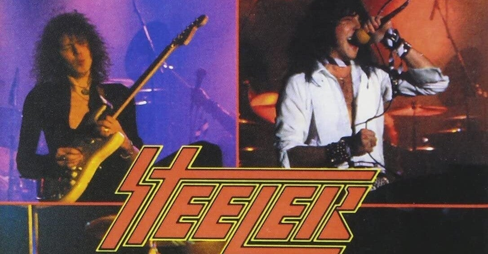

<figure>

</figure>

　今月号のヤングギター誌は、イングヴェイ・マルムスティーンのニューアルバムが発売されることを受けて、なんと島紀史がイングヴェイの全軌跡、スタジオ・アルバムを解説するという豪華大特集だそうだ。

[https://twitter.com/young\_guitar/status/1412744382361391104](https://twitter.com/young_guitar/status/1412744382361391104)

　イングヴェイがデビューしてから40年。いつしか王者と呼ばれ、今でもメタルキッズのギターヒーロー。もしかしたら我々は永遠の時の流れの中に生きているのかも知れない。フォーエヴァーイズアロングタイムだ。（ちなみにイングヴェイは先日6月30日に58歳の誕生日を迎えている）

　実はニューアルバムにはあまり期待していないのだが、しかしヤングギターでこんな特集をぶちあげられると、ワクワクしてしまう。

[https://note.com/keigox68000/n/n3b6be6c10786](https://note.com/keigox68000/n/n3b6be6c10786)

　特に、ヤングギターのツイッターアカウントがツイートしている、前述のアルバム解説にSTEELERの記事を見つけて興奮クライマックス。いつでもどこでもヒロシマモナムール。ジェットトゥジェットである。

　このSTEELERのアルバムは、マイク・ヴァーニーに見いだされたイングヴェイが単身スウェーデンから渡米して、とりあえず突っ込まれたLAメタル的サウンドのバンドだ。今でこそネットでいくらでも聞けるが、当時はアルバムを探すこと自体苦労した1枚だ。

　正直、ロン・キールのヴォーカルは野暮ったく、楽曲もパットしない一般的なメタル作品で、低予算故にサウンドプロデュースもお粗末だ。しかし、ここでのイングヴェイのギタープレイは、すでにその輝きを遺憾なく発揮している。

　確か僕が最初にこのアルバムの存在を雑誌の紹介で知ったときは、「イングヴェイらしさはあまり感じられない」というようなことが書かれていたが、とんでもない。ギターソロになった途端繰り出される、まごうことなきイングヴェイスタイル。流麗かつドラマティックな速弾きは、本当に若いイングヴェイのほとばしるエナジーと、天才的なギターテクニックを感じることができる。

　特に3曲目の"No Way Out"はイントロのクラシカルなアコースティックギターから、イングヴェイ以外の何物でもないリリカルで荘厳なメロディが奏でられる。この頃から、その後のアルカトラスの楽曲にもつながる今ポーズセンスが伺い知れる。そして、続いて現れるロン・キールのヴォーカルで一気にずっこけてほしい。本当に残念であると同時に素晴らしいアルバムだ！

　こうなってくると、あまり期待していなかったはずのニューアルバムもちょっと気になってきた。同時に、何年も買っていなかったヤングギターも買ってみよう。これはこれで楽しみだ。

　ああ、王者よ永遠なれ！

[https://open.spotify.com/album/6X4xOK2vncouastY92OcYw?si=3PD7yZ\_FRp-jNYvAmR9pxw&dl\_branch=1](https://open.spotify.com/album/6X4xOK2vncouastY92OcYw?si=3PD7yZ_FRp-jNYvAmR9pxw&dl_branch=1)
