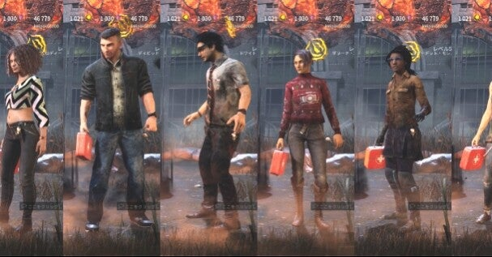
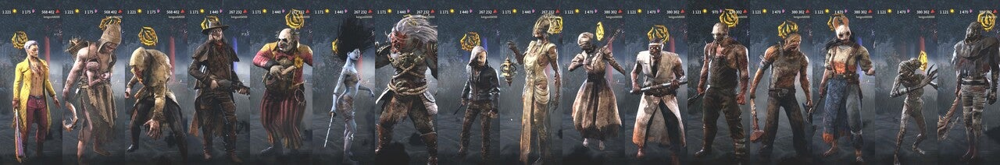
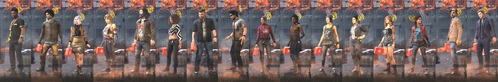

<figure>

</figure>

　『デッドバイデイライト』でイベントアイテムの「王冠」というのを集めていた。持っているとすごく得するというアイテムでもなく、単に装備してキャラクターの見た目が変化するだけのアイテムである。いや、むしろゲーム中は目立って殺人鬼に発見されやすくなるというマイナスアイテムかも知れない。

　それでもこのイベントに参加した感のようなものからついつい集めてしまう。しかもアイテムの所有権はキャラクターごとに独立しているので、それぞれのキャラクターで王冠を取得しなければならず、ついつい遊んでしまうのだ。行き過ぎた『デッドバイデイライト』ファンのマゾ根性ここに極まれり。

　それはともかく、イベント開始から1週間ほど経ってようやく全キャラクターで王冠を集めることができた。で、記念に全キャラクターが王冠を装備しているスクリーンショットを撮って、並べた画像にしてみたわけだ。

　そんなことをやっていたら、SNSでどうやって並べているのかという話になったので、それを簡単に書こうと思う。

　画像を並べるのなんか難しいことではないのだが、話の要点は、何か簡単にできる方法があるのかということである。

　今回使ったソフトは、  
・Geforce Experience （動画の録画）  
・Aviutl （動画ファイルの任意の場所でスクリーンショット）  
・Affinity Photo （画像のトリミング・貼り付け加工）  
の3本である。

　まず、NVIDIAのグラボを使っている人にはおなじみのGeforce Experienceで、キャラクター選択画面の動画を録画しておく。もちろん、ここで同ソフトを使っていきなりスクリーンショットを撮ることも可能だ。しかし、キャラクターの立ち絵と言っても常に動いているので、思ったポーズでスクリーンショットを撮るのは意外と難しい。

　で、キャラクター選択画面の動画をAviutlに読み込ませて、任意の場面でスクリーンショットを撮る。僕の場合は、Aviutlのショートカットキー登録で、Ctrl+Cに「現在のフレームをJPEG保存」を割り当てていて、矢印キーで場面をシークしてCtrl + Cでスクリーンショットを撮るという方法を使っている。これが効率がよさそうだ。

　好きなポーズのスクリーンショットを集めたら、今度はAffinity Photoでトリミングして、1枚の長い画像にまとめる。と言っても、1枚1枚トリミングをするのはダルいので、Affinity Photoのマクロにトリミング作業を登録して、あとはそれぞれの画像でマクロを実行するだけ。

　こうして切り出した画像を貼るわけだが、どれか1枚の画像の横サイズを画像の枚数分だけ拡張してやる必要がある。ドキュメント→キャンバスサイズの変更で、横サイズをさっきのマクロで切り出して横サイズx人数分にしてやるだけだ。（今回は408ピクセルx16人分=6528ピクセル）

　あとは手作業になるが、ひたすらCtrl + Cでそれぞれの画像をコピーし、横サイズを拡張した画像に貼り付けるだけ。割と面倒な作業に見えるかもしれないが、結構簡単である。

　そんなわけで、殺人鬼と生存者の王冠勢揃い画像のできあがり。画像のトリミングと連結は、今pythonで画像を色々加工して遊んでいるので、プログラムでやるという手もあったけど、コーディングの手間を惜しんでAffinity Photoでやってしまった。

　今回使った中でAffinity Photoだけは有料ソフトだが、6000円の買い切り価格でPhotoShopに迫る機能を持っているおすすめソフトだ。

　とか言ってたら、生存者の勢揃い写真にフェン・ミンがいなかった！なんということでしょう。
