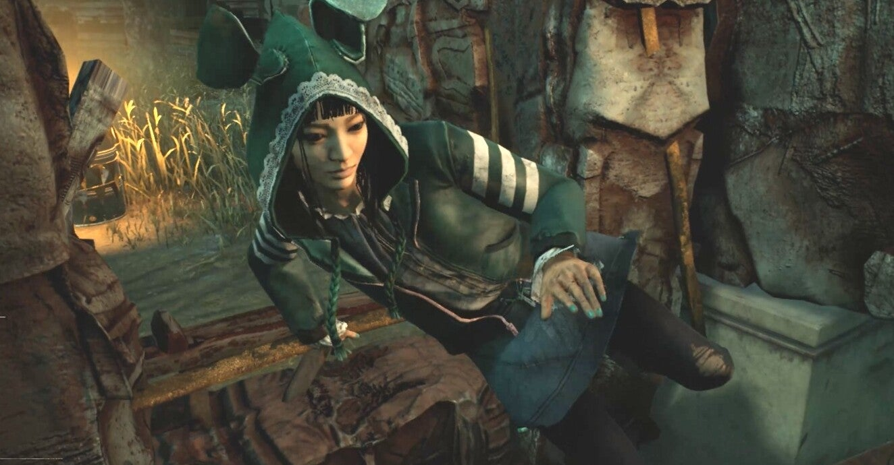

<figure>

</figure>

## 『デッドバイデイライト』ってどんなゲーム？

　『デッドバイデイライト』は、カナダのBehaviour Interactiveが開発したホラーゲームだ。発売は2016年。今年で5周年を迎えた。

　プレイヤーは、4人の生存者（サバイバー）と、1人の殺人鬼（キラー）に分かれてゲームをプレイする。通常は、オンラインでランダムにマッチングされるが、フレンドと一緒に生存者をプレイしたり、フレンドだけでプライベートなマッチを遊ぶことも可能だ。

　この生存者と殺人鬼でプレイ条件が異なることを、オフィシャルサイトでは「非対称型マルチプレイホラーゲーム」と呼称している。生存者は殺人鬼から逃れて脱出を目指し、殺人鬼は生存者の殲滅を目的とする。

　『デッドバイデイライト』はどちらかと言うとメディアに取り上げられることも少なく、例えば海外のPCゲーム雑誌などにもほとんど記事が掲載されていないようだ。しかし、発売後数年してからYoutubeなどでゲーム実況が注目されるようになり、口コミのような形でワールドワイドにヒットするゲームとなった。

　『デッドバイデイライト』は、いわゆる演出でプレイヤーを怖がらせるホラーゲームとは違うが、5人すべてのキャラクターを人間が操っていることにより、従来のホラーゲームとは一線を画す本物の緊迫感を体験できる。

## 『デッドバイデイライト』はどのゲーム機で遊べるの？

　当初PC版（Steam版）しかリリースされていなかった『デッドバイデイライト』だが、その後PS4/PS5、Xbox One/S/X、任天堂スイッチと、次々にコンシューマ対応した。その後PC版は現在マイクロソフトストア版もリリースされている。また、STADIA版もラインナップされた。

　要するに、現行（または一世代前）のゲーム機があればすぐにでも『デッドバイデイライト』が始められるといわけだ。しかも、すべてのPC版とコンシューマ版は互いにクロスプレイができるようにアップデートされ、例えば友達がPC版で遊んでいても、自分はPS4版で一緒に遊ぶことができるのも嬉しいところだ。

　ゲームソフトの販売形態はダウンロード販売が一般的。コンシューマ版には一応パッケージも用意されている。しかし、セールなどのタイミングでダウンロード版を買うのが現状お得である。

## で、『デッドバイデイライト』っておもしろいの？

　おもしろい。こんな記事を書いているぐらいだから、そう言い切るしかないのである。実際、３年間プレイして未だに毎日遊んでいるぐらい面白い。

　『デッドバイデイライト』は、生存者となってマップ上に７台ある発電機のうち５台を修理し、出口のゲートを開けて脱出する。あるいは、殺人鬼となって生存者の修理を妨害して全員を攻撃してフックに吊るすということが目的である。

　ゲーム自体は非常に単純で、操作もシンプルだ。どちらかと言えば毎回やることも同じで代わり映えしない。しかし、その生存者と殺人鬼の能力やパークの組み合わせが膨大で、なおかつゲームに参加しているプレイヤー5人すべてが人間ということもあり、毎回多彩なゲーム展開を見せてくれる。これが『デッドバイデイライト』の魅力の本質だ。

　配信で人気が出たのも、人によってプレイスタイルがまったく異なり、ゲーム展開もその都度違うところが楽しいからではないか。とにかく、このゲームは多様性の塊のようなところがある。それがプレイヤーを飽きさせないところになっている。

　また、頻繁なアップデートで、開発側はゲームの細かいルールや、各パークの能力を結構大胆に変更してくる。正直、その度にプレイヤーからは「弱体化だ」「強すぎる」と言った非難の声が聞かれる向きもある。しかし結局はその調整が馴染んでいき、また新しい『デッドバイデイライト』が生まれる。この挑戦的なゲームの改良もゲームが古くならない要因の一つである。

　現在も『デッドバイデイライト』は、3ヶ月毎に新キャラクターが投入され、グラフィックのアップデートも行われ続けている。おそらく、この更新が続く限りはまた新たなプレイヤーをゲームに引き込むことができることだろう。

　なんかもっと色々書きたいけど、長くなったのでまた！

[https://www.youtube.com/watch?v=96YUUVtZ75o](https://www.youtube.com/watch?v=96YUUVtZ75o)
