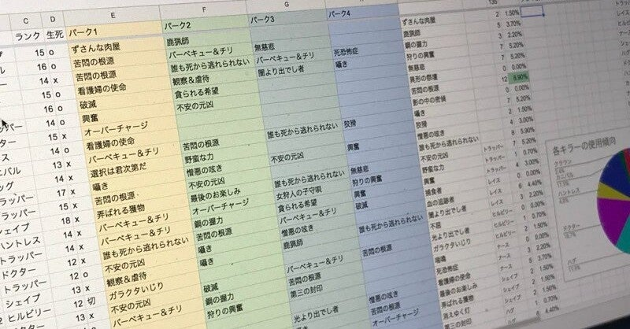
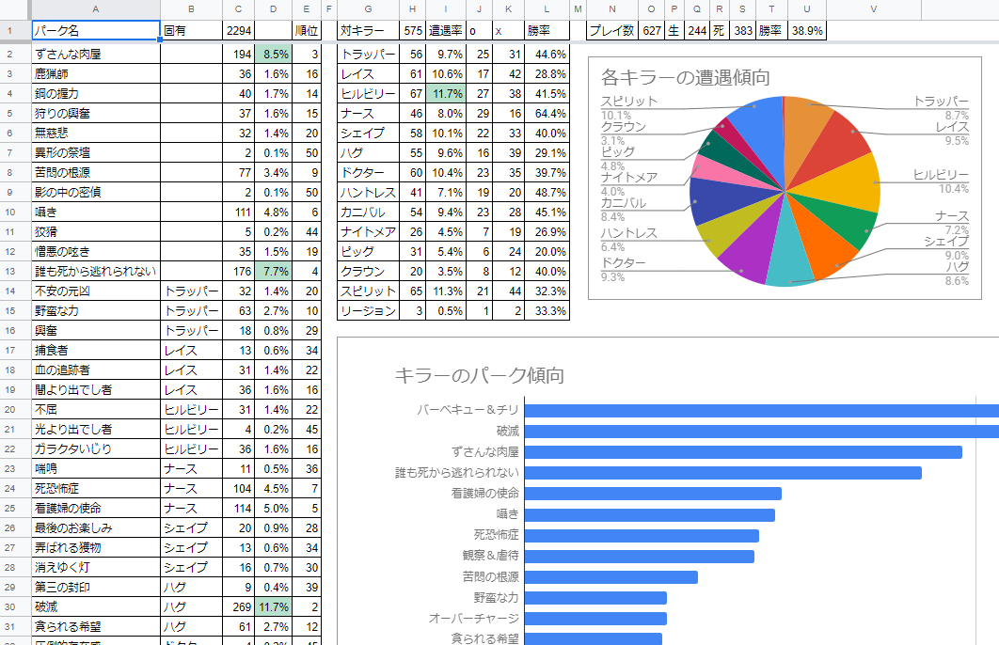

<figure>

</figure>

　『デッドバイデイライト』はパークの装備が重要なゲームだ。実は以前、一緒にマッチした人たちがどんなパークを使っているのか、キラーはどんなパークを使っているのか、ひたすら統計をとっていた。

　2000人以上のデータを蓄積したので、おそらく統計的にはある程度正しい感じになりつつあったんじゃないかと思う。実際、キラーのパークはおおよそ想像がついて、これはゲームの攻略にも役立った。

　しかし『デッドバイデイライト』は日々アップデートされるゲームなので、パークの効果も変更があることもある。また、有名配信者がマイナーなパークの使い方を紹介すると途端にそのパークが流行ったりすることもある。以前収集したデータはほとんど役に立たないということだ。それで最近また統計をとってみるのも面白いかもしれないと思っている。

　当時、ゲームのリザルト画面を見ながら、Googleスプレッドシートにものすごい勢いで手入力で使われたパークを登録していたのだが、今回はなにかプログラムを自作してできないものか模索している。

　最初はPython + OpenCVでリザルト画面からテンプレートマッチングパークを探して数えるプログラムを書いてみた。

[https://twitter.com/keigox68000/status/1412254900906467329](https://twitter.com/keigox68000/status/1412254900906467329)

　これは簡単ですぐにできたのだが、肝心のパーク画像が、各キャラ3種類×3レベル分で9パターン。現在キャラクターが生存者と殺人鬼で45人ぐらいいるので、これだけで400種類以上の画像がある計算になる。さらに、キャラクター固有じゃない一般パークもいくつかあるので、おそらくパークの画像だけで450種類ぐらいはありそうだ。

　この画像をあらかじめ準備してテンプレートマッチングするのもありだが、ちょっと面倒なので、現在機械学習でプログラム画像パターンを覚えてもらえないか考えている。

　つまり、新しいパーク画像が登場する度に教師あり学習で画像を覚えてもらって、既習のパークについては自動でカウントしてもらいたいというわけだ。これがうまくいけば、数週間後にはすべてのパーク画像を学習した『デッドバイデイライトパーク統計プログラム君』が完成するに違いない。特に、各パークのレベル違いの微妙な差はあまり厳密に判別しないで、同じ画像として学習をしてくれるとありがたい。都合よすぎるかな

　そんなわけで、学習するためのプログラムを書かなければならないのだが、この部分は現在勉強中。本でちょっと読んだだけなので、いろいろ試しながら具体的な画像を操作してみる必要がありそうだ。

　そんな一からの状態でプログラム作るのかよという気もするが、まあ、いつもそうやっていろいろ作ってきたので、まずはトライしてみることで何か見えてくるに違いない。

　とりあえずリザルト画面を毎回キャプチャして、その画像からパーク部分だけ切り出せるようにしてみた。さて、この大量のパーク画像をどう料理するか。これからじっくり考えてみたい。

[https://twitter.com/keigox68000/status/1413557228112515072](https://twitter.com/keigox68000/status/1413557228112515072)
