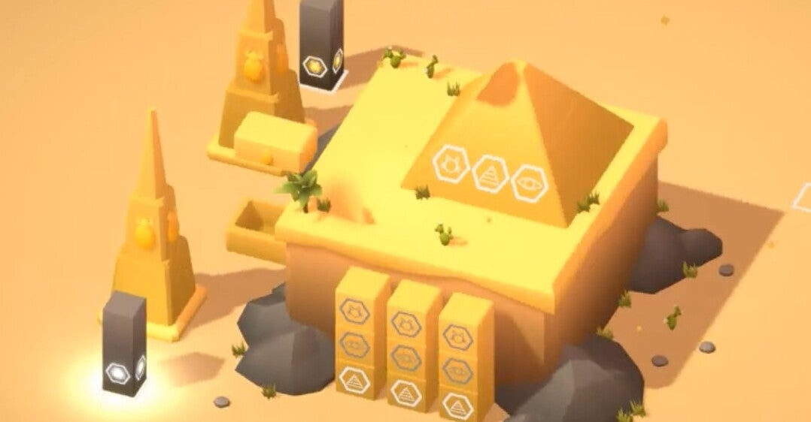

<figure>

</figure>

　Steamのセールも無事終わった。今回は10本ぐらいゲームを買った感じだ。よく覚えてない。

　その中でも印象的な1本がこの『SIZEABLE』。画面の真ん中に置かれたおもちゃのようなジオラマを回転させ、さらに置いてあるオブジェクトを「拡大・縮小」させることでお目当てのアイテムを見つけるとクリアとなるパズルゲームだ。

　この拡大・縮小が『SIZEABLE』の肝で、オブジェクトのサイズが変わると画面内に何かが起きるしかけになっている。簡単なものでは、オブジェクトの大きさを変えるとダイレクトにアイテムが見つかることもある。またあるオブジェクトは、大きくすることでステージの邪魔なものがなくなり、間接的にアイテムが発見されることもある。その作業をマウスだけの快適な操作感で試せるお手軽かつ楽しいゲームだ。

　『SIZEABLE』は一応パズルゲームの範疇に入るだろう。しかし、画面内のオブジェクトには論理的な関係はない。プレイヤーは勘を働かせて、あれこれ試行錯誤するのが主なプレイスタイルとなる。

　もしかしたら、このお気楽なプレイ感は、本格パズルマニアには物足りないと感じるかもしれない。しかしちょっとした時間を使い、あまり深く考えずにおもちゃをいじるような感覚で画面のものを動かすのが『SIZEABLE』の魅力とも言える。オブジェクトを動かして、予想外の場所からアイテムが登場したときには思わず感嘆の声を上げてしまう快感がある。

　そんなお手軽パズルを、アンビエントな雰囲気のヒーリングミュージックをバックに遊んでいると、2,3ステージをクリアした頃には自然と眠くなってくる。あまり無理をせず、そこで終わりにして今日1日を終わりにして眠りにつくのがいい。

　そんな、ゆるくて癒やしのゲーム『SIZEABLE』は、Steamで1010円で販売中である。セール中は500円ぐらいで買えた。なお、デモ版もあるので、気になったらまずはデモ版で遊んでみるのがいいかもしれない。

　ちなみに『SIZEABLE』の作者はベルギー生まれのSander Ambroos君。23歳だそうだ。（ツイッターのプロフィールに書いてあった）若い発想でこういうゲームを作るのっていいと思う。

[https://www.youtube.com/watch?v=V\_EoSi3vIEw](https://www.youtube.com/watch?v=V_EoSi3vIEw)
