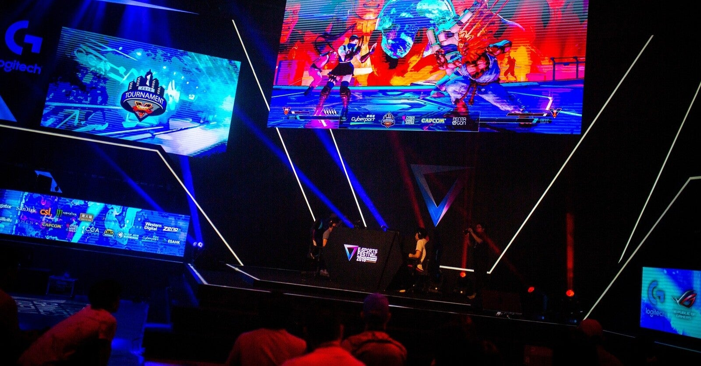

<figure>

</figure>

　最近eスポーツが盛り上がっている。バーチャファイターが復活したり、eスポーツのチームがAPEX部門を作るということで選手を募集したり、その動きは活発だ。果ては、eスポーツをやっているとグラビアアイドルと結婚できるなんて話も出てきたり、話題に事欠かないホットな競技と言えるだろう。

　もっとも、世の中にはeスポーツなんてスポーツじゃない！　なんて言う人もいるが、それはそのとおりである。スポーツじゃないから「e」スポーツなのだ。

　そもそもスポーツの語源は憂さ晴らしや気晴らしという説があるが、それならばゲームもスポーツを名乗る資格は十分あるのではないだろうか。

　そんなeスポーツであるが、最近登場してきただけあって、主には若者が活躍する場のように思う。もっとも、梅原大吾40歳が若者かどうかは微妙なラインかもしれないが。

　ともかく、eスポーツの大会といえば、やはりメインは若者。ロートルはおとなしく家でFGOでも回していなさいということなのかもしれない。しかし、我々中高年にも意地がある。今のゲームシーンの礎を築いてきたのは自分たち古参ゲーマーだという自負もある。何より、めんどくささとゲームの歴史について語らせたら若造には後れは取らない自信もある。

　要するに、ロートル向けにもeスポーツ大会が欲しいんじゃないかという気がするわけだ。しかし、年をとってくると目も反射神経も、いろんなところが衰えてくる。いくらeスポーツやるぞ！　と言ってみても、やはり若者と対等には渡り合えない。

　そこでタイトルの通り、eスポーツシニア大会だ。もう死にかけの老兵たちが集い、いつ壊れるかもわからないアーケード基板を持ち寄って豪華なるeスポーツ大会を開催するのである。参加資格は40歳以上。血圧が高い選手のために、試合後の血圧測定機も常備だ。もちろんAEDも忘れちゃいけない。

　とか考えていたら、そんな辛気臭い大会とてもやってられないな、と残念な気分になってきた。年寄りはやっぱり、家でオンライン対戦しているのが一番かもしれない。
