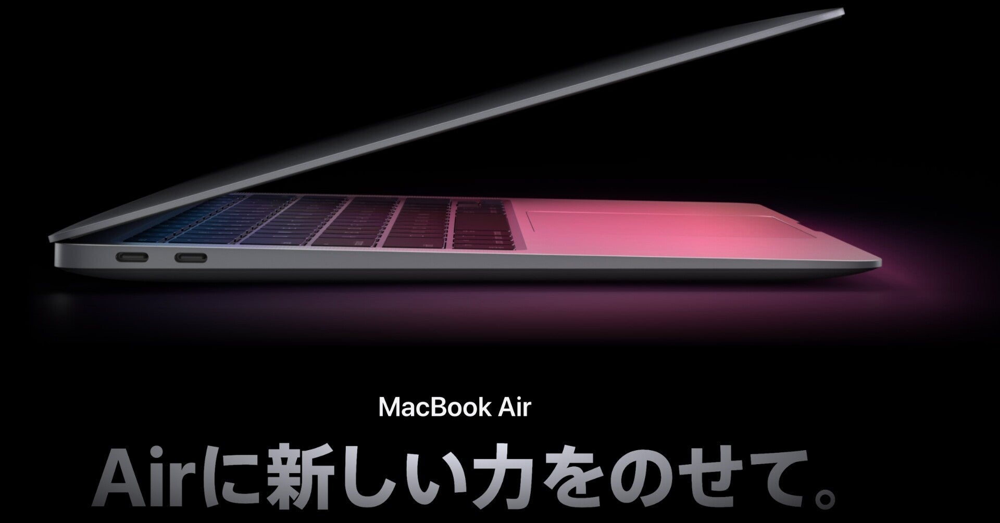

<figure>

</figure>

　普段、つらつらとコーディングするときとか、こういうnoteを書いているときとか、MacBook Proを使っている。

　このMacBook Proは、数年前に銀座のアップルストアへふらりと立ち寄ったときについうっかり買ってしまったものだ。シルバーのフラットなデザインと、電源オンで点灯する天板のアップルマークが生かしている。

　どれぐらい前に買ったのだろうと型番を調べたら、なんと6年前。もう今年で7年目に突入する年季の入ったMacだった。僕が初めてMacを買ったのが17年前なので、その大部分をともに過ごしたモデルと言ってもいい。

　おかげで今でも調子よく動くし、そもそもラップトップで文章書いたりプログラム書いたりという用途がメインなので、年老いたマシンながらだいぶ余裕を持って動作してくれる。欠点は、内部ストレージが128GBなので、何も考えずにソフトをインストールしていると、すぐに容量がいっぱいになってしまうぐらいだ。

　しかしその容量のことや、Macも脱インテルで時代も変わったななどと感慨にふけっていたらやにわにMacBook Airが欲しくなってしまった。MacBook Airは今のMacBook Proを買う前に使っていて、本当に使い勝手がよかった。ただ、最後は劣化したバッテリーが膨らんで、本体ごと壊れてしまったのだ。

　そんなわけで、今はMacBook Airが欲しい。新しいM1プロセッサーはニューラルエンジンで機械学習にも向いていそうだし（よくわかってない）、ちょうど今遊んでいるPythonのプログラミングにもうってつけ？

　なんだか自分でもよくわかってないが、とにかくMacBook Air欲しみが高まってるというわけだ。
