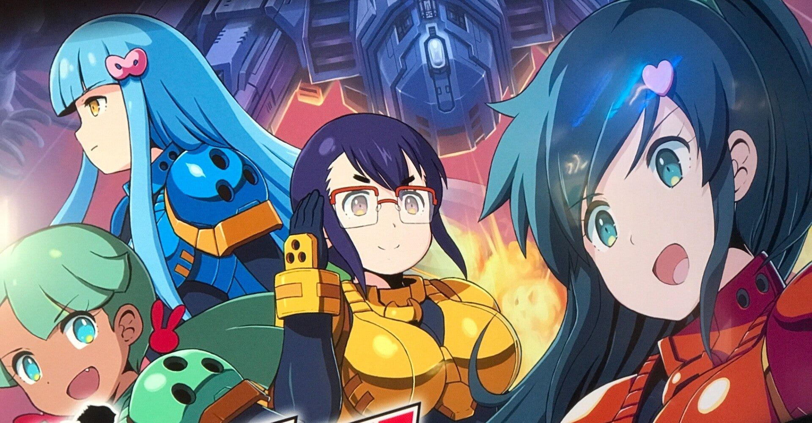
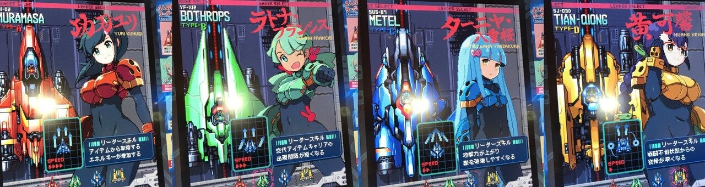
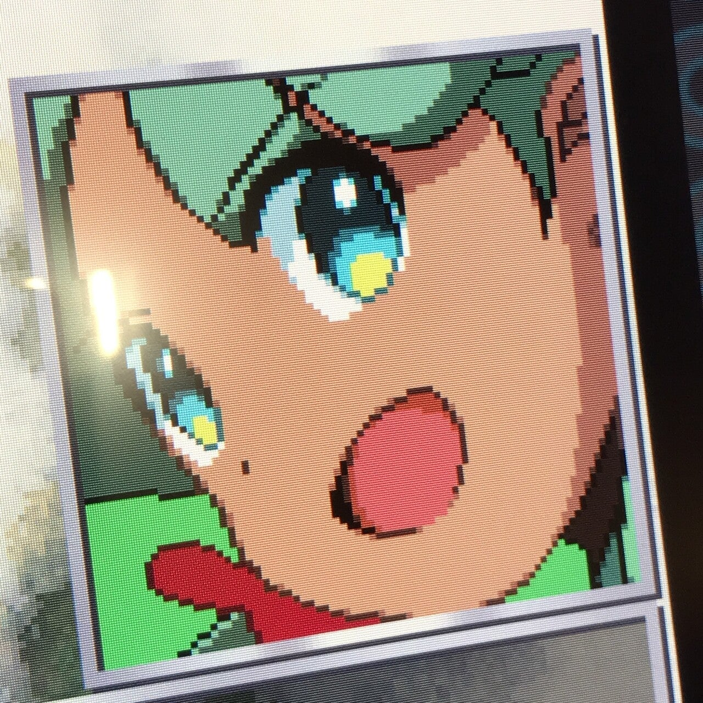

<figure>

</figure>

　M2が満を持して世に送り出した完全新作アーケードゲーム『戦刃アレスタ』がいよいよゲームセンターに登場だ。今日7月15日が、その記念すべき稼働1日目となる。

　ありがたいことにセガの「ALL.Net P-ras MULTI バージョン3(APM3)」による配信での稼働なので、ゲーセン砂漠の我が家の近所でも何件も稼働している店がある。やはり今の時代オンラインに載せてこないと、ゲームも消費者に届きにくい。

　6月の終わりに秋葉原Heyなどでロケテストも実施していが、時節柄遠出して遊ぶという愚行をおかすわけにもいかず指をくわえていた僕は、本稼働初日から、早速近所のゲーセンで遊んできた。

　ざっくりと感想を言うと、アーケードゲームなどの移植で、昔のゲームの再現度をサウンドからフレームレートまで細かくこだわって作るM2らしい作品と言える。

　決して派手で大仰な印象のゲームではないが、初心者からゲーマーまで幅広く遊べる工夫が施され、それをゲーム内でわかりやすく説明し、そして遊べば遊ぶほどゲームの仕組みがわかって楽しくなってくるように作られている。このかっちりした手堅い作りこそが、M2らしいゲームということになるのだろう。丁寧な作りに、プレイしていてなにか嬉しくなるような感覚すらある。

　過去のアレスタシリーズと比べると、それほど過去作にとらわれず、でも要所要所でアレスタの伝統を取り入れているという印象だ。

　4人のパイロットからなるアレスタチームは、それぞれが特徴ある機体で戦いに臨む。しかし、これは自機選択制というよくあるゲームシステムを意味しない。プレイヤーはあくまでチームとして出撃し、4機の機体を交代アイテムで切り替えながらゲームを攻略するという独特のシステムが構築されているからだ。

　ゲームに残機の概念はなく、使用中の機体が被弾すると、次の機体に切り替わってゲームは継続する。被弾した機体は一定時間で戦線復帰し、また使用可能になる。やられた機体が復活するまでに最後の1機が落とされるとゲームオーバーという仕組みだ。

　ゲーム開始時にプレイヤーは4人のパイロットからリーダーを一人選択するが、これによってチームの性格が変化する。功刃ユリ（赤）ならPアイテムのエネルギー上昇率がUP。ラトナ・フランシス（緑）は交代アイテムが出るまでのインターバルが短くなる。ターニャ・八重桜（青）は全員の攻撃力UP。腹肉（黃）は戦闘不能になった機体の復活が早い。と、それぞれのリーダーで攻略のポイントも変わってくる。

　もちろん各機体には特徴があり、どの場面でどの機体に交代するかということも大きな攻略ポイントだ。たぶん、お気入りの機体があれば、ずっとそれで戦えばいいじゃないかという発想も出てくると思う。しかし、『戦刃アレスタ』には、敵を倒すと出現するPアイテムでエネルギーをため、そのエネルギーを消費してパワーアップモードに切り替えることで攻撃力的にも得点的にも有利に戦えるという特徴的なアイテム周りのシステムが実装されている。このゲームシステムのおかげで、機体を切り替えるインセンティブが生まれ、ほとんどのプレイヤーは頻繁に機体を交代させてゲームを進めることになるのだ。

　と、文章で書くと少々ややこしいようにも感じられるが、ゲームの素地の部分がシンプルに設計されているため、数回プレイするとそのシステムも、各機体のプレイ感も容易につかめるはずだ。ステージ数も5面とコンパクトで、冗長になることもなく、それでいて難易度設定によっては往年のアーケードゲーム並みの難易度も楽しめる。実に攻略しがいのあるレベルデザインになっている。

　ゲームのできがよくて、つい長々と書いてしまったが、とにかくプレイしてほしい。やればわかるゲームだ。しかも切れ味よくおもしろい。一見してオールドスクールなシューティングゲームに見えるが、その中身は進化した現代風シューティングにブラッシュアップされている。

　これからしばらくはゲーセンに通う日々が続きそうだ。楽しみである。

