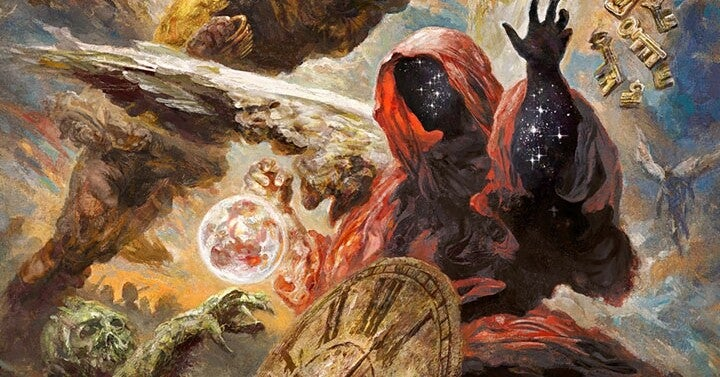

<figure>

</figure>

　6月の終わりに、2021年上半期のアルバムをまとめよう！　とか意気込んでnoteに書き始めていたのだが、思い返してみると今年はハードロック/ヘヴィメタル/プログレ辺りがかなり豊作だった。

　やはりミュージシャンも家にこもって作業する時間が増えているため、より作り込んだアルバムをリリースすることができたということかもしれない。本当に聞いていて嬉しくなってしまうようなアルバムばかりだ。

　そんなわけで、10枚ぐらいでまとめるつもりが30枚を超えてしまった。これでもかなり絞り込んだつもりなのだが、これ以上絞り切れない感じになったので、そのまま書き散らすことにした。まあ、リスナーにとっても実に幸せなことである。

　それでは、以下おおよそリリース順でどうぞ。

## IMMORTAL / MICHAEL SCHENKER

　レイドバックした感じはあるものの、マイケルの年齢からすれば十分にハードロックしている。

[https://open.spotify.com/album/0NhE86aNuWFx4qveE9iisN?si=6aYcpuHHTuSJza1TxNqdLg&dl\_branch=1](https://open.spotify.com/album/0NhE86aNuWFx4qveE9iisN?si=6aYcpuHHTuSJza1TxNqdLg&dl_branch=1)

## HEATWAVE / A.C.T  

　スウェーデンのポップでメロディアスなプログレバンド。いかにもプログレ然としたメロディが美味しい。

[https://open.spotify.com/album/3rQIUfmC61AyS8uOsFTxQH?si=ndrpFuBUSBm4aY1XKQ1eFg&dl\_branch=1](https://open.spotify.com/album/3rQIUfmC61AyS8uOsFTxQH?si=ndrpFuBUSBm4aY1XKQ1eFg&dl_branch=1)

## VIRIBUS UNITIS / DRAGONY

　『美しく青きドナウ』から始まるメロディックスピードメタル。それはかっこいいのかよくわからないミスマッチ感が楽しい。

[https://open.spotify.com/album/0KPqvuoVSIXYkQNQ0jiYvi?si=SHZf1z88TzWXKKpuRcv4cA&dl\_branch=1](https://open.spotify.com/album/0KPqvuoVSIXYkQNQ0jiYvi?si=SHZf1z88TzWXKKpuRcv4cA&dl_branch=1)

## RUNNING GAMES / JOEL HOEKSTRA

　ホワイトスネイクで活躍するジョエル・ホークストラのソロ。オーソドックスだが力強いメロディアスハードロックが貫かれている。

[https://open.spotify.com/album/5dmU9PX43DGzSC8nwvGd1h?si=vJrsO\_lWTtCXh\_VX0Gz5Yw&dl\_branch=1](https://open.spotify.com/album/5dmU9PX43DGzSC8nwvGd1h?si=vJrsO_lWTtCXh_VX0Gz5Yw&dl_branch=1)

## DEATH BY ROCK AND ROLL / THE PRETTY RECKLESS

　テイラー・モムセンのジャケットが話題（？）のアルバム。歌声もパワフルでよいのだ。

[https://open.spotify.com/album/7DIpDSIh0m4FElsDwskEWo?si=tf0yuKlES9unL7nLSzqxIg&dl\_branch=1](https://open.spotify.com/album/7DIpDSIh0m4FElsDwskEWo?si=tf0yuKlES9unL7nLSzqxIg&dl_branch=1)

## BY THE GRACE OF ROCK'N'ROLL / STARMEN  

　KISSみたいなメイクをしたスウェーデンの4人組。飛び出てきたサウンドはこりゃ古き良き正統派北欧メタルじゃないの！？

[https://open.spotify.com/album/2SnVfIWPRpm3IkZEXt7Y7p?si=Koqk0ArdRXWbtagJ6yegnA&dl\_branch=1](https://open.spotify.com/album/2SnVfIWPRpm3IkZEXt7Y7p?si=Koqk0ArdRXWbtagJ6yegnA&dl_branch=1)

## ALL THE RIGHT NOISES / THUNDER

　ブリティッシュハードロックが元気いいと嬉しくなるし、安心する。本当に英国らしいメロディラインが堪能できる。

[https://open.spotify.com/album/7pjipuQ9Ch4KO3jhnmn6bH?si=iVV8EBvSQCmLDnizk00jbw&dl\_branch=1](https://open.spotify.com/album/7pjipuQ9Ch4KO3jhnmn6bH?si=iVV8EBvSQCmLDnizk00jbw&dl_branch=1)

## THE BITTER TRUTH / EVANESCENCE  

　苦い真実。なんとなく入れてみたけど、これ2020年発売のアルバムだった！？

[https://open.spotify.com/album/4E9a01qX16n2B4TqSTL4Ed?si=OE\_tmospTXiffUoWXaFCDg&dl\_branch=1](https://open.spotify.com/album/4E9a01qX16n2B4TqSTL4Ed?si=OE_tmospTXiffUoWXaFCDg&dl_branch=1)

## MEDICINE AT MIDNIGHT / FOO FIGHTERS

　久しぶりに聞いて懐かしい感じのフー・ファイターズ。すっかり普遍的なロックサウンドになって深みが増した。

[https://open.spotify.com/album/1FyNZvJ6MHO01kl3ySMPdc?si=Rr1qmJohQ0uqF2ACIGF\_jQ&dl\_branch=1](https://open.spotify.com/album/1FyNZvJ6MHO01kl3ySMPdc?si=Rr1qmJohQ0uqF2ACIGF_jQ&dl_branch=1)

## LTE3 / LIQUID TENSION EXPERIMENT

　リキッド・テンション・エクスペリメントは、そのとき限りのプロジェクトと思いきや、22年経って新作が出るとは！

[https://open.spotify.com/album/6GDFV4kWsQDYuah6tSqmu2?si=Lmb0WbPrQ3CbB68a4FNfGg&dl\_branch=1](https://open.spotify.com/album/6GDFV4kWsQDYuah6tSqmu2?si=Lmb0WbPrQ3CbB68a4FNfGg&dl_branch=1)

## A VIRTUAL WORLD / METALITE

　女性ヴォーカルとピコピコシンセとヘヴィなギターがいいマッチングをしていてさすがヤコブハンセン。シンセ多めでも軽くないのがいい。

[https://open.spotify.com/album/09vTPs3hUxr9j4MBZ0Y89O?si=JllH77iAQg6ehLrbfTkU0w&dl\_branch=1](https://open.spotify.com/album/09vTPs3hUxr9j4MBZ0Y89O?si=JllH77iAQg6ehLrbfTkU0w&dl_branch=1)

## COEXIST / OCTAVISION

　ダークでプログレッシブな現代メタル。ジェフ・スコット・ソート参加の曲はまた一味違う重厚さ漂う。

[https://open.spotify.com/album/5E8epApuKtkaw2PkxjWTCW?si=osJgMY6HRfC0cx0VoCYVPQ&dl\_branch=1](https://open.spotify.com/album/5E8epApuKtkaw2PkxjWTCW?si=osJgMY6HRfC0cx0VoCYVPQ&dl_branch=1)

## ONE SHOT / RONNIE ATKINS

　ステージ4の癌と闘病中のロニー・アトキンス。ソロアルバムは初めてということだが、往年の歌声が蘇ったような完成度がすごい。

[https://open.spotify.com/album/6s9o2Nb0d9pVooyunTSH02?si=kSW1fqDhSuiE8wE136xmlA&dl\_branch=1](https://open.spotify.com/album/6s9o2Nb0d9pVooyunTSH02?si=kSW1fqDhSuiE8wE136xmlA&dl_branch=1)

## THE DEVIL IN ME / SUZI QUATRO

　スージー・クワトロ、御年71歳。よもやこんなヘヴィなアルバムが出てくるとは……すごいね！

[https://open.spotify.com/album/1qqfUPHoTgJZFbnqUwTA29?si=Sy0h5BHVSeu4n-UQije1nQ&dl\_branch=1](https://open.spotify.com/album/1qqfUPHoTgJZFbnqUwTA29?si=Sy0h5BHVSeu4n-UQije1nQ&dl_branch=1)

## SMITH/KOTZEN

　エイドリアン・スミスとリッチー・コッツェンのコンボでブルージーなハードロック。こんないいアルバムの日本盤が発売されないなんて

[https://open.spotify.com/album/4fuwMAMhY0LC4Qu1KXdgK5?si=AsZNmTn3SLqi71lK\_gadaQ&dl\_branch=1](https://open.spotify.com/album/4fuwMAMhY0LC4Qu1KXdgK5?si=AsZNmTn3SLqi71lK_gadaQ&dl_branch=1)

## OUT OF THIS WORLD

　トミー・ハートとキー・マルセロのプロジェクト。メロディアスなハードロックしか出てこないじゃないか。素晴らしい美旋律。

[https://open.spotify.com/album/3J9pWUkru5CumJBuEilzmU?si=4xG\_HqckS8KMgfVHyT4LPA&dl\_branch=1](https://open.spotify.com/album/3J9pWUkru5CumJBuEilzmU?si=4xG_HqckS8KMgfVHyT4LPA&dl_branch=1)

## WINTERBANE / FROZEN CROWN

　素晴らしい！このB級っぽいメロディをA級クラスのクォリティまで引っ張り上げてしまう荒業！素晴らしい！

[https://open.spotify.com/album/7959qrdIZlcH6ETwW0N5u3?si=\_k0-4lU7RvCB68xrboOOHg&dl\_branch=1](https://open.spotify.com/album/7959qrdIZlcH6ETwW0N5u3?si=_k0-4lU7RvCB68xrboOOHg&dl_branch=1)

## THE UNDERFALL YARD / BIG BIG TRAIN

　90年代から活動を続ける英国プログレバンド2009年作品の再録。叙情的な音作りが魅力。

[https://open.spotify.com/album/0RldmYaAF6Q9YeQ0cxFJ06?si=lR3FYnZLSZu70fZbUTHJng&dl\_branch=1](https://open.spotify.com/album/0RldmYaAF6Q9YeQ0cxFJ06?si=lR3FYnZLSZu70fZbUTHJng&dl_branch=1)

## THE BATTLE AT GARDEN'S GATE / GRETA VAN FLEET

　レッド・ツェッペリンと比較されてもこのクォリティで続ければオリジナリティになるんじゃないか。

[https://open.spotify.com/album/7kjLKy9JLbwM9F7eDQEnd2?si=ybAE0ck3RwOpsoMbM-stjw&dl\_branch=1](https://open.spotify.com/album/7kjLKy9JLbwM9F7eDQEnd2?si=ybAE0ck3RwOpsoMbM-stjw&dl_branch=1)

## PYROMIDE / TEMPLE BALLS

　豊かなメロディとアグレッシブなサウンドが身上のフィンランド産メロディアスハード。パワフルな音作りで鋭く切り込んでくる。

[https://open.spotify.com/album/4VzCQ9QPhIqQduqkbkiiZU?si=wIATme6TQeS3bZea\_Gmnnw&dl\_branch=1](https://open.spotify.com/album/4VzCQ9QPhIqQduqkbkiiZU?si=wIATme6TQeS3bZea_Gmnnw&dl_branch=1)

## DAY AND AGE / FROST\*  

　モダンなセンスとトラディショナルなメロディでコンテンポラリーなプログレッシブサウンドを聞かせてくれる。上品な仕上がり。

[https://open.spotify.com/album/4iNsIkR18NMo2chPsyfVnv?si=3sJD9kZcSwSysxQSdAarRA&dl\_branch=1](https://open.spotify.com/album/4iNsIkR18NMo2chPsyfVnv?si=3sJD9kZcSwSysxQSdAarRA&dl_branch=1)

## FORTITUDE / GOJIRA

　ブルータルでテクニカルなエクストリームミュージックを進化させ続けるGOJIRA。複雑な音作りは単なるデスメタルではない。

[https://open.spotify.com/album/3bmdzJRZ4DLRTiA6yBBQcI?si=ynet3sYISBG66CceEma-Gg&dl\_branch=1](https://open.spotify.com/album/3bmdzJRZ4DLRTiA6yBBQcI?si=ynet3sYISBG66CceEma-Gg&dl_branch=1)

## OUT OF THIS WORLD / KAYAK

　クラシカルでリリカルなメロディを大仰に展開させるオランダのベテランプログレバンド。そのドラマティックな構築美に酔いしれる。

[https://open.spotify.com/album/4efFfFNayzLIS38BiA2f9Z?si=URBdd5-BQoCq1g4-wOMI5Q&dl\_branch=1](https://open.spotify.com/album/4efFfFNayzLIS38BiA2f9Z?si=URBdd5-BQoCq1g4-wOMI5Q&dl_branch=1)

## SEPARATE WORLDS / ROBBY VALENTINE

　ピアノを多用した微旋律ロックを作り出してきたロビー・バレンタイン。20年経ってもその美しいメロディを失わない。今作はロック色は薄い。

[https://open.spotify.com/album/3k1Gl6ZmtXlROY0ruLSsEL?si=0acnQLjiSAiRmn8d0yrvEQ&dl\_branch=1](https://open.spotify.com/album/3k1Gl6ZmtXlROY0ruLSsEL?si=0acnQLjiSAiRmn8d0yrvEQ&dl_branch=1)

## STANDING ON THE EDGE / ROBIN McAULEY

　ロビン・マッコーリーがソロアルバムを発表するのは実に22年ぶり。思いの外ウェットで哀愁漂うサウンドができあがった。

[https://open.spotify.com/album/2m44oOnubmrObfD7EWF8vM?si=7G0Bup-qSPSOBO31Dct2HQ&dl\_branch=1](https://open.spotify.com/album/2m44oOnubmrObfD7EWF8vM?si=7G0Bup-qSPSOBO31Dct2HQ&dl_branch=1)

## DELIRIUM / SEVENTH CRYSTAL

　スェーデンのメロディアス・ハードバンド、デビューアルバム。堅実な曲作りで好感が持てる。

[https://open.spotify.com/album/1znGOtJyzlLj4VjwDUqK13?si=ZHSDtXnDQw6fOOh4nA9jDw&dl\_branch=1](https://open.spotify.com/album/1znGOtJyzlLj4VjwDUqK13?si=ZHSDtXnDQw6fOOh4nA9jDw&dl_branch=1)

## EVIL AND DIVINE / SUNBOMB

　マイケル・スイートとトレイシー・ガンズのコンビからこんなサウンドが出てくるとは！　神よあなたを信じますと歌っていたマイケル・スイートも今や完全にこっち側の人間だ。

[https://open.spotify.com/album/6yy5f4KDiAvqpu0T7FAajp?si=76IuhnEAS8Cd7rWv6xw8ug&dl\_branch=1](https://open.spotify.com/album/6yy5f4KDiAvqpu0T7FAajp?si=76IuhnEAS8Cd7rWv6xw8ug&dl_branch=1)

## BOTH SIDES OF MIDNIGHT / EAST TEMPLE AVENUE

　堅実なサウンドが嬉しいメロディアス・ハード作品。マルチプレイヤーのダレン・フィリップスが中心になっているプロジェクト。

[https://open.spotify.com/album/5VssEz9sGPs1XBDJuSuw8n?si=n5R0g5JzTW2EEea7p3DY4A&dl\_branch=1](https://open.spotify.com/album/5VssEz9sGPs1XBDJuSuw8n?si=n5R0g5JzTW2EEea7p3DY4A&dl_branch=1)

## HELLOWEEN

　ハロウィンが帰ってきた！　マイケル・キスクとカイ・ハンセンがいるだけでこんなにも古ハロウィンになるなんて！　素晴らしい！

[https://open.spotify.com/album/6ZOpyAm1HCU9Z0aRSLMPnn?si=xCUf3hfySU2VjRK0nZ0kfg&dl\_branch=1](https://open.spotify.com/album/6ZOpyAm1HCU9Z0aRSLMPnn?si=xCUf3hfySU2VjRK0nZ0kfg&dl_branch=1)

(DATSUNS)

## 「小さな物語」〜Stories〜 / キクラテメンシス

　フルート奏者の鈴木和美を擁する日本のプログレバンド。繊細かつ丁寧に構築されたサウンドは聞くものに感動をもたらす。

[https://open.spotify.com/album/0rXmt742pWRSSn8RGv1F05?si=nF8-gZF\_R0KfYir2umee9g&dl\_branch=1](https://open.spotify.com/album/0rXmt742pWRSSn8RGv1F05?si=nF8-gZF_R0KfYir2umee9g&dl_branch=1)

## WEREWOLVES OF PORTLAND / PAUL GILBERT

　ポール・ギルバートのポップセンスが遺憾なく発揮されたソロアルバム。こういう曲書かせたら抜群だね。

[https://open.spotify.com/album/43jK0WhoDPp0RYY0gzBCLl?si=pqAxk\_yARUiiPdnr0q2dsw&dl\_branch=1](https://open.spotify.com/album/43jK0WhoDPp0RYY0gzBCLl?si=pqAxk_yARUiiPdnr0q2dsw&dl_branch=1)
