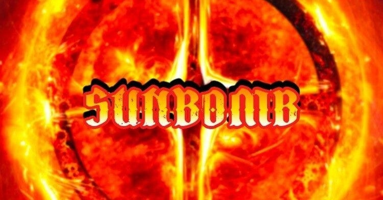

<figure>

</figure>

　昨日の『2021年上半期のアルバム』に入れたSUNBOMBというバンドというかプロジェクトにどうしても物申したい。

[https://note.com/keigox68000/n/nd3363535b3f7](https://note.com/keigox68000/n/nd3363535b3f7)

　SUNBOMBは、元L.A.GUNSのギタリスト、トレイシー・ガンズと、元STRYPERのヴォーカル、マイケル・スイートが組んだプロジェクトだ。今年の2月ぐらいからYoutubeで新曲を発表していた。

　トレイシー・ガンズと言えば、ガンズ・アンド・ローゼズ脱退後、そのガンズが大ブレイクして以降不遇なギタリストというイメージがつきまとう。L.A.GUNSのサウンド自体は、バッドボーイなロックンロールといった趣でなかなか楽しかったとは思う。

[https://open.spotify.com/album/7qxMyKTvm9UtiypH7t8pqz?si=cRMcEqs2TXOwkp0QaNyWBA&dl\_branch=1](https://open.spotify.com/album/7qxMyKTvm9UtiypH7t8pqz?si=cRMcEqs2TXOwkp0QaNyWBA&dl_branch=1)

　一方、マイケル・スイートはご存知神を崇めてデビューしたSTRYPERのヴォーカル。神聖なるハイトーンヴォイスを駆使して、神よあなたを信じますと歌うスタイルと、工事現場を思わせる黄色と黒の衣装が話題だった。

[https://open.spotify.com/album/3XvK5NpafsiwfKyd9ULCsJ?si=sVl8lkidRgGLUTQaMgb\_vQ&dl\_branch=1](https://open.spotify.com/album/3XvK5NpafsiwfKyd9ULCsJ?si=sVl8lkidRgGLUTQaMgb_vQ&dl_branch=1)

　その2人が合体して作り上げたプロジェクトがSUNBOMBである。バンド名もすごいが、アルバムジャケットもなんだかわからないが、炎燃え盛る迫力あるアートワークだ。

[https://www.amazon.co.jp/dp/B08XRBSFHC](https://www.amazon.co.jp/dp/B08XRBSFHC)

　そして、いざアルバムを聞いてみると、トレイシーとマイケルの経歴を知っているものは誰でも驚くはずだ。

[https://www.youtube.com/watch?v=mY672AJDa80](https://www.youtube.com/watch?v=mY672AJDa80)

　そこにはL.A.GUNSのノリノリな雰囲気も、STRYPERの神聖さもまったくみられない。哀愁とダークさを伴った悲しげなギターリフ。そして朗々と人生について歌い上げるマイケル・スイートの歌メロも、何か人生の無常やタフネスを表現しているかのようだ。

　よもやこの2人から、こんな曲が出てくるとは思いもよらなかった。もしかしたら、彼らの歩んできたこれまでの人生がこんな楽曲を生み出したのかもしれない。

　アルバムの1曲目"Life"はPVも作られているが、何か思いつめた男が教会で煙草を吸いながら佇んでいる映像が挿入される。STRYPER初期のコンセプトとは真逆を行くような映像に、マイケル・スイートの人生観の変化を感じずにはいられない。

　いや、むしろメタル的にメインストリームな音作りに、マイケル・スイートも完全に伝統的なメタルの世界に生まれ変わったとも言えるのかもしれない。以降の楽曲も、むしろBLACK SABBATHを思わせるようなダークで重々しい雰囲気に包まれているものが続く。すごくメタル的にパワフルなアルバムだ。

　今年はライブが行われない分、いろいろなミュージシャンが思わぬコラボレーションを企画して次々にアルバムを発表している。そして、それが実に当たった年になりつつある。メタルファンとしては、ある意味歓迎すべき状況でもある。そして、このSUNBOMBはそんなサウンド作りに成功したひとつである。その意外性も含めて。おもしろい。実におもしろい。

　こんな化学反応があるからメタルはやめられない。
