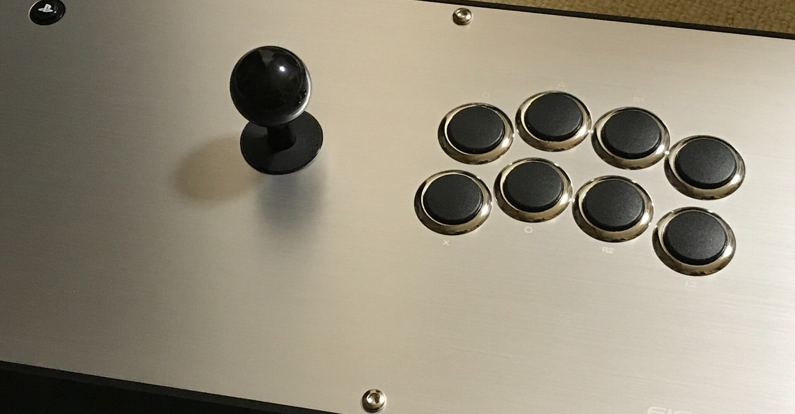
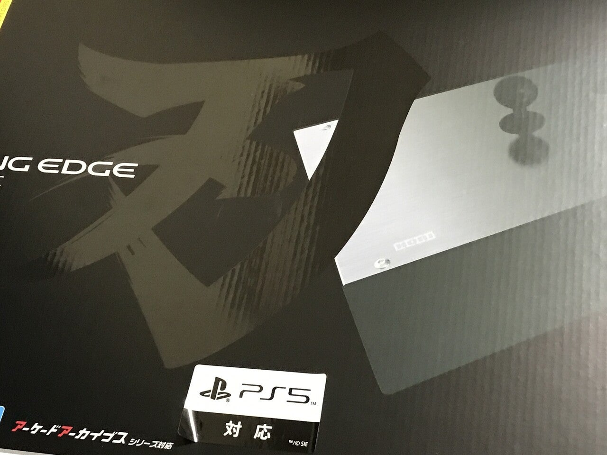
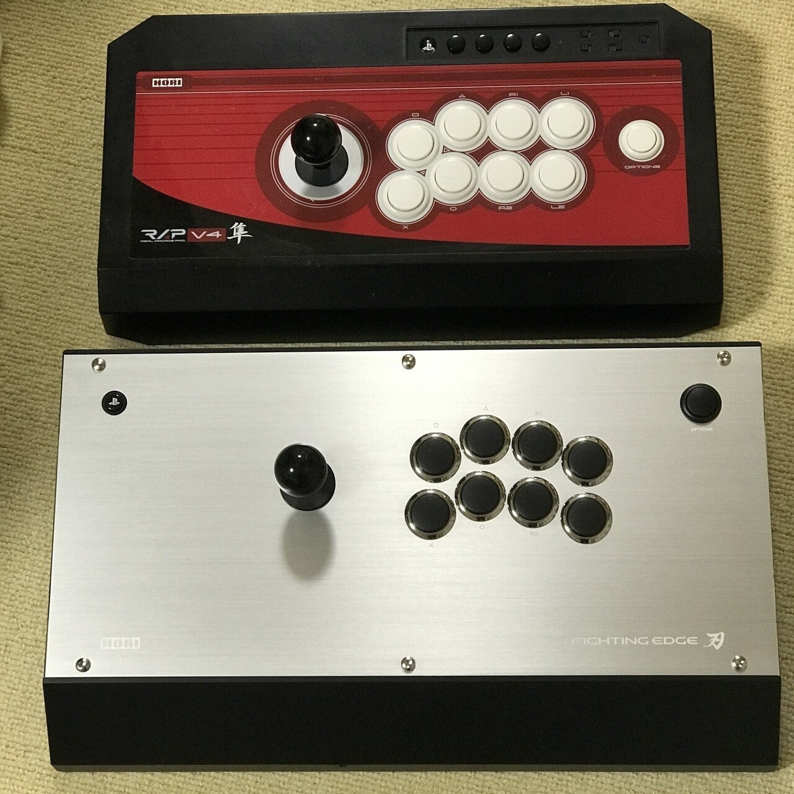

<figure>

</figure>

　以前noteに新しいアーケードスティックが欲しいということを書いた。

[https://note.com/embed/notes/n07ea789121c4](https://note.com/embed/notes/n07ea789121c4)

　ついに買ってしまった『ファイティングエッジ刃』。銀色に輝く天板と、その巨大さがゲーマーを圧倒する一品だ。

<figure>

</figure>

　重量約3.5kgで、これまで使っていた『RAP V4 隼』も十分に重いはずなのに、遥かにずっしりと来る重みが感じられる。

<figure>

</figure>

　発売自体はもう3年以上前なので、特に目新しい製品ではないが、こういうものは年月が経っても問題なく使えるのがいい。近所の家電量販店で買ったが、未だに在庫が置いてあって、逆に製品の息の長さにびっくりする。

　製品箱には後から貼り付けた「PS5対応」の文字があり、今回この製品を買った目的も、PS5でタッチパッドを使いたいからというのがひとつある。

　事前にあまり調べないで買ったのだが、どうやらボタンのアサインを入れ替えられる機能があるらしい。あまり使わない機能だが、どうしてもボタンの割り当てを変更できないゲームが出てきたときには役に立つかも知れない。

　その代わり、連射機能はオミットされている。今やレトロゲームの移植作品は、ゲームに連射機能が搭載されていることがほとんどなので、こちらもあまり使わない機能で問題ないだろう。

　個人的には、アーケードスティックの筐体がどっしりと安定していて、レバーやボタンの配置、そしてレバーとボタンそのものの完成度といった、ゲームをプレイする際に直接プレイヤーがアクセスする部分の素性がしっかりしていてくれれば、それで満足である。

　レバーとボタンについては、いつものセイミツ製、三和製に交換してしまおうと思っていたのだが、標準でついているホリ製のHAYABUSAユニットで全然問題ない。ホリもレバーやボタンのクォリティアップを図っているようで、最初に手にしたホリ製のレバーよりよくなっている印象だ。このまま使っていこうと思う。まあ、レバーやボタンに関しては感覚的な話で、何か数値的なデータを取る方法も確立されていないので、自分でいいと思えばいいのだ。

　とりあえず、アーケードアーカイブスの数作と、それから懐かしい『ウルトラストリートファイターIV』のCPU戦を遊んでみたが、実に快適だ。ずっしりと重たい筐体も、予定通りラップトップスタイルで問題なく使える。裏面にゴムパッドが貼ってあるので、冷たくなくて滑りづらいのも優秀だ。

　高い買い物で、どうかなあという心配はあったが、予想外に出来のいい商品で満足した。以前はRAPのビューリクスモデルも欲しいと思った時期があったが、PS5で使うことを考えると、この『ファイティングエッジ刃』がベストマッチだっただろう。これから長く使っていけそうだ。
