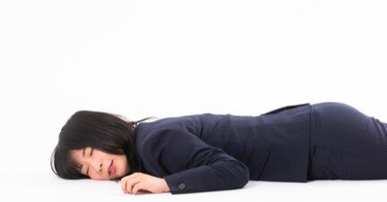

<figure>

</figure>

　普段肩こりに縁がない。血圧が高い人は肩が凝らないという俗説もあるが、別に血圧も高くない。とにかくほとんど肩こりで困ったことがない。

　しかし、そんな僕も肩が凝ることがある。それは、寝不足のときだ。寝不足の原因はだいたいがゲームなのだが、ゲームに熱中して数日間睡眠時間の少ない日が続くと、ある朝突然肩が凝っていることがある。

　僕は子供の頃からショートスリーパーで、5時間も眠ればスッキリ目が覚める方だ。休日も平日もほぼ同じ時間に目が覚める。休みだから目一杯寝てやろうという発想はあまりない。

　そんな、もともと睡眠が少ない人間が「睡眠不足」というのだから、これはもうよほど寝る時間が足りていないということなのだろう。なるべく4時間は眠るようにしているのだが、もしかするとときどき足りていないかもしれない。

　いずれにしても、肩が凝り始めたら睡眠が足りてないなということで、少し早寝をするようにしている。6時間眠れば、これはもう大量睡眠をゲットしたと言っても過言ではない。7時間とか8時間眠るとなると、これは逆に難しい。そんなに寝ていられないのだ。

　まあ、そんな感じで少し眠る時間を増やすと、肩こりは回復する。そもそも肩が凝るのは血行が悪いからと言うが、寝不足はきっと体に悪いのだろう。やっぱり4時間じゃなくて5時間寝ないとダメだな。いつもそんなことを自分に言い聞かせながら、肩こりで健康状態を計っているのである。

　そんな健康に悪そうな生活をしている毎日だが、実は便利なこともあって、布団に入るときはいつも眠さマックス状態のときなので、横になると5秒ぐらいで寝ついてしまうのだ。誇張じゃなくて本当に5秒。何かいい感じの曲を聞きながら寝ようとか思っても、1曲目のイントロすら聞いた覚えがないうちに眠りについている。

　何だよくわからない話になったが、とにかくよく寝るのはいいことだと思う。僕ももっと眠るように努力しよう。
