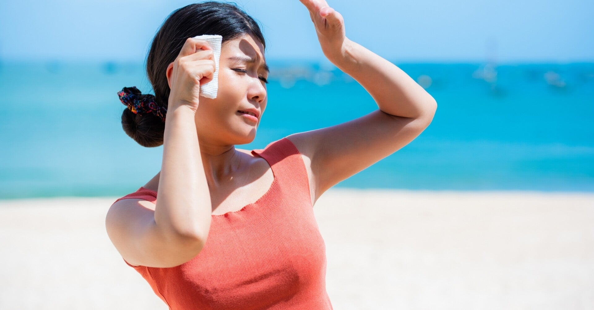

<figure>

</figure>

　梅雨明け宣言が来たと思ったら連日容赦ない猛暑だ。そんなに急に切り替えなくてもいいだろ。人間にも少しは慣らし期間が必要だと思う。

　とは言え、やはり夏は暑い方がいい。暑い夏は経済がよく回ると聞く。エアコン、ビール、かき氷。電気が足りなくなるぐらい世の中にお金が回るといいなと思う。

　ところでそんな夏の日差しにも、なぜか僕の肌はあまり焼けない。インドア生活がメインのせいもあるが、たとえ日に当たっても、腕も顔も首もほとんど焼けずに真っ白なのだ。

　焼けなくていいねとか言われるけど、実は日に焼けないのはそれなりにつらい。例えば1日外の日差しの中で仕事をせざるを得ない場合もあるのだが、そういう日は夜全身が熱を持って火照ってしまう。日に焼けない代わりに、体中真っ赤になって猛烈にヒリヒリするのだ。

　そんなわけで、日差しの強い日はなるべく炎天下に出ないようにしている。日に焼けないのは別にいいことではなくて、むしろ強い日差しに適応できない危険な皮膚ということなのだ。

　冒頭にも書いたように、どうやら今年の夏はだいぶ暑くなりそうである。自分の皮膚を殺人的な日の日差しから守るためにも、より一層インドアで暮らすことを決意しよう。
