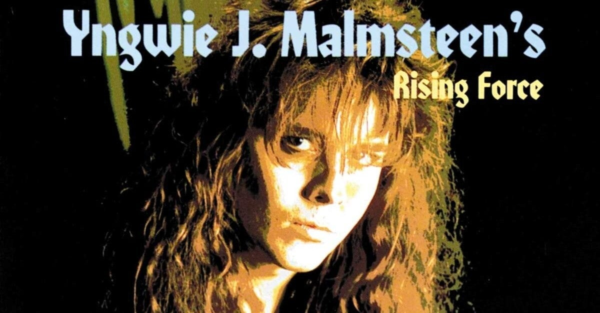

<figure>

</figure>

　明日7/23（金）は、イングヴェイ・マルムスティーンのニューアルバムの発売日だ。

　実は先行して公開されている動画で新曲を聞いて、ニューアルバムにはあまり期待していない。

[https://open.spotify.com/album/0w0kWBmluwVX5kqGwVHX4T?si=sUFlZ2NHQEmeFp327lFGBQ](https://open.spotify.com/album/0w0kWBmluwVX5kqGwVHX4T?si=sUFlZ2NHQEmeFp327lFGBQ)

　それでもせっかくイングヴェイがニューアルバムをリリースするのだから、記念に（？）過去のアルバムで僕が最も推すものを3点に絞って紹介したい。

## ODYSSEY (1988)

　ヴォーカルはジョー・リン・ターナー。イングヴェイのソングライティングがすごくアメリカナイズされていて、ネオクラシカルな要素は少ない。しかしながら、その楽曲とジョーの声質が奇跡的なマッチングを果たして、非常にクォリティ高いアルバムが完成している。エンジニアのジェフ・グリックスマンの力も大きいんじゃないだろうか。

[https://open.spotify.com/embed/album/2Bgu9FC19pRP8O6ZY4QIWs](https://open.spotify.com/embed/album/2Bgu9FC19pRP8O6ZY4QIWs)

## FACING THE ANIMAL (1997)

　まずプロデューサーがクリス・タンガリーディスであることを挙げたい。そのおかげか各楽器のバランスがよく、音もいい。キーボードが前面に出ている曲などもあって聞いていて心地よい。ヴォーカルのマッツ・レヴィンの声も楽曲に洗練されたイメージを与えている。そして何よりコージー・パウエルのドラムが曲を引き締めている。

[https://open.spotify.com/embed/album/0xxFsChhpxWwcTbPZgjGIG](https://open.spotify.com/embed/album/0xxFsChhpxWwcTbPZgjGIG)

## SEVENTH SIGN (1994)

　いろんな意味で楽曲が充実している。バラエティに富んだ内容は楽しい。オープニングを飾る"Never Die"は単純ながらスピード感あふれる佳曲。何より"Crash and Burn"の北欧メタル然とした曲調、展開だけでアルバムの存在感をぐっと押し上げている。ヴォーカルにマイク・ヴェセーラを起用したのもよかった。（その後色々あったみたいだけど）

[https://open.spotify.com/embed/album/5JYJg9Typs4lNkUEFt9e2W](https://open.spotify.com/embed/album/5JYJg9Typs4lNkUEFt9e2W)

　実はこの辺りが好きなアルバム。いや、他のも全然好きなんだけど。これぐらい何か聞きどころのあるアルバムが出てきてくれると嬉しいけどね。期待して待とう。
