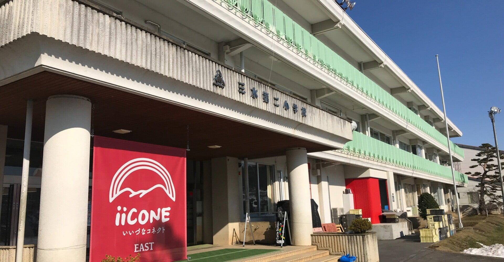
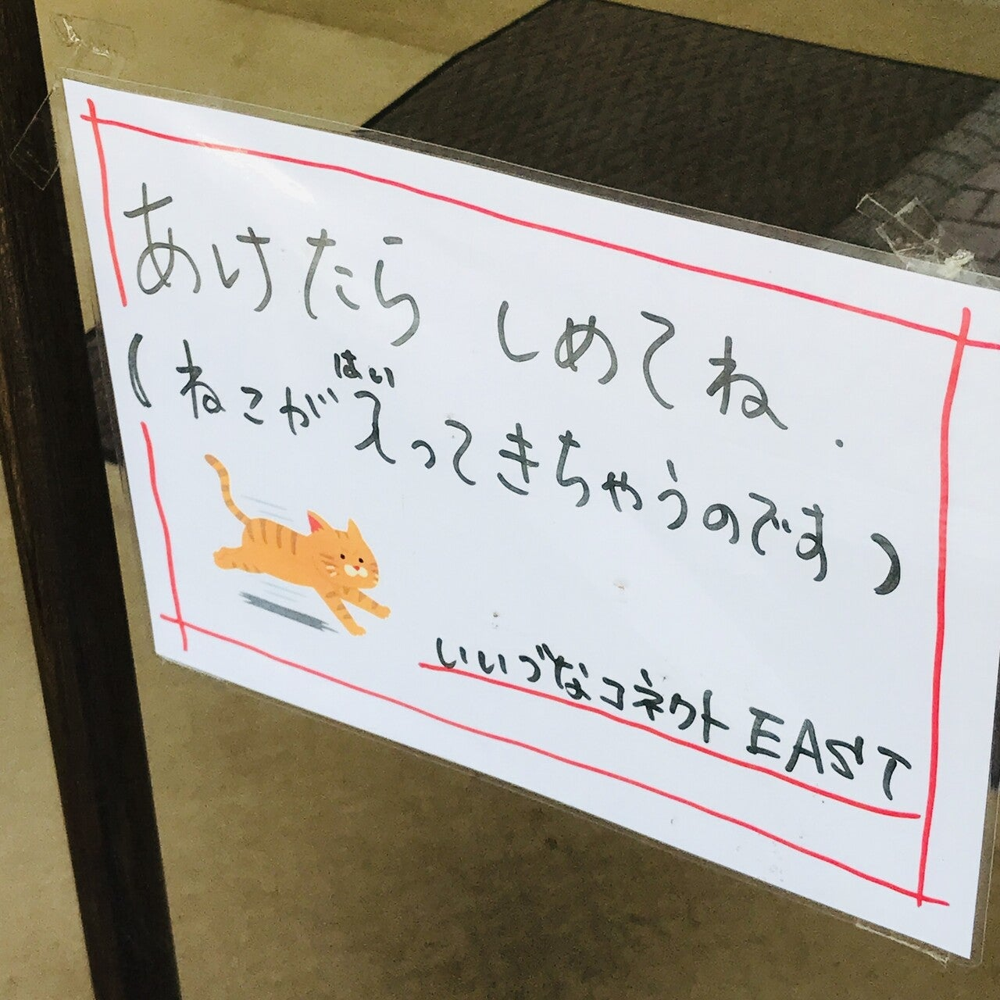
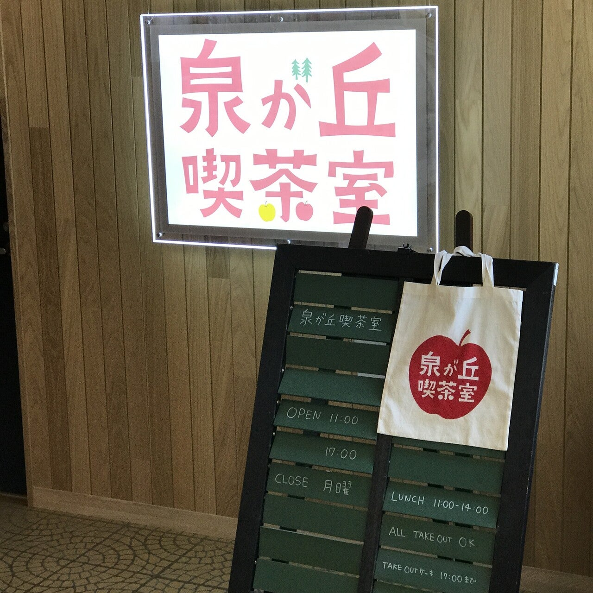
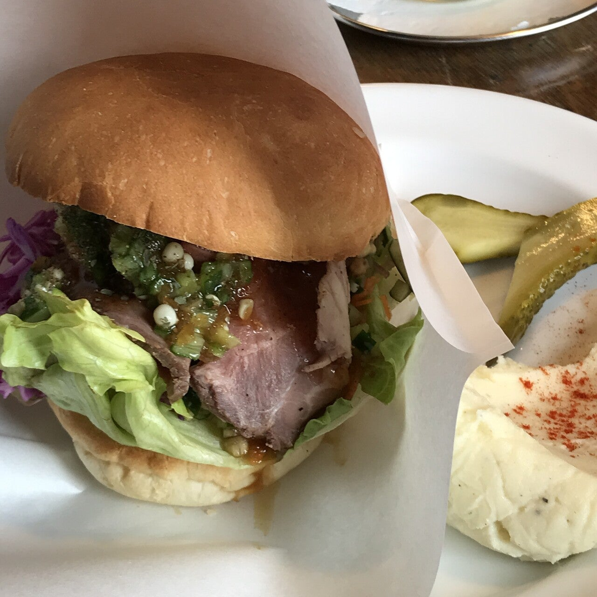
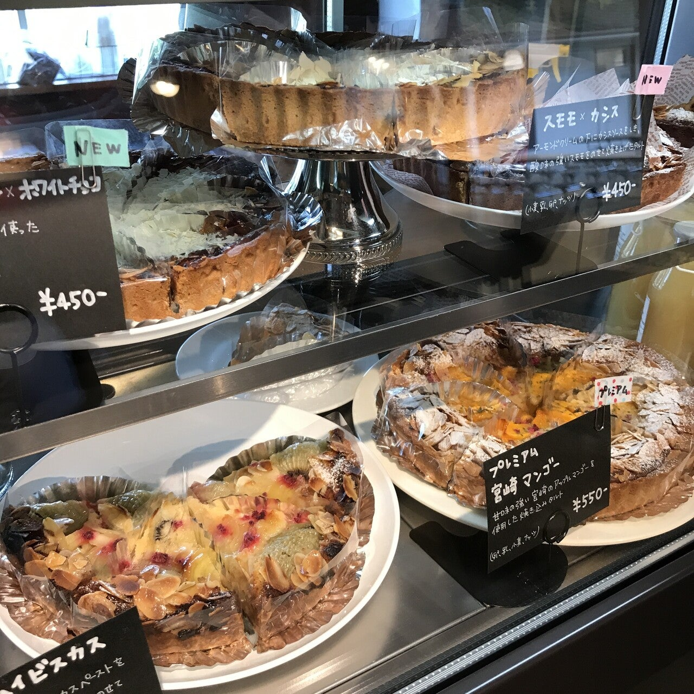
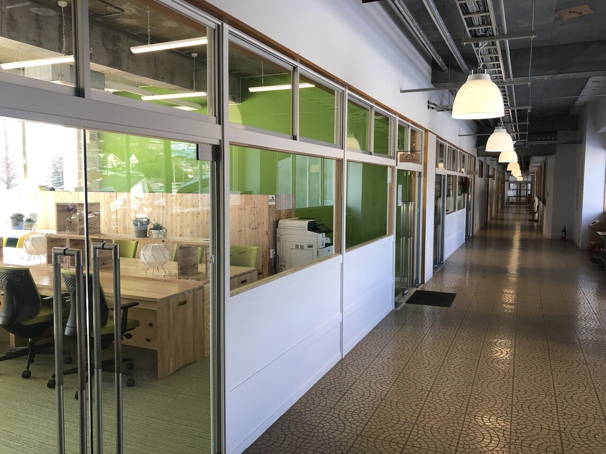
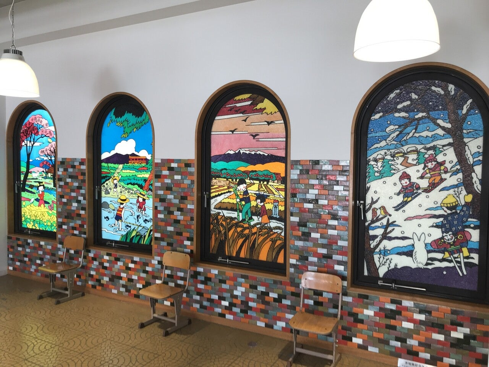
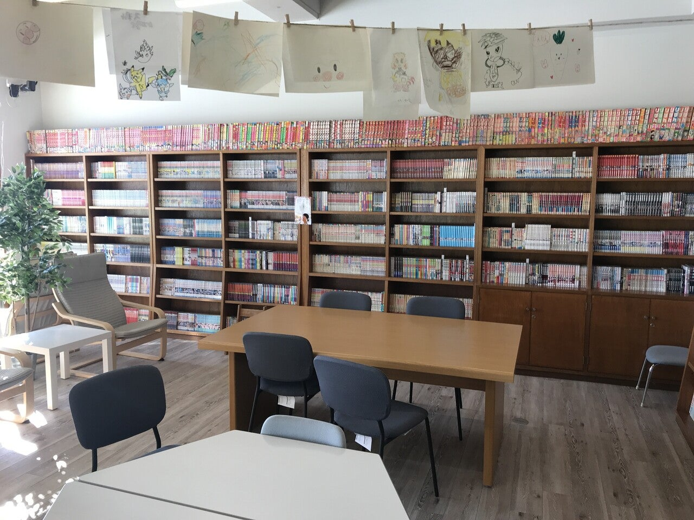

<figure>

</figure>

　『いいづなコネクトEAST』は長野県飯綱町にある、閉校になった小学校を改装し、地域活性化の拠点として活用する目的として飯綱町が営業を始めた複合施設だ。

　この『いいづなコネクトEAST』の中にテナントとして入っているカフェ『泉ヶ丘喫茶室』の雰囲気がいいので、ときどき利用している。

　ここで食べられるローストビーフバーガー、タコライスなどがなかなか絶品で気に入ってしまった。また、自家製ジンジャーエールが飲めるのだが、こちらも生姜が効いていて、市販のジンジャーエールでは味わえない刺激が体験できる逸品である。

　もう最近は街にあるチェーン店な食品はコスト削っていてあまり美味しくないので、こういう手作りの味を味わえるお店は本当にありがたい。

　このお店にはケーキも豊富にラインナップされていて、こちらも手作りの味が楽しめる。お値段も手頃で、ちょっとお茶をするのにはいい場所だ。（と言っても、我が家からは車で30分かかるのだが）

　とは言え、この『いいづなコネクトEAST』に他にお店が入っているかと言うと、実はあまり多くの店はない。普通に買い物ができるのは、りんごのお酒を売っている林檎学校醸造所のみ。あとは企業がテナントを利用しているようだ。

　他には飯綱町で営業しているコワーキングスペースがあり、こちらは比較的安価で仕事のできるスペースがレンタルできる。コピー機とWifiというシンプルな構成だが、テレワーク時代にこういう場所で静かに仕事ができる人もいるのではないだろうか。僕はテレワークではないので使ったことはないが、テレワークするならこういうところもいいなという感じはする。

　それ以外に、レーザープリンターやレーザーカッターなどの工作機械を備えたラボもあり、こちらも1時間1500円で借りられる。材料は自分で持ち込みだが、アクリルもカットできるレーザーカッターのようなので、機会があればレンタルしてみたいとも思っている。

　また、誰でも無料で利用できる図書室もあり、こちらはなんだかものすごいレトロな漫画が置いてあって、もしかして興味のある人にはすごいスペースなのかも知れない。

　個人的にはカフェを利用する以外に使ったことはないのだが、人口減少時代において、こういう多目的スペースが生まれてくるのはある意味面白いと思う。

　正直、あまり採算は取れていないのだろうと予想されるが、どこかから噂を聞きつけて、こういう場所が盛り上がってくれるとよいのだが。なかなか難しいのかも知れない。

　ちなみに、『いいづなコネクトWEST』というのもあって、そちらも閉校になった小学校をリノベーションして活用した事務などがあるらしい。今度行ってみようかな。

[https://iizuna.jp/iicone-east.html](https://iizuna.jp/iicone-east.html)
