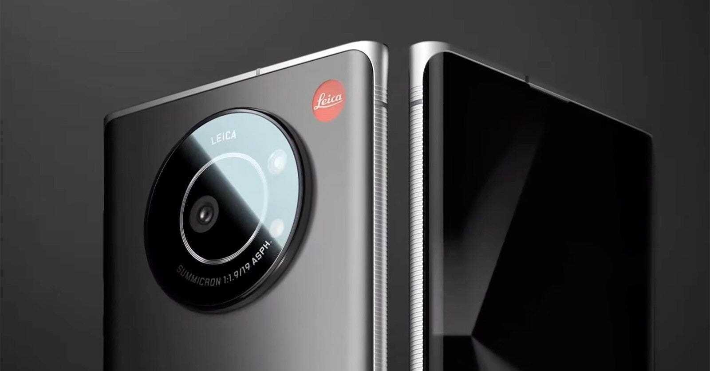

<figure>

</figure>

　『Leitz Phone 1』は、つい先日ライカが発売したスマートフォンだ。いや、正確にはライカが監修し、ソフトバンクが販売するという形になっている。

　スマートフォン自体は普通のAndroid端末のようだが、ライカ監修ということでカメラ部分にはこだわりがある。この『Leitz Phone 1』のカメラは、センサーサイズが1インチと、普通のスマートフォンより大きいサイズのものを搭載している。

　デジカメで1インチサイズのセンサーは決して大きいサイズではないが、もっぱらコンデジの高級機に搭載され、持ち運びに便利だがワンランク上の画質を求める層に一定の支持がある。

　この1インチのセンサーは、シャープのスマートフォンに先行して採用されている。こちらもライカのレンズと合わせて使われている。しかしながら、多くのスマートフォンと比べた場合、この1インチサイズのセンサーというのはやはりアドバンテージになるだろう。

　特に今回は、ライカ自身がスマートフォンを出したという体を取っているため（実際はどこが作っているかよくわからないが）、そのインパクトは大きいと思う。

　僕自身も1インチセンサーのコンデジを買おうと思っていた時期があり、スマートフォンに同じサイズのセンサーが搭載されるのであれば、そちらを選択する手はありだなと思っている。

　スマートフォンに搭載されるカメラのセンサーサイズは、スマートフォンそのものの大きさの都合から小型のものが使われるが、その分をソフトウェアの画像処理で補ってきたような歴史がある。

　しかしレンズとセンサーにこだわるのであれば、素性の良い画像データを記録でき、ソフトウェア処理によるボケや解像感とはまた別次元の高画質が得られるだろう。（だからと言って、必ずきれいな写真が撮れるとは限らないところがデジカメの難しいところだが）

　そういう意味で『Leitz Phone 1』には期待が持てる。ライカというブランドに関係なく、僕も欲しいスマートフォンの候補に挙げられる内容のカメラだ。

　にもかかわらず、残念なことにソフトバンク独占の販売だ。おそらく、ライカの名を冠したソフトバンクのスマートフォンということなのだろうが、それでもカメラについては気になるスペックを持っていると言える。（中身はシャープなのかな）

　さらには、価格にもセンサーサイズやライカブランドが否応なしに反映されていて、18万円を超える、スマートフォンとしてはあり得ない高額の製品となってしまっている。この辺は実に残念で、しょうもない価格設定だと落胆している。

　いずれにしても、とりあえずカメラに1インチセンサーを搭載したスマートフォンが登場したことで、他社が少しでもその動きに反応してくれると楽しいんじゃないかと思っている。

　もちろん前述のとおり、1インチセンサーを搭載すると値段が跳ね上がる傾向にあるのは、スマートフォンのみならずコンデジでも一緒である。価格が高くなれば売れ行きに影響もあるので、そう単純には大型センサーを搭載したスマートフォンは登場しないとは思うが、それでもいろいろと可能性を妄想して楽しくなってしまうことには違いない。

　カメラメーカーも1インチセンサーにはプレミア感を持たせているようなところがあり、それが高級コンデジの価格を必要以上に吊り上げている風は感じられる。それが嫌で1インチセンサーのコンデジも買うのをやめてしまったのだが、マイクロフォーサーズなんかは、カメラ市場でもすごくこなれているんだから、1インチもがんばれよという気はしている。

　と、そんな感じで『Leitz Phone 1』を買うことはないのだろうが、期待を持ってウォッチしているのであった。

**※追記）ちょっと調べたら『Leitz Phone 1』は回線なしでも購入できるとのこと**
