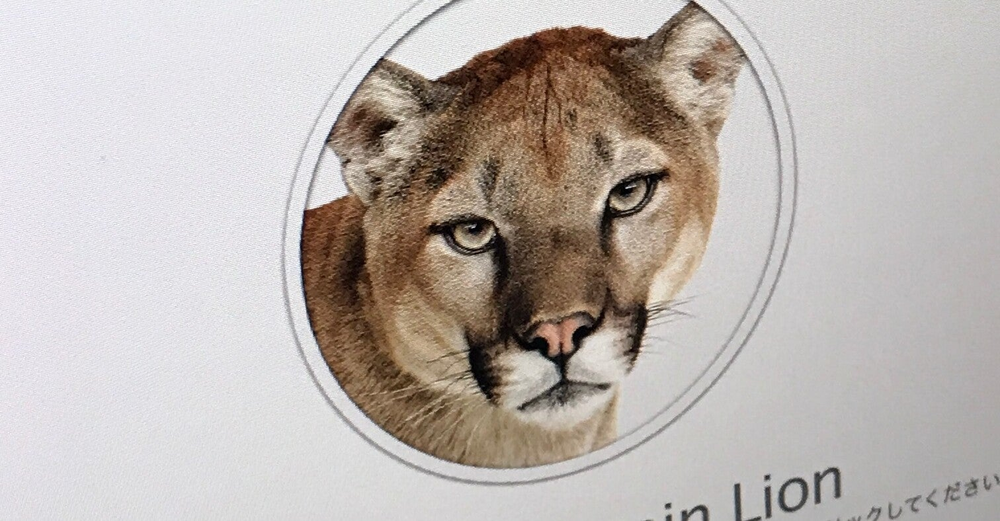

<figure>

</figure>

　少し前にNASを導入した話を書いた。

[https://note.com/keigox68000/n/n20da2e8bf3fe](https://note.com/keigox68000/n/n20da2e8bf3fe)

　NASが本格的に稼働してから1ヶ月以上経ち、旧サーバであるMacMiniの動作を止めた。それも1週間以上経ち、特に問題なくデータの管理もできているため、今度はMac MiniのOSをクリーンインストールして、何かに活用しようと思う。

　ところが、MacMiniがあまりに古いため、OSの再インストールが少し面倒でハマった。僕のMacMiniはLate2012というモデルなのだが、まず、最新MacOSであるBig Surは対応していない。まあ、古い機種なのでそれは仕方ないが、それじゃあこのMacがどのOSまで対応しているのか。それは自分で調べなければならない。

　ちなみに、再インストールで起動したところ、なんとMountain Lionをインストールしますという画面で立ち上がってきた。流石にネコ科コードネームの旧世代OSが来るとは思わなかった。

　さて、アップルのサポートページで調べてみると、Late2012のMacMiniは、MacOS Catalinaが対応する最も新しいOSらしい。なんだ、結構最近のOSで行けるんじゃないか。

　ということで、Catalinaを選択してクリーンインストールしようと思う。しかし、ネットワークに接続しても、そこから選択的に古いMacOSを選んでインストールすることはできない。あえて古いMacOSを入れるには、まずアップルのサイトからターゲットとなるMacOSをダウンロードする必要がある。

　さらに、このOSをインストールするために、USBメモリなどを使ってインストーラを作成、そのUSBメモリから起動してインストールする必要がある。

[https://twitter.com/keigox68000/status/1419108363808370688](https://twitter.com/keigox68000/status/1419108363808370688)

　サポートページに書いてあるので難しくはないが、ターミナルからsudoでUSBメモリにダウンロードしたOSイメージを書き込まなければならない。アップルのマシンでこんなにめんどくさいことをやらされるのは初めてじゃないか。ちょっと驚きである。

　さて、USBメモリからインストーラが立ち上がると、いよいよMacOSのインストールだ。と、思いきや、まずはHDDをフォーマットしなければならない。いろんなページを見ると、APFSというアップルの起動ディスク用フォーマット形式を選択するらしい。

　実はここでもハマった。MacMini本体のクリーンインストール画面から起動できるディスクユーティリティには、このAPFSが出てこない。USBメモリから起動したインストーラで、HDDの物理層までアクセスしてフォーマットすることで、ようやくAPFSを選択してフォーマットできるのだ。

　で、無事APFSでフォーマット。いざCatalinaをインストール、と思ったら、今度は古いMacではAPFSでフォーマットしたHDDにOSはいれられないというメッセージ。どういうことなの。古いMacでは今まで通り、MacOS拡張でフォーマットしろということらしい。最初に言ってよ。

　仕方なく、再度HDDをアンマウントしてMacOS拡張でフォーマット。これでようやくCatalinaのインストールと相成った。

　そんな感じで、新しいことを取り入れていくアップルらしく、古い規格は結構容赦なく切り捨てられているようだ。一応情報は各所に残されているものの、ちょっとしたアドベンチャーゲーム気分で探さないとなかなかクリーンインストールも難しいというのが現状のようだ。

　で、Catalinaで生まれ変わったMacMiniで、ラジオ録音をしようと思った。早速フリーソフトを導入してみたところ、当てにしていたソフトが予約録音に対応していないため、当初の目論見は頓挫。早速活用方法を見失っているMacMiniであった。またゆっくり考えよう。

　そう思いながら、サーバを引退したMacMiniは、今まで24時間通電していたが、今日は他のPC同様電源を落とした。
