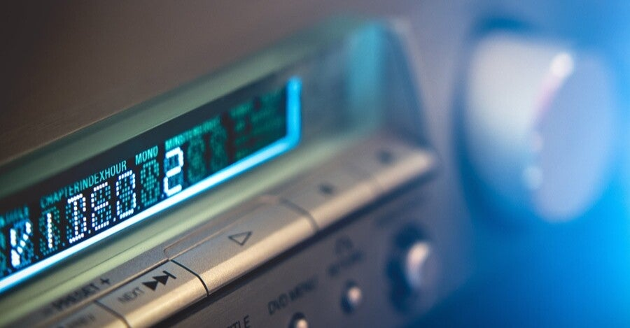

<figure>

</figure>

　ことあるごとに書いているが、最近はまったくCDを買わない。音楽はほぼすべてストリーミングで聞いている。逆に、音楽を提供する側もストリーミングを当てにしていて、ほとんどの新譜がストリーミングサービスで聞けるようになっている。

　こうなってくると、そのストリーミングサービスに乗ってこないアルバムはほとんど聞く機会がなくなってしまう。どうしても聞きたいものについてはそのうちCDを買おうとか考えているのだが、そのうち……というのは、往々にして忘れられがちだ。気づいたら聞かずに終わっていたというアルバムも増えてきてしまった。

　そもそも我が家にはCDを聞く環境がすでにない。PCにドライブも付いていない。どうしてもCDを聞きたい場合は、外付けのドライブをPCに取り付けて、取り込んだ音源を聞いているような状態だ。

　こうなってくると、もともと簡単に音楽を聞けるメディアだったCDが一転して、音を出すまでが非常に面倒な円盤と化している。よもやこんな時代が来るとは思っていなかったが、それだけストリーミングサービスが便利すぎるということだ。

　もっともCDを買わずとも、mp3などでダウンロードで買おうと思う場合もあるが、これすらもストリーミングの手軽さに比べたら敷居が高い。そもそもサブスクリプションでお金を払っている以外に出費して聞こうという時点で、なかなかそこまで到達しない場合もあるだろう。

　かように、（意図しなくとも）メディアの形態で音楽が選ばれる時代が到来してしまった。自分がその潮流にどっぷり飲み込まれているわけだが、ちょっと自分自身を見直して、もっと貪欲に音楽を聞きたいとも思っている。

　がんばろう。
