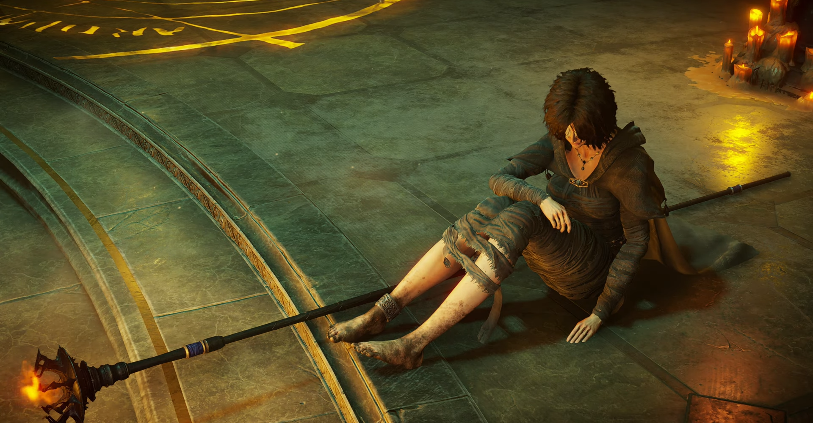

<figure>

</figure>

　PS5が売れていないという話を根拠に、もうPS5はオワコンだと言わんばかりの話が飛び交っていた。SNS中心の話なので、水に流して終わりと言えばそうなのだが、ちょっと認識不足のところもある感じがして気になった。みんなゲームやってないのかな？

　PS5のグラフィック機能は、もちろんPS4を遥かに凌駕するのだが、これは口で言ってもなかなか伝わらない。実際に同じゲームを、PS4とPS5で遊んでみるとその解像感の違い。カチッとしたクソ真面目な3D描写に思わず息を呑むレベルだ。

　いつも遊んでいる『デッドバイデイライト』なんかは、もともとそれほどグラフィックがきれいというゲームではないが、そんなゲームでも、PS5版では細かい部分までよく見えるようになっている。要するに描写が精細なのだ。しかも、HUDの文字やアイコンもカッチリとクソ真面目な描写をしているかのような見え方で、画面上の表示すべてがわかりやすく、心地よい。グラフィックきれいでもそんなに変わらないよ、という向きには、ぜひこういう部分まで注目してほしい。ちなみに、4K対応だが、フルHDでもこの解像感の恩恵にはあずかれる。本当に美しい。

　また、遊ぶゲームがないという意見も見かける。確かにローンチが少なくてあまり見栄えがしなかった。おそらく今の世の中の状況もあって開発は遅れているだろう。しかし、そんな中にあって『デモンズソウル』は重厚なグラフィックをしっかり4K60FPSで動かし、特にPS3で初代を遊んだプレイヤーにはその進化をしっかり見せつけてくれた。最近ではフィンランドのスタジオHousemarqueが作った『Returnal』もスペースホラーな世界観をローグライクな味付けで楽しませてくれた。グラフィックは精細なだけでなく、エフェクト面でも凝った演出が見られる。かように専用ソフトにはなかなか遊べるものがあって、今後も期待しているのだ。

　しかし、僕がPS5で何よりも進化したと感じたところは、ゲームプレイを録画・配信する機能だ。PS4にも配信機能はあったが、30FPSでしか配信できず、解像度も低く抑えられてしまい、正直PS4の映像美を伝えるには不十分なスペックだった。しかし、PS5では60FPSの配信が可能である。もっともPS4 Proでも60FPS配信は可能とされていたが、こちらはブロックノイズがひどかった。そういう体験を通ってきているからこそ、PS5の配信機能の凄さがよくわかる。

　また、録画機能においては、例えばYoutubeなどに4Kでアップすることも可能になり、実に美しい動画が残せるようになっている。Youtubeは多くの人が見る動画はより美しいvp9というエンコードを使用してくれるのだが、4Kでアップロードすると再生数に関わらずこのvp9を使ってくれる。この辺の細かいことは、動画のアップロードなんかしなければまったく関係ないことなので、知らないユーザーも多いだろう。細かいことだが、世に多くいるゲーム系ユーチューバーは気づいていることと思う。

　どうやら日本ではPS5の台数が極端に絞られているようだ。Xboxなどもそうだが、最近は日本の市場が相手にされず、日本は日本製のゲームをやっていてくださいという風潮があるのかもしれない。もちろん日本のメーカーにも世界的な市場へ出て勝負しているところがあるが、若干クローズドな市場になっている感は否めない。そういうところから、日本へのハードの供給は絞られているのだろう。

　しかしながら、世界を見るとPS5は目標としていた売上をすでに達成していて、まったくオワコンではない。オワコンだったのは日本のゲーム市場の方だったのだ。これは決して日本のゲーム市場を揶揄する意味ではなく、PS5の売上のように、数字がある一定の事実を示している。一方でSteamなどでは世界を相手に元気な国内のインディーズも存在していて、これまでとは日本のゲームと世界の市場の関係性が変化してきているということだろう。我々ユーザーは、そういうインディーズメーカーのようにがんばっている部分に希望を見出しつつ、かつての有名ゲームメーカーにもがんばってほしいということを感じるべきかもしれない。

　さて、結論を言うと、もはや日本という狭い市場だけでゲームを考えることはできないようだ。我々ユーザーも世界的のゲームに目を向け、「日本でPS5は終わっている」ではなく、日本のプレイヤーも海外のゲームも国内のゲームも楽しむというスタイルが理想的なんじゃないかと思っている。

　もっとも僕は80年代のパソコン時代から海外のゲーム好きだったので、ここは各ユーザーの好みが大きく影響するのかもしれない。もちろん日本のゲームだけ遊びたいユーザーがいても全然悪くない。しかし、日本のゲーム好きな若者を見ても、『フォートナイト』や『APEX Legends』に興じて、もはやゲームに国境はないんじゃないだろうか。むしろ黎明期からゲームを遊んでいるおっさん達が、勝手に自分たちの寿命を感じて落胆しているように見える。老年ゲーマーの意識の問題かもしれない。

　久々に思っていることを書き連ねて長文になってしまった。僕自信も視野を広く持って、世にある様々なゲームを楽しんでいきたい。しかしゲームはあくまで嗜好品だ。無理せず、自分の好きなものを遊ぶのがいいことには変わりない。あまり難しく考えずにいこうじゃないか。

[https://www.youtube.com/embed/JMCvLFOLxUI?rel=0](https://www.youtube.com/embed/JMCvLFOLxUI?rel=0)
